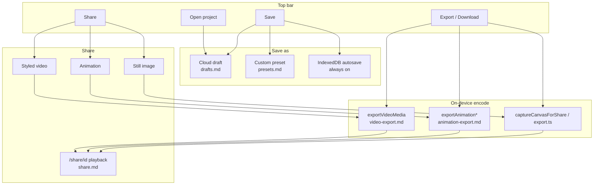
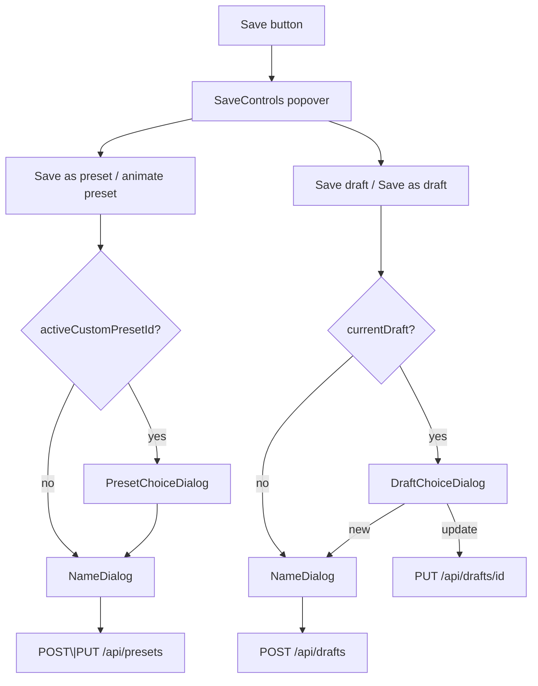
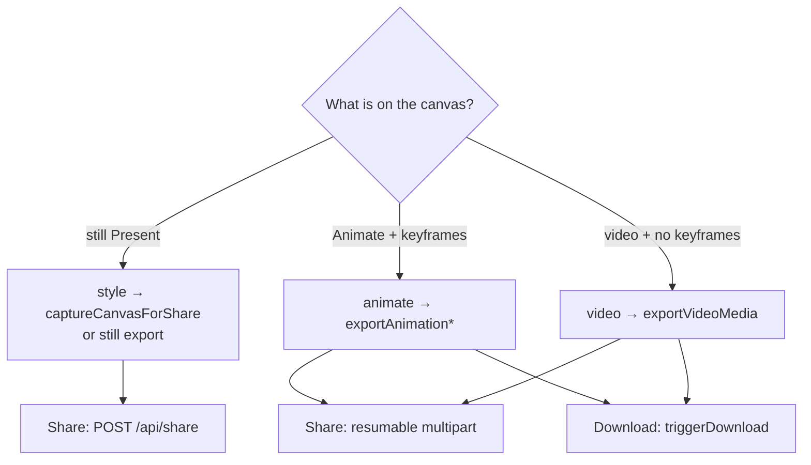
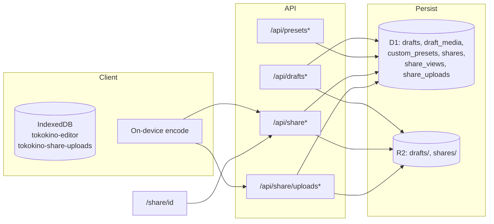
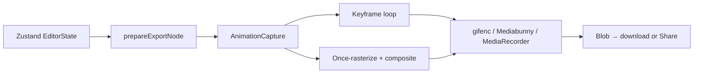

# Core systems overview

Tokokino is a client-heavy editor. Styling, capture, and encode run in the browser. The server holds auth, metadata (D1), and blobs (R2) for drafts, presets, and shares.

## Product flows at a glance

## Docs index

| Doc | Flow |
|---|---|
| [canvas.md](./canvas.md) | Drop/upload, URL→screenshot, X/Bluesky post cards, WebP thumb→optimized |
| [drafts.md](./drafts.md) | Save as draft, open project, local autosave, draft media |
| [presets.md](./presets.md) | Save as preset / animate preset, Custom tab apply |
| [share.md](./share.md) | Share image / animation / video, resumable upload, public player |
| [animation-export.md](./animation-export.md) | Keyframe timeline → GIF/WebM/MP4 |
| [video-export.md](./video-export.md) | Styled video canvas → GIF/WebM/MP4 |

## Save-as UX

Unauthenticated Save / Open / Share → flush IndexedDB (`saveCurrentEditorDraft`) then login.

## Share vs download routing

Gate: `shouldUseVideoMediaShareExport` in `lib/editor/share-export-choice.ts`.

## Persistence map

### Quick limits

| Concern | Limit |
|---|---|
| Cloud draft storage / user | 1 GB |
| Draft JSON | 15 MB |
| Draft video upload | 1 GB |
| Custom preset JSON | 1 MB |
| Share storage / user | 1 GB |
| Direct still share body | 40 MB |
| Resumable share upload | 1 GB |
| Keyframe export frames | 600 |

## Canvas images (edit performance)

- **File screenshots** stay pixel-perfect until **>10 MB** (then max 2400px).
- **URL → screenshot** goes through `POST /api/screenshot` (Cloudflare Browser Rendering) → full-page PNG `data:` + `fullPageCapture`.
- **X / Bluesky** URLs load via `GET /api/tweet` into an editable `TweetCard` DOM (not a PNG capture).
- **Backgrounds** paint a CDN **WebP thumb** first, then swap to a client-downscaled ~1600px JPEG; export upgrades back to full `sourceUrl`.

Details: [canvas.md](./canvas.md).

## Export family detail

Still / animation / video encode internals:

- Shared capture prep: `lib/editor/export.ts` (`AnimationCapture`, asset rewrite, portrait DoF)
- Keyframes: [animation-export.md](./animation-export.md)
- Styled video: [video-export.md](./video-export.md)

## Related UI

| Area | Path |
|---|---|
| Top bar orchestration | `components/editor/top-bar/index.tsx` |
| Save / Share / Export controls | `components/editor/top-bar/*-controls.tsx` |
| Open project | `components/editor/top-bar/open-project-dialog.tsx` |
| Custom presets UI | `components/editor/present-presets-section.tsx` |
| Public share page | `app/share/[id]/` |
| User share gallery | `app/app/shares/` |
