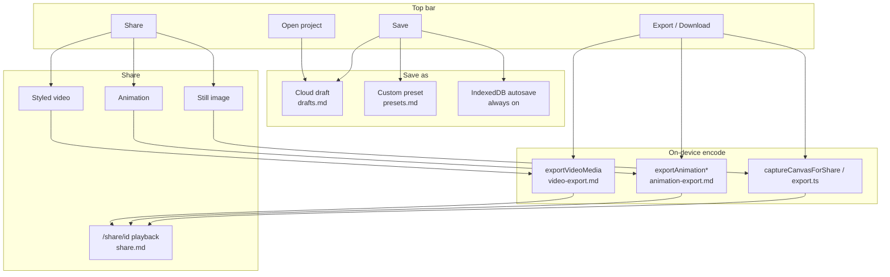
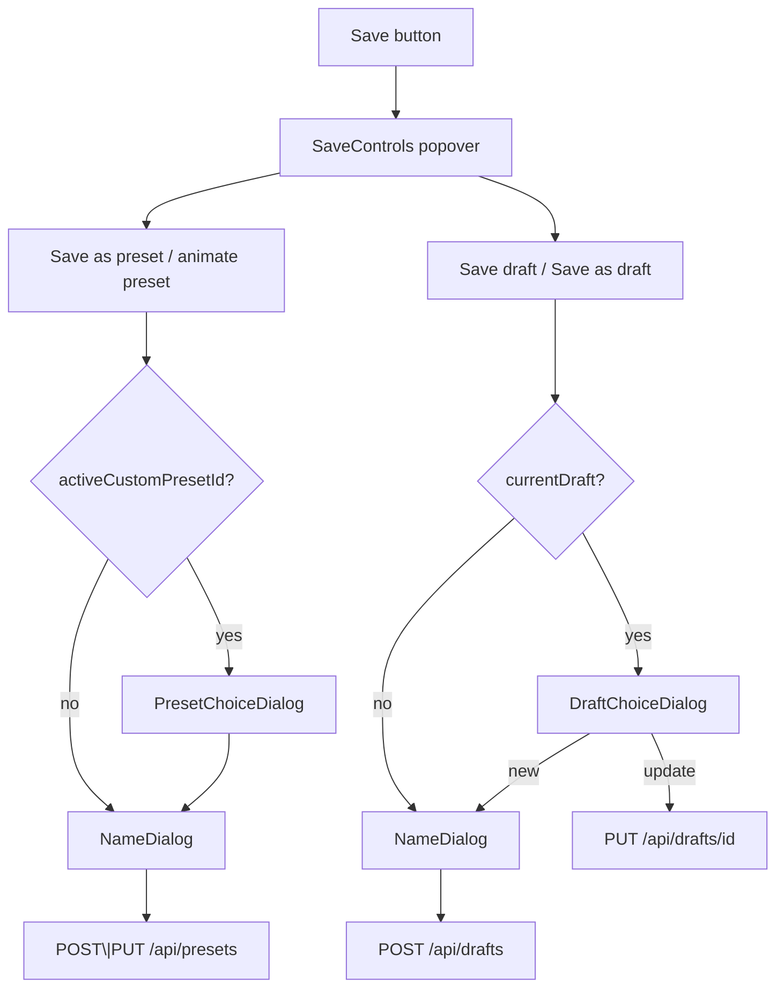
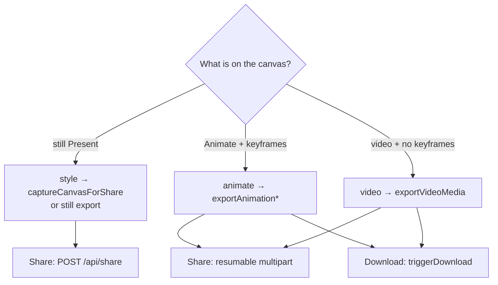
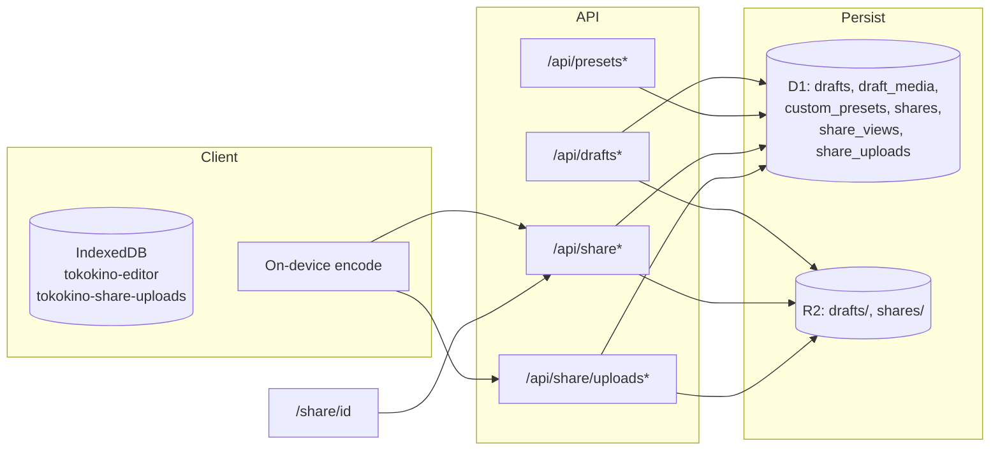
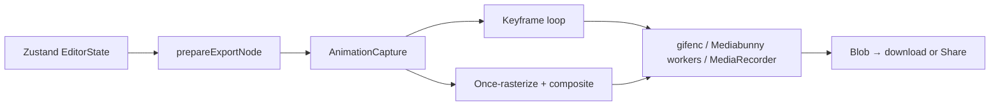

# Core systems overview

Tokokino is a client-heavy editor. Styling, capture, and encode run in the browser. The server holds auth, metadata (D1), and blobs (R2) for drafts, presets, and shares.

**Full module map:** [architecture.md](./architecture.md) — every feature and directory responsibility.

## Product flows at a glance

```mermaid
flowchart TB
  subgraph TopBar["Top bar"]
    Save["Save"]
    Share["Share"]
    Export["Export / Download"]
    Open["Open project"]
  end

  subgraph SavePaths["Save as"]
    Draft["Cloud draft<br/>drafts.md"]
    Preset["Custom preset<br/>presets.md"]
    Local["IndexedDB autosave<br/>always on"]
  end

  subgraph SharePaths["Share"]
    Img["Still image"]
    Anim["Animation"]
    Vid["Styled video"]
    Public["/share/id playback<br/>share.md"]
  end

  subgraph Encode["On-device encode"]
    StillEnc["captureCanvasForShare / export.ts"]
    AnimEnc["exportAnimation*<br/>animation-export.md"]
    VidEnc["exportVideoMedia<br/>video-export.md"]
  end

  Save --> Draft
  Save --> Preset
  Save --> Local
  Open --> Draft
  Share --> Img --> StillEnc
  Share --> Anim --> AnimEnc
  Share --> Vid --> VidEnc
  StillEnc --> Public
  AnimEnc --> Public
  VidEnc --> Public
  Export --> AnimEnc
  Export --> VidEnc
  Export --> StillEnc
```

## Docs index

### Architecture & editor

| Doc | Flow |
|---|---|
| [architecture.md](./architecture.md) | Full app / module map |
| [editor-store.md](./editor-store.md) | Zustand store, history, commits |
| [canvas.md](./canvas.md) | Drop/upload, URL→screenshot, X/Bluesky, WebP thumbs |
| [video-canvas.md](./video-canvas.md) | Video/GIF → control bar → trim → export gate |
| [device-frames.md](./device-frames.md) | Device mockups, browser chrome, glass frames, export re-project |
| [styling-canvas.md](./styling-canvas.md) | Inspector → CSS → canvas paint |
| [ascii-backdrop.md](./ascii-backdrop.md) | ASCII texture from the background, keyframeable |
| [live-preview.md](./live-preview.md) | Live CSS vars during slider/drag |
| [layers.md](./layers.md) | Text, assets, 3D shapes, annotations, multi-screenshot slots |
| [animate-mode.md](./animate-mode.md) | Timeline, playback, effect ownership |
| [bulk-preview.md](./bulk-preview.md) | Multi-canvas bulk edit + full-screen preview |
| [shortcuts.md](./shortcuts.md) | Keyboard shortcuts catalog + handlers |

### Save / share / export

| Doc | Flow |
|---|---|
| [drafts.md](./drafts.md) | Save as draft, open project, local autosave, draft media |
| [presets.md](./presets.md) | Save as preset / animate preset, Custom tab apply |
| [templates.md](./templates.md) | Curated in-repo templates gallery |
| [share.md](./share.md) | Share image / animation / video, resumable upload, public player |
| [shares-gallery.md](./shares-gallery.md) | User library `/app/shares` + stats |
| [still-export.md](./still-export.md) | Still PNG/JPEG/WebP capture & download (WebKit raster settle) |
| [animation-export.md](./animation-export.md) | Keyframe timeline → GIF/WebM/MP4 (Safari layer cache + encode workers) |
| [video-export.md](./video-export.md) | Styled video canvas → GIF/WebM/MP4 (+ dav1d) |

### Platform, site & integrations

| Doc | Flow |
|---|---|
| [platform.md](./platform.md) | OpenNext/Workers, D1, R2, rate limits, env |
| [auth-account.md](./auth-account.md) | Auth, sessions, preferences, account deletion |
| [integrations.md](./integrations.md) | Unsplash, screenshot, tweet, image proxy, feedback |
| [offline.md](./offline.md) | Offline editor shell (service worker) |
| [web-mcp.md](./web-mcp.md) | Browser agent tools (`modelContext`) |
| [marketing-site.md](./marketing-site.md) | Landing, compare, showcase, legal, SEO |

## Save-as UX

```mermaid
flowchart TD
  SaveBtn["Save button"] --> Pop["SaveControls popover"]
  Pop --> PresetPath["Save as preset / animate preset"]
  Pop --> DraftPath["Save draft / Save as draft"]
  PresetPath --> PC{"activeCustomPresetId?"}
  PC -->|yes| PCD["PresetChoiceDialog"]
  PC -->|no| PN["NameDialog"]
  PCD --> PN
  PN --> API1["POST\|PUT /api/presets"]
  DraftPath --> DC{"currentDraft?"}
  DC -->|yes| DCD["DraftChoiceDialog"]
  DC -->|no| DN["NameDialog"]
  DCD -->|update| PUT["PUT /api/drafts/id"]
  DCD -->|new| DN
  DN --> POST["POST /api/drafts"]
```

Unauthenticated Save / Open / Share → flush IndexedDB (`saveCurrentEditorDraft`) then login.

## Share vs download routing

```mermaid
flowchart TD
  Need{"What is on the canvas?"}
  Need -->|still Present| Style["style → captureCanvasForShare<br/>or still export"]
  Need -->|Animate + keyframes| Anim["animate → exportAnimation*"]
  Need -->|video + no keyframes| Video["video → exportVideoMedia"]

  Style --> ShareStill["Share: POST /api/share"]
  Anim --> ShareMulti["Share: resumable multipart"]
  Video --> ShareMulti
  Anim --> DL["Download: triggerDownload"]
  Video --> DL
```

Gate: `shouldUseVideoMediaShareExport` in `lib/editor/share-export-choice.ts`.

## Persistence map

```mermaid
flowchart LR
  subgraph Client
    IDB[("IndexedDB<br/>tokokino-editor<br/>tokokino-share-uploads")]
    Enc["On-device encode"]
  end
  subgraph API
    Drafts["/api/drafts*"]
    Presets["/api/presets*"]
    Share["/api/share*"]
    Uploads["/api/share/uploads*"]
  end
  subgraph Persist
    D1[("D1: drafts, draft_media,<br/>custom_presets, shares,<br/>share_views, share_uploads")]
    R2[("R2: drafts/, shares/")]
  end
  Public["/share/id"]

  IDB --- Client
  Enc --> Share
  Enc --> Uploads
  Drafts --> D1
  Drafts --> R2
  Presets --> D1
  Share --> D1
  Share --> R2
  Uploads --> D1
  Uploads --> R2
  Public --> Share
```

### Quick limits

| Concern | Limit |
|---|---|
| Cloud draft storage / user | 1 GB |
| Draft JSON | 15 MB |
| Draft video upload | 1 GB |
| Custom preset JSON | 1 MB |
| Share storage / user | 1 GB |
| Direct still share body | 40 MB |
| Resumable share upload | 1 GB |
| Keyframe export frames | Uncapped (GIF 350M px, MediaRecorder WebM 150M px — frames × area) |

## Canvas images (edit performance)

- **File screenshots** stay pixel-perfect until **>10 MB** (then max 2400px).
- **URL → screenshot** goes through `POST /api/screenshot` (Cloudflare Browser Rendering) → full-page PNG `data:` + `fullPageCapture`.
- **X / Bluesky** URLs load via `GET /api/tweet` into an editable `TweetCard` DOM (not a PNG capture).
- **Backgrounds** paint a CDN **WebP thumb** first, then swap to a client-downscaled ~1600px JPEG; export upgrades back to full `sourceUrl`.

Details: [canvas.md](./canvas.md).

## Export family detail

Still / animation / video encode internals:

- Shared capture prep: `lib/editor/export.ts` (`AnimationCapture`, asset rewrite, portrait DoF)
- Stills: [still-export.md](./still-export.md) — WebKit settles the FO raster; glass frost is baked as pixels
- Keyframes: [animation-export.md](./animation-export.md) (WebKit uses layered underlay/shell/warp when tilt flattens in FO; unchanged layers are cached across frames)
- Styled video: [video-export.md](./video-export.md)
- ASCII glyphs: wait for sample+paint before clone — [ascii-backdrop.md](./ascii-backdrop.md)

```mermaid
flowchart LR
  STORE["Zustand EditorState"] --> CLONE["prepareExportNode"]
  CLONE --> CAP["AnimationCapture"]
  CAP --> ANIM["Keyframe loop"]
  CAP --> VID["Once-rasterize + composite"]
  ANIM --> ENC["gifenc / Mediabunny workers / MediaRecorder"]
  VID --> ENC
  ENC --> OUT["Blob → download or Share"]
```

## Related UI

| Area | Path |
|---|---|
| Top bar orchestration | `components/editor/top-bar/index.tsx` |
| Save / Share / Export controls | `components/editor/top-bar/*-controls.tsx` |
| Open project | `components/editor/top-bar/open-project-dialog.tsx` |
| Custom presets UI | `components/editor/present-presets-section.tsx` |
| Public share page | `app/share/[id]/` |
| User share gallery | `app/app/shares/` — [shares-gallery.md](./shares-gallery.md) |
| Editor store provider | `lib/editor/store/provider.tsx` |
| Animate timeline | `components/editor/animate/` |
| Bulk flow | `components/editor/bulk-canvas-flow.tsx` — [bulk-preview.md](./bulk-preview.md) |
| Web MCP | `components/web-mcp-provider.tsx` — [web-mcp.md](./web-mcp.md) |
| Landing | `components/landing/*` — [marketing-site.md](./marketing-site.md) |
