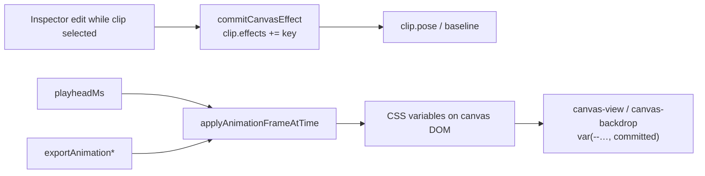
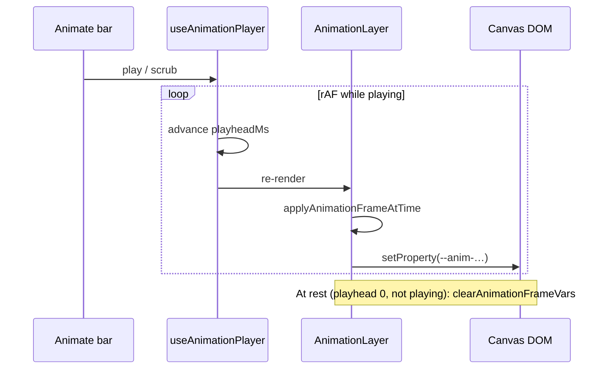

# Animate mode (timeline + playback)

Animate mode is a **per-canvas** timeline of **clips** (keyframes). Each clip owns a set of effects (`clip.effects: AnimationEffect[]`) — properties changed while that clip was selected. Live playback and export sample the same interpolation path so preview matches output.

---

## Mental model



Rules (non-negotiable — also in `agents.md`):

1. **Start from committed baseline**, not neutral 0 — first owning clip's `baseline`.
2. **Cross-blend between keyframes** — no hard cuts for continuous properties.
3. **Reveal-from-nothing is a fade** — invisible rest shares position/colour of the base.
4. **Hold at end** — past a clip's window, progress clamps to 1 (unless `returnToDefault`).
5. **Style-only keyframes are valid** — recolour / type swap still counts.

---

## Data model

```ts
CanvasAnimation {
  durationMs: number
  clips: AnimationClip[]
}

AnimationClip {
  id, startMs, durationMs
  target?: { scope: "all" | "main" | "slot"; slotId? }
  baseline?: ClipBaseline   // pose before this clip's edits
  pose?: ClipBaseline       // target pose
  effects?: AnimationEffect[]
  easing?, speed?
  returnToDefault?          // ease back after window (default ON)
}
```

### Animatable effects

`AnimationEffect` union (`state-types.ts`):

`position` · `zoom` · `tilt` · `padding` · `shadow` · `background` · `backdrop` · `canvasRadius` · `lighting` · `filter` · `portrait` · `pattern` · `overlay` · `border` · `borderRadius` · `crop`

Slot-limited set: tilt / zoom / shadow (and related slot pose fields) — see `SLOT_ANIMATABLE_EFFECTS` in store/playback code.

---

## Playback architecture

| Piece | Path | Role |
|---|---|---|
| Timeline UI | `components/editor/animate/*` | Clips, ruler, controls |
| Player hook | `hooks/use-animation-player.ts` | playhead, play/pause |
| Layer driver | `animate/animation-layer.tsx` | Per-frame: sample → CSS vars |
| Sampler | `lib/editor/apply-animation-frame.ts` | Shared with export |
| Math | `lib/editor/animation-playback.ts` | lerp, stacks, baselines |
| Easing | `lib/editor/clip-easing.ts` | clip progress curves |
| Motion helpers | `lib/editor/animation-motion.ts` | extra motion utilities |
| Timeline util | `lib/editor/animation-timeline.ts` | clip window helpers |



Renderers read `var(--anim-…, <committed fallback>)` so committed style shows when vars are cleared.

---

## Two interpolation shapes

### Numeric / interpolatable tracks

tilt, zoom, padding, canvasRadius, shadow, border, lighting, crop, …  

`sampleKeyframes` + a `lerpValue` (`shadowBetween`, `borderBetween`, `lightingBetween`, …).

### Layered overlay stacks

background, filter, portrait, pattern, overlay — each keyframe owns a layer; player drives per-layer opacity.

| Stack kind | Opacity rule |
|---|---|
| Opaque (background, filter) | later covers earlier: `progress(clip)` |
| Additive (portrait, pattern, overlay) | crossfade-chain: `p_i · (1 − p_{i+1})` |

Resolvers: `resolveAnimateXStack` in `animation-playback.ts`. Render: `canvas-backdrop.tsx` (+ overlay over/under in `canvas-view.tsx`).

Invisible rest constants: `INVISIBLE_BORDER`, `INVISIBLE_SHADOW`, `lightingEntranceRest`, etc.

---

## UI surfaces

| Component | Role |
|---|---|
| `animate-toggle.tsx` | Enter / leave Animate mode |
| `animate-bar.tsx` / `animate-controls.tsx` | Transport |
| `timeline-clip.tsx` | Clip body + effect icons (`ICON_FOR`) |
| `timeline-video-clip.tsx` | Video trim segments on timeline |
| `timeline-ruler.tsx` | Time scale |
| `clip-transition-toolbar.tsx` | Easing / return-to-default |
| `easing-curve.tsx` | Visual curve |
| `animation-preview-controls.tsx` | Preview-related |
| `use-animate-timeline.ts` | Timeline interactions |

---

## Video on the timeline

- Canvas may hold `videoClips` (trim/shift segments) separate from style keyframes.
- Export routing: keyframes present → [animation-export](./animation-export.md); video only → [video-export](./video-export.md).
- Gate: `shouldUseVideoMediaShareExport` in `share-export-choice.ts`.

Filmstrip / mute prefs: `video-filmstrip.ts`, `video-mute-preference.ts`, `video-registry.ts`, `video-timeline-map.ts`.

**Full video-canvas lifecycle** (intake, GIF→WebM, control bar, trim vs keyframes): [video-canvas.md](./video-canvas.md).

---

## Adding a new animatable effect

Checklist (also in `agents.md`):

1. `state-types.ts` — `AnimationEffect` union + optional `ClipBaseline` field  
2. `animation-playback.ts` — `DEFAULT_BASELINE`, interpolator or stack, invisible rest  
3. `store.tsx` — `captureClipPose` / `applyPoseToCanvas` / `resolveKeyframePose` + `commitCanvasEffect` in setter  
4. `animation-layer.tsx` / `apply-animation-frame.ts` — drive CSS vars; clear on rest  
5. `canvas-view.tsx` / `canvas-backdrop.tsx` — read `var(--…, committed)`  
6. `timeline-clip.tsx` — `ICON_FOR` map (exhaustive Record)  
7. `pnpm typecheck` + eslint changed files  

---

## Key files

| Path | Role |
|---|---|
| `lib/editor/animation-playback.ts` | Interpolation core |
| `lib/editor/apply-animation-frame.ts` | DOM application (live + export) |
| `lib/editor/clip-easing.ts` | Easing functions |
| `components/editor/animate/animation-layer.tsx` | Player loop |
| `hooks/use-animation-player.ts` | Playhead state |
| `lib/editor/store.tsx` | Clip CRUD + pose helpers |
| [animation-export.md](./animation-export.md) | Encode pipeline |
