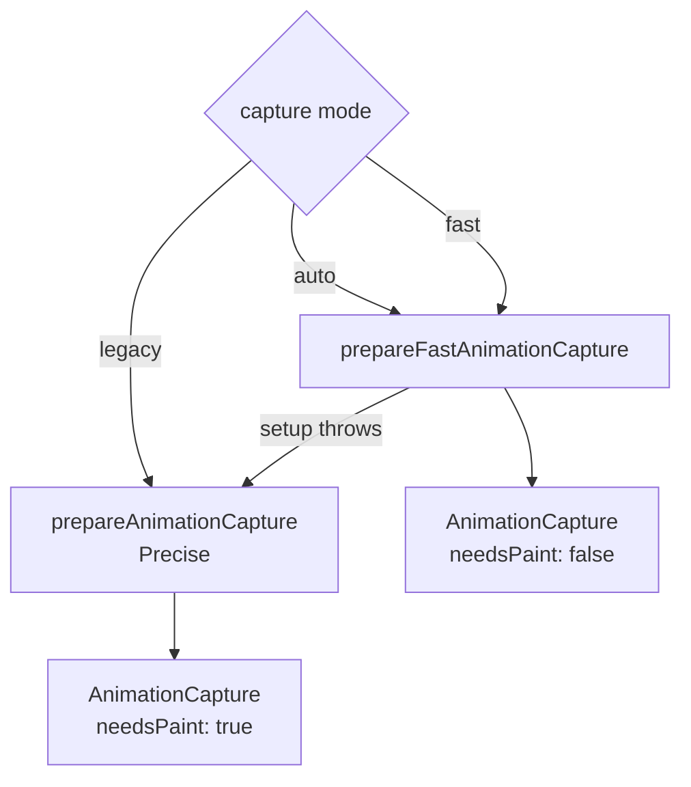
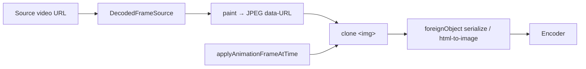
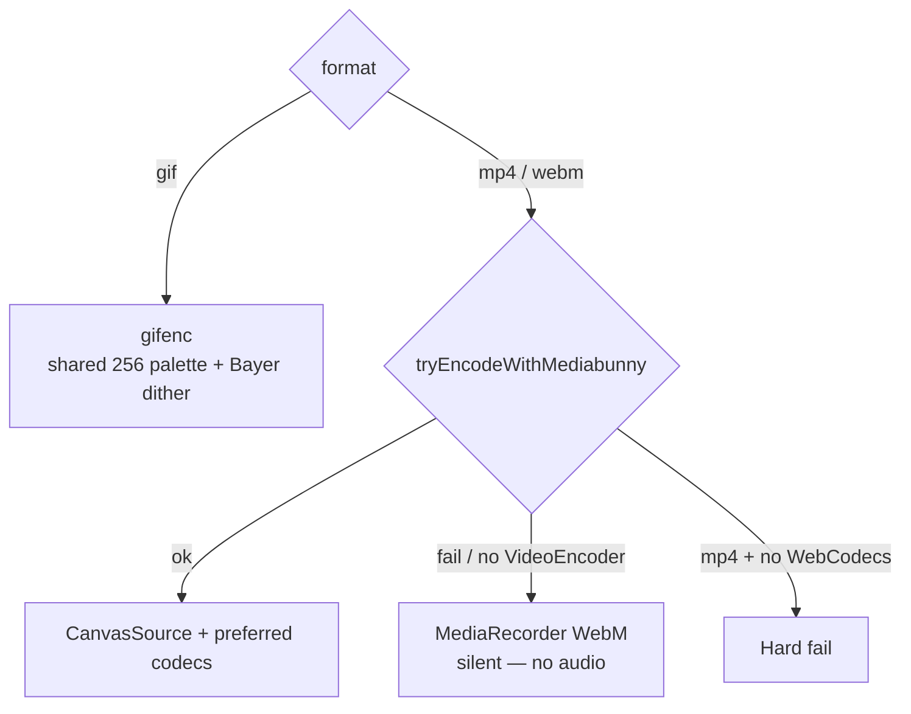
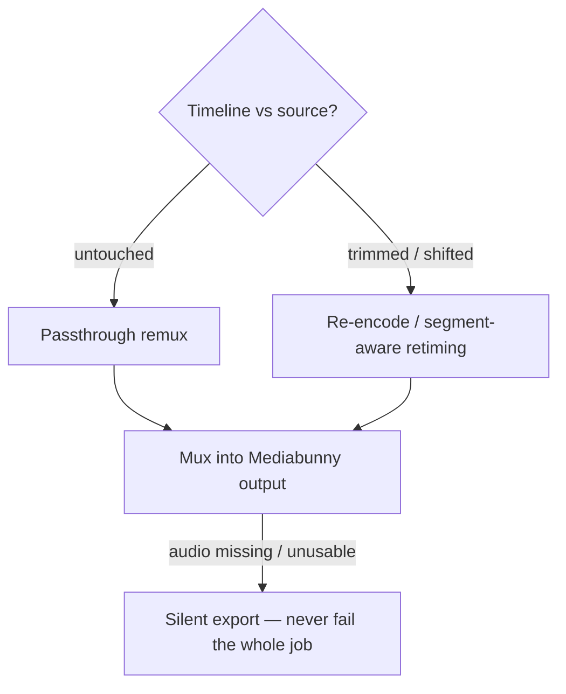

# Animation export (keyframe / Animate mode)

**Entry:** `lib/editor/animation-export/index.ts`  
**Public API:** `exportAnimation`, `exportAnimationBlob`, `isWebmExportSupported`

Samples the active canvas's Animate-mode timeline onto an offscreen DOM clone, captures each frame, and encodes GIF / WebM / MP4 entirely in the browser.

Use this path when the canvas has visual keyframes. For a video canvas with **no** keyframes (trim-only Animate UI), prefer [video-export](./video-export.md) instead.

---

## Folder map

```
lib/editor/animation-export/
├── index.ts            # Orchestrator — exportAnimation*
├── types.ts            # Formats, phases, CaptureCtx, MAX_FRAMES
├── capture.ts          # Engine selection + captureStableFrame
├── video.ts            # Mediabunny encode + MediaRecorder WebM fallback
├── gif.ts              # gifenc palette encode
├── video-layer.ts      # Decode → JPEG  bridge for foreignObject
├── animation-audio.ts  # Re-timed audio for trimmed/shifted video
├── watermark.ts        # Logo + Inter font credit
├── draw-utils.ts       # safeDrawImage / blank / snapshot helpers
├── utils.ts            # Abort, progress, mime, download, even()
├── error-message.ts    # User-facing error copy
└── video-media/        # Separate styled-video path (see video-export.md)
```

**Outside this folder but required:**

| File | Role |
|---|---|
| `lib/editor/export.ts` | `AnimationCapture`, `prepareAnimationCapture`, `prepareFastAnimationCapture` |
| `lib/editor/apply-animation-frame.ts` | Apply sampled pose → CSS vars on the clone |
| `lib/editor/store.tsx` | Clips, `captureClipPose`, canvas state |

---

## End-to-end pipeline

```mermaid
sequenceDiagram
  participant UI as Export UI / Share
  participant Orch as exportAnimation
  participant Cap as acquireAnimationCapture
  participant VL as prepareCloneVideoLayer
  participant Frame as captureStableFrame
  participant Enc as gifenc / Mediabunny / MediaRecorder

  UI->>Orch: canvasId + format/fps/width
  Orch->>Orch: Read clips, duration; frameCount ≤ 600
  Orch->>Cap: auto | fast | legacy
  Cap-->>Orch: AnimationCapture
  opt screenshot is video
    Orch->>VL: decode + replace &lt;video&gt; with JPEG &lt;img&gt;
  end
  loop each frame t
    Orch->>Frame: paint videoLayer → applyAnimationFrameAtTime → rasterize
    Frame-->>Enc: ImageBitmap / canvas
  end
  Orch->>Enc: optional prepareAnimationAudio
  Enc-->>UI: Blob (download or asBlob share)
```

### Stages (ordered)

1. Read store: `canvas.animation`, clips, `durationMs`; optionally merge live selected-clip pose via `captureClipPose`.
2. Compute `frameCount = min(600, duration × fps)`; preload watermark assets.
3. `acquireAnimationCapture(mode)` — `auto` tries fast, falls back to legacy.
4. `suppressCloneTransitions` on the clone.
5. If main screenshot is video → `prepareCloneVideoLayer` (decode + JPEG bridge).
6. Encode by format:
   - **GIF** → `encodeGif` → per-frame `captureStableFrame` → gifenc palette / Bayer dither
   - **MP4 / WebM** → `tryEncodeWithMediabunny`; on failure, MediaRecorder WebM (MP4 hard-fails without WebCodecs)
7. Per frame inside encoders: `videoLayer.paint(t)` → `applyAnimationFrameAtTime` → `captureFrame` → portrait DoF → watermark.
8. Audio (Mediabunny only): `prepareAnimationAudio` — passthrough if timeline untouched, else re-time to segments.
9. Cleanup: video layer, `clearAnimationFrameVars`, `capture.cleanup`.
10. Download or return `{ blob, contentType, extension }`.

---

## Capture engines



| Mode | Strategy | When |
|---|---|---|
| `fast` | Clone once; bake computed styles; serialize foreignObject each frame | Default via `auto` |
| `legacy` / Precise | html-to-image `toCanvas` every frame | Fallback or explicit |
| `auto` | fast → legacy if setup throws | Default |

Video-media export always uses legacy `prepareAnimationCapture` — see [video-export.md](./video-export.md).

`captureStableFrame` also:

- Applies the keyframe pose at time `t`
- Paints the clone video layer when present
- Runs Safari portrait blur polyfill when `ctx.filter` is unreliable
- Holds the last complete frame if a raster comes back incomplete (WebKit FO flake)

---

## Video on the keyframe path (`video-layer`)

A live `<video>` paints nothing once the clone is serialized into SVG foreignObject. The keyframe path therefore:

1. Decodes source frames (Mediabunny / WebCodecs, with dav1d for Safari AV1 — shared with video-media).
2. Replaces clone `<video>` with an `` fed JPEG data-URLs each frame.
3. Maps timeline time → source time via `resolveVideoSegments` / `resolveVideoSourceTimeMs` (trim + shift).
4. Holds the last painted frame outside active video clips.

This is different from video-media compositing: keyframes can **move** the video box every frame, so the JPEG bridge must ride inside the animated DOM tree.



---

## Encode paths



**Codec preferences (Mediabunny + WebCodecs):**

| Container | Preference order |
|---|---|
| MP4 | `avc` → `hevc` → `av1` |
| WebM | `vp9` → `vp8` → `av1` |

- Bitrate: high quality; keyframe interval ~2s; even dimensions.
- Safari: WebM disabled in UI (`isWebmExportSupported` false).
- `MAX_FRAMES = 600` hard cap on the keyframe path.

---

## Audio (`animation-audio`)



MediaRecorder fallback has **no** audio.

---

## Module responsibility map

| File | Responsibility |
|---|---|
| `index.ts` | Wire options → capture → encode → download/blob |
| `types.ts` | Shared options, phases, `CaptureCtx`, constants |
| `capture.ts` | Engine acquire; `captureStableFrame`; incomplete-frame hold |
| `video.ts` | Mediabunny encode; MediaRecorder fallback; WebM capability probe |
| `gif.ts` | GIF encode loop |
| `video-layer.ts` | Timeline↔source mapping; FO-safe video bridge |
| `animation-audio.ts` | Segment-aware audio for keyframe export |
| `watermark.ts` | Per-frame credit overlay |
| `utils.ts` / `draw-utils.ts` / `error-message.ts` | Plumbing |

---

## Key types

| Type | Meaning |
|---|---|
| `AnimationExportFormat` | `"webm" \| "mp4" \| "gif"` |
| `AnimationExportPhase` | `preparing` → `capturing` → `encoding` → `finishing` |
| `AnimationCaptureMode` | `"auto" \| "fast" \| "legacy"` |
| `CaptureCtx` | Capture handle + clips + frame plan + optional video layer |
| `CloneVideoLayer` | Paint/cleanup bridge for video-in-animation |
| `AnimationExportBlobResult` | `{ blob, contentType, extension }` |

---

## Constraints & design choices

1. **100% client-side** — no encode API.
2. **Start from committed canvas pose** — export samples the same interpolation as live Animate playback.
3. **foreignObject is hostile to `<video>`** — JPEG bridge is mandatory on the keyframe path.
4. **Audio is best-effort** — missing tracks never fail export.
5. **600-frame budget** — long timelines are capped (video-media has no such cap; GIF has a pixel-budget guard there instead).
6. **WebM gated on Safari** — UI + `isWebmExportSupported`.

---

## Tests

| File | Documents |
|---|---|
| `tests/lib/editor/animation-export/capture-engines.test.ts` | auto/fast/legacy selection + fallback |
| `tests/lib/editor/animation-export/export-video.integration.test.ts` | video layer → Mediabunny → cleanup |
| `tests/lib/editor/animation-export/video-layer.test.ts` | segment math; JPEG bridge; hold outside clips |
| `tests/lib/editor/animation-export/animation-audio.test.ts` | passthrough vs retimed audio |
| `tests/lib/editor/animation-export/error-message.test.ts` | user-facing errors |
| `tests/lib/editor/share-export-choice.test.ts` | when to prefer video-media over keyframes |
