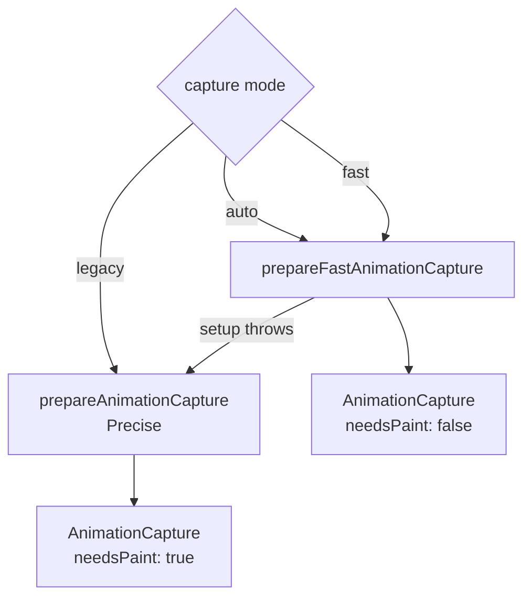
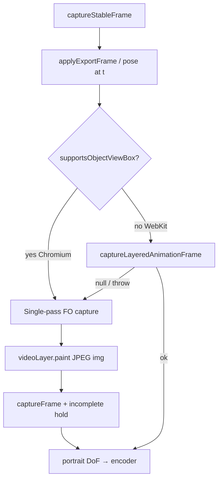
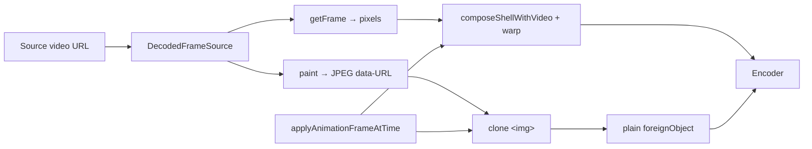
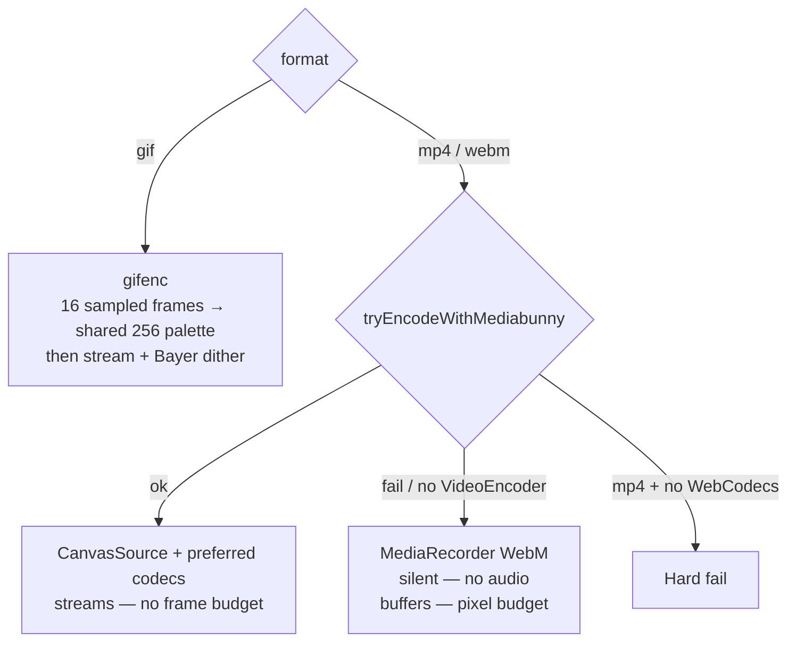
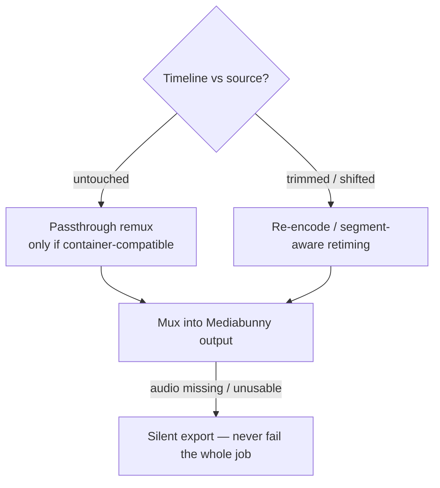

# Animation export (keyframe / Animate mode)

**Entry:** `lib/editor/animation-export/index.ts`  
**Public API:** `exportAnimation`, `exportAnimationBlob`, `isWebmExportSupported`

Samples the active canvas's Animate-mode timeline onto an offscreen DOM clone, captures each frame, and encodes GIF / WebM / MP4 entirely in the browser.

Use this path when the canvas has visual keyframes. For a video canvas with **no** keyframes (trim-only Animate UI), prefer [video-export](./video-export.md) instead.

---

## Folder map

```
lib/editor/animation-export/
├── index.ts                 # Orchestrator — exportAnimation*
├── types.ts                 # Formats, phases, CaptureCtx
├── capture.ts               # Engine selection + captureStableFrame
├── webkit-layered-frame.ts  # WebKit perspective fix — layered underlay/shell/FG
├── video.ts                 # Mediabunny encode + MediaRecorder WebM fallback
├── gif.ts                   # gifenc palette encode
├── video-layer.ts           # Decode → JPEG  bridge (+ getFrame for layered)
├── animation-audio.ts       # Re-timed audio for trimmed/shifted video
├── watermark.ts             # Logo + Inter font credit
├── draw-utils.ts            # safeDrawImage / blank / snapshot helpers
├── utils.ts                 # Abort, progress, mime, download, even()
├── error-message.ts         # User-facing error copy
└── video-media/             # Shared geometry/warp + styled-video path (see video-export.md)
```

**Outside this folder but required:**

| File | Role |
|---|---|
| `lib/editor/export.ts` | `AnimationCapture`, `prepareAnimationCapture`, `prepareFastAnimationCapture` |
| `lib/editor/apply-animation-frame.ts` | Apply sampled pose → CSS vars on the clone |
| `lib/editor/store.tsx` | Clips, `captureClipPose`, canvas state |

---

## End-to-end pipeline

```mermaid
sequenceDiagram
  participant UI as Export UI / Share
  participant Orch as exportAnimation
  participant Cap as acquireAnimationCapture
  participant VL as prepareCloneVideoLayer
  participant Frame as captureStableFrame
  participant Enc as gifenc / Mediabunny / MediaRecorder

  UI->>Orch: canvasId + format/fps/width
  Orch->>Orch: Read clips, duration; frameCount = duration × fps
  Orch->>Cap: auto | fast | legacy
  Cap-->>Orch: AnimationCapture
  opt screenshot is video
    Orch->>VL: decode + replace &lt;video&gt; with JPEG &lt;img&gt;
  end
  loop each frame t
    Orch->>Frame: applyAnimationFrameAtTime → layered getFrame | videoLayer paint → rasterize
    Frame-->>Enc: ImageBitmap / canvas
  end
  Orch->>Enc: optional prepareAnimationAudio
  Enc-->>UI: Blob (download or asBlob share)
```

### Stages (ordered)

1. Read store: `canvas.animation`, clips, `durationMs`; optionally merge live selected-clip pose via `captureClipPose`.
2. Compute `frameCount = duration × fps` — the whole timeline, uncapped; preload watermark assets.
3. `acquireAnimationCapture(mode)` — `auto` tries fast, falls back to legacy.
4. `suppressCloneTransitions` on the clone.
5. If main screenshot is video → `prepareCloneVideoLayer` (decode + JPEG bridge).
6. Encode by format:
   - **GIF** → `encodeGif` → 16 sampled frames build the shared palette, then per-frame `captureStableFrame` → Bayer dither → straight into gifenc
   - **MP4 / WebM** → `tryEncodeWithMediabunny`; on failure, MediaRecorder WebM (MP4 hard-fails without WebCodecs)
7. Per frame inside encoders: `captureStableFrame` (WebKit layered when applicable, else videoLayer paint → FO) → portrait DoF → watermark.
8. Audio (Mediabunny only): `prepareAnimationAudio` — passthrough if timeline untouched, else re-time to segments.
9. Cleanup: video layer, `clearAnimationFrameVars`, `capture.cleanup`.
10. Download or return `{ blob, contentType, extension }`.

---

## Capture engines


```mermaid
flowchart TD
  M{"capture mode"}
  M -->|auto| FAST["prepareFastAnimationCapture"]
  M -->|fast| FAST
  M -->|legacy| LEG["prepareAnimationCapture<br/>Precise"]
  FAST -->|setup throws| LEG
  FAST --> OUT["AnimationCapture<br/>needsPaint: false"]
  LEG --> OUT2["AnimationCapture<br/>needsPaint: true"]
```

| Mode | Strategy | When |
|---|---|---|
| `fast` | Clone once; bake computed styles; serialize foreignObject each frame | Default via `auto` |
| `legacy` / Precise | html-to-image `toSvg` + `rasterizeNodeToCanvas` every frame | Fallback or explicit |
| `auto` | fast → legacy if setup throws | Default |

Video-media export always uses legacy `prepareAnimationCapture` — see [video-export.md](./video-export.md).

`captureStableFrame` also:

- Applies the keyframe pose at time `t` **first** (before any raster path)
- On WebKit with a transformed media shell → tries `captureLayeredAnimationFrame` (see below)
- Else paints the clone video layer (JPEG `` bridge) when present
- Runs Safari portrait blur polyfill when `ctx.filter` is unreliable
- Holds the last complete frame if a plain-path raster comes back incomplete (WebKit FO flake)

Layered frames deliberately do **not** feed that incomplete-frame hold: their passes retry internally, and holding one of them could hand a mismatched fallback to the plain path.

---

## WebKit layered capture (`webkit-layered-frame`)

WebKit rasterizes a 3D transform inside SVG foreignObject **without** the perspective divide — tilted boxes land at the wrong shape even when the clone DOM matches Chrome. Chromium (`supportsObjectViewBox()`) declines this path and keeps the single-pass FO capture.

The video-media export already solved the same FO flatten with underlay / media / foreground + `frame-geometry` + `warp-gl`. Animate reuses that recipe **per frame**, with one speed trick: the media shell's *untransformed* texture does not change with tilt — only its projection does — so expensive FO work is cached and each frame is mostly 2D/GPU compositing.


```mermaid
flowchart TD
  CSF["captureStableFrame"] --> POSE["applyExportFrame / pose at t"]
  POSE --> GATE{"supportsObjectViewBox?"}
  GATE -->|yes Chromium| PLAIN["Single-pass FO capture"]
  GATE -->|no WebKit| LAYER["captureLayeredAnimationFrame"]
  LAYER -->|null / throw| PLAIN
  LAYER -->|ok| DOF["portrait DoF → encoder"]
  PLAIN --> JPEG["videoLayer.paint JPEG img"]
  JPEG --> FO["captureFrame + incomplete hold"]
  FO --> DOF
```

### Per-frame stack (when layered applies)

1. **Underlay** — scene minus foreground and bent shells (`data-export-stack=underlay`, bent els hidden). Cached by backdrop CSS-var key; recaptured until two consecutive downsampled rasters agree (WebKit can fire SVG image load before data-URI backgrounds decode). Cache bounded (~6 entries / 96 MB) so crossfade segments cannot retain hundreds of MB.
2. **Below-media foreground** — text/overlays ordered behind the shell (`paintsAboveVideo`).
3. **Shell texture(s)** — each bent shell rasterized untransformed via `captureProjectedElementTexture` (shared with video-media). Cached per shell-var + layout size. On video canvases the clone `` is hidden during texture capture; decoded pixels are drawn straight into the measured media box with `paintFrameToLocalBox` (object-fit / radius / enhance) — **no JPEG round-trip**. Result is `warpProjectedTexture`'d onto the frame's current quad.
4. **Device-frame chrome** — re-projected over the media (`buildFrameChromeLayer`).
5. **Above-media foreground** — remaining overlays / annotations.

### Gating & fallbacks

| Condition | Result |
|---|---|
| Chromium / `supportsObjectViewBox()` | `null` → plain path |
| No `matrix3d` shells (even with `includeFlat`) | `null` |
| Only foreground elements are transformed (slots only) | `null` |
| Transformed wrapper contains `data-export-stack=underlay` | `null` (would freeze animated backdrop) |
| Shell texture or warp fails | `null` (plain FO is the lesser artifact) |
| Layered throws | Caught in `captureStableFrame` → plain path |

`collectProjectedLayers(root, { includeFlat: true })` keeps zero-tilt frames on this pipeline so a tilt animating through 0° does not flip-flop against the plain raster (and a flat main over a tilted slot still gets live video).

Shared primitives live in video-media and are now exported for reuse: `captureProjectedElementTexture`, `warpProjectedTexture`, `paintFrameToLocalBox`, `buildForegroundLayer`, `buildFrameChromeLayer`, `paintsAboveVideo`.

---

## Video on the keyframe path (`video-layer`)

A live `<video>` paints nothing once the clone is serialized into SVG foreignObject. The keyframe path therefore:

1. Decodes source frames (Mediabunny / WebCodecs, with dav1d for Safari AV1 — shared with video-media).
2. Replaces clone `<video>` with an `` (JPEG data-URLs on the plain path).
3. Maps timeline time → source time via `resolveVideoSegments` / `resolveVideoSourceTimeMs` (trim + shift).
4. Holds the last painted / decoded frame outside active video clips.

`CloneVideoLayer` exposes:

| Member | Role |
|---|---|
| `paint(timelineMs)` | JPEG into the clone `` — plain FO path |
| `getFrame(timelineMs)` | Decoded `CanvasImageSource` without JPEG — layered path |
| `mediaElement` | The stand-in `` (for style + hide-during-texture) |
| `sourceDurationMs` / `cleanup` | Trim clamp + decode teardown |

On WebKit layered capture, `captureStableFrame` skips `paint()` entirely when the layered path succeeds — pixels come from `getFrame` into the shell texture.

This is different from video-media compositing: keyframes can **move** the video box every frame, so the plain path's JPEG bridge must still ride inside the animated DOM tree; the layered path projects that motion by warping a cached untransformed texture onto each frame's quad.


```mermaid
flowchart LR
  SRC["Source video URL"] --> DEC["DecodedFrameSource"]
  DEC --> GET["getFrame → pixels"]
  DEC --> JPEG["paint → JPEG data-URL"]
  GET --> SHELL["composeShellWithVideo + warp"]
  JPEG --> IMG["clone &lt;img&gt;"]
  KF["applyAnimationFrameAtTime"] --> IMG
  KF --> SHELL
  IMG --> FO["plain foreignObject"]
  SHELL --> ENC["Encoder"]
  FO --> ENC
```

---

## Encode paths


```mermaid
flowchart TD
  FMT{"format"}
  FMT -->|gif| GIF["gifenc<br/>16 sampled frames → shared 256 palette<br/>then stream + Bayer dither"]
  FMT -->|mp4 / webm| MB{"tryEncodeWithMediabunny"}
  MB -->|ok| MBENC["CanvasSource + preferred codecs<br/>streams — no frame budget"]
  MB -->|fail / no VideoEncoder| MR["MediaRecorder WebM<br/>silent — no audio<br/>buffers — pixel budget"]
  MB -->|mp4 + no WebCodecs| FAIL["Hard fail"]
```

**Codec preferences (Mediabunny + WebCodecs):**

| Container | Preference order |
|---|---|
| MP4 | `avc` → `hevc` → `av1` |
| WebM | `vp9` → `vp8` → `av1` |

- Bitrate: high quality; keyframe interval ~2s; even dimensions.
- Safari: WebM disabled in UI (`isWebmExportSupported` false).
- **GIF fps is clamped to `MAX_GIF_FPS = 50`** in `index.ts`, before `frameCount` is computed. Delays are whole centiseconds with a 2cs floor (viewers clamp anything shorter to ~10cs), so 50fps is the fastest cadence a GIF can express — asking for 60 doesn't play faster, it emits 2cs anyway and runs the clip 20% long. The UI already only offers GIF `[20, 25, 50]`; the clamp makes the encoder correct for direct API callers too.

### Frame budgets

There is **no global frame cap**. A `MAX_FRAMES = 600` clamp used to live in `index.ts` and silently truncated any timeline past 20 s @ 30fps (10 s @ 60fps) — the file just ended mid-motion, with the audio window cut to match so it looked deliberate. It was really a blunt guard for the two encoders that buffer; each now carries its own bound, and only where the memory pressure is real.

| Path | Buffers? | Bound |
|---|---|---|
| Mediabunny / WebCodecs (MP4, WebM) | No — streams into the muxer | None. Full timeline at any length |
| GIF (`gif.ts`) | No — samples then streams | `gifExportExceedsMemory` (`MAX_GIF_TOTAL_PIXELS = 350M`, frames × area) |
| MediaRecorder WebM fallback | **Yes** — every frame as a canvas | `MAX_MEDIARECORDER_TOTAL_PIXELS = 150M` (frames × area) |

- **GIF** used to buffer every frame as raw `ImageData` just to build a shared palette in a second pass (~700 MB at the old cap on 720p). It now mirrors `video-media/encode-gif.ts`: render 16 evenly-spaced frames for the palette, then render each frame once and write it straight into the encoder. Peak memory is flat regardless of length, for 16 extra captures rather than a 2× full pass. The remaining guard exists because **gifenc** accumulates the whole compressed stream in RAM until `finish()` — that ceiling is real and independent of how frames are captured.
- **MediaRecorder** genuinely cannot stream: capture is slower than real time, so every frame is rasterized up front and held as a canvas before playback drives the recorder. Canvas backing stores are raw RGBA, so 150M px is already ~600 MB — buying only ~162 frames at 720p (**5.4 s @ 30fps**) or ~72 at 1080p (**2.4 s**). Deliberately tight: the number is set by memory, not by a target duration. Only browsers without WebCodecs reach it. For reference, the old 600-frame cap at 720p would have been ~2.2 GB.

Both bounds **throw a user-facing error** rather than shortening the output. Either the export is complete or it says why it can't be.

---

## Audio (`animation-audio`)


```mermaid
flowchart TD
  Q{"Timeline vs source?"}
  Q -->|untouched| PASS["Passthrough remux<br/>only if container-compatible"]
  Q -->|trimmed / shifted| RETIME["Re-encode / segment-aware retiming"]
  PASS --> MUX["Mux into Mediabunny output"]
  RETIME --> MUX
  MUX -->|audio missing / unusable| SILENT["Silent export — never fail the whole job"]
```

Both branches pick codecs through `containerAudioCodecs` (AAC/MP3 for MP4, Opus/Vorbis for WebM) rather than the muxer's own capability list — see [video-export.md](./video-export.md#encode--audio) for why Opus-in-MP4 has to be re-encoded.

MediaRecorder fallback has **no** audio.

---

## Module responsibility map

| File | Responsibility |
|---|---|
| `index.ts` | Wire options → capture → encode → download/blob |
| `types.ts` | Shared options, phases, `CaptureCtx`, constants |
| `capture.ts` | Engine acquire; `captureStableFrame`; layered-then-plain; incomplete-frame hold |
| `webkit-layered-frame.ts` | WebKit Animate capture: underlay/shell caches + projected compose |
| `video.ts` | Mediabunny encode; MediaRecorder fallback; WebM capability probe |
| `gif.ts` | GIF encode: sampled shared palette, then streaming dither/write |
| `video-layer.ts` | Timeline↔source mapping; JPEG bridge; `getFrame` for layered |
| `animation-audio.ts` | Segment-aware audio for keyframe export |
| `watermark.ts` | Per-frame credit overlay |
| `utils.ts` / `draw-utils.ts` / `error-message.ts` | Plumbing |

---

## Key types

| Type | Meaning |
|---|---|
| `AnimationExportFormat` | `"webm" \| "mp4" \| "gif"` |
| `AnimationExportPhase` | `preparing` → `capturing` → `encoding` → `finishing` |
| `AnimationCaptureMode` | `"auto" \| "fast" \| "legacy"` |
| `CaptureCtx` | Capture handle + clips + frame plan + optional video layer |
| `CloneVideoLayer` | `paint` / `getFrame` / `mediaElement` bridge for video-in-animation |
| `LayeredFrameOptions` | `{ timelineMs, videoLayer?, enhance? }` for WebKit layered capture |
| `AnimationExportBlobResult` | `{ blob, contentType, extension }` |

---

## Constraints & design choices

1. **100% client-side** — no encode API.
2. **Start from committed canvas pose** — export samples the same interpolation as live Animate playback.
3. **foreignObject is hostile to `<video>`** — JPEG bridge on the plain path; layered WebKit draws decoded pixels into a cached shell texture instead.
4. **WebKit FO flattens perspective** — Animate uses the layered underlay/shell/warp path; Chromium stays on single-pass FO.
5. **Layered declines cleanly** — `null` or throw → plain capture; never fail the whole export.
6. **Audio is best-effort** — missing tracks never fail export.
7. **No silent truncation** — the timeline exports in full, or the export fails with a reason. Memory bounds live on the two encoders that actually buffer (GIF, MediaRecorder), expressed as frames × area; the WebCodecs path streams and is unbounded.
8. **WebM gated on Safari** — UI + `isWebmExportSupported`.

---

## Tests

| File | Documents |
|---|---|
| `tests/lib/editor/animation-export/capture-engines.test.ts` | auto/fast/legacy selection + fallback |
| `tests/lib/editor/animation-export/capture-stable-frame.test.ts` | layered preferred; skip JPEG when layered; decline → plain; throw → plain |
| `tests/lib/editor/animation-export/webkit-layered-frame.test.ts` | gating, compose/warp, video `getFrame`, underlay settle + caches |
| `tests/lib/editor/animation-export/export-video.integration.test.ts` | video layer → Mediabunny → cleanup; long timelines are not truncated; GIF fps clamp |
| `tests/lib/editor/animation-export/mediarecorder-budget.test.ts` | fallback pixel budget rejects before any frame is captured |
| `tests/lib/editor/animation-export/video-layer.test.ts` | segment math; JPEG bridge; hold outside clips |
| `tests/lib/editor/animation-export/animation-audio.test.ts` | passthrough vs retimed audio |
| `tests/lib/editor/animation-export/error-message.test.ts` | user-facing errors |
| `tests/lib/editor/share-export-choice.test.ts` | when to prefer video-media over keyframes |
