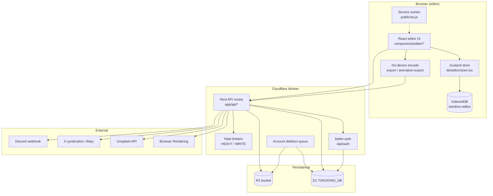
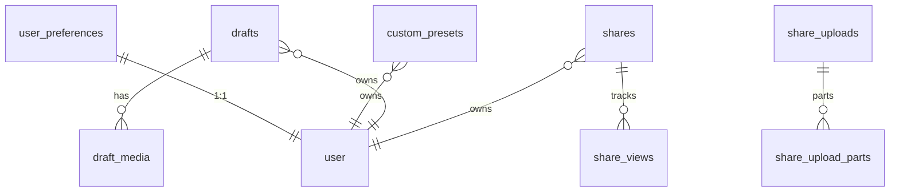
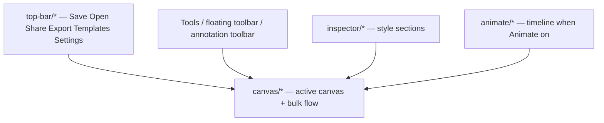
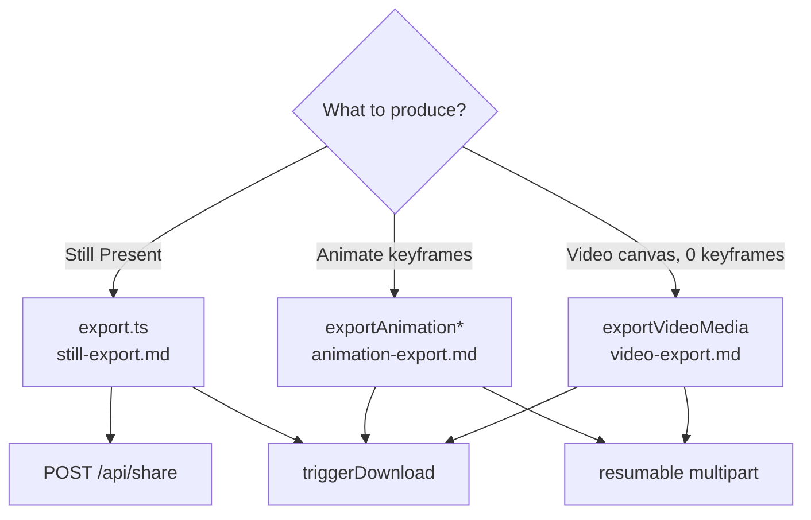

# Full app architecture

Tokokino is a **client-heavy** screenshot mockup editor. Almost all editing, styling, animation playback, and encode run in the browser. The server (Cloudflare Workers via OpenNext) holds auth, metadata (D1), blobs (R2), rate limits, and a few proxy/capture integrations.

This page is the **module map**. Deep pipelines live in the linked docs.

---

## Stack snapshot

| Layer | Choice |
|---|---|
| Framework | Next.js 16 App Router + React 19 |
| Deploy | OpenNext Cloudflare → Workers (`worker.ts` wraps `.open-next/worker.js`) |
| Editor state | Zustand 5 + temporal undo/redo + IndexedDB autosave |
| UI | Tailwind v4 + shadcn/Radix + `@remixicon/react` |
| Auth | better-auth (email + Google) on D1 |
| Metadata | Cloudflare D1 via Drizzle (`lib/db/schema.ts`) |
| Blobs | Cloudflare R2 via AWS S3 SDK |
| Capture | `html-to-image` (stills + animation frames) |
| Video encode | Mediabunny + WebCodecs; dav1d WASM AV1 fallback (Safari) |
| Validation | Zod v4 (`zod/v4`) |
| Motion | `motion/react` |

---

## High-level topology

---

## Directory → responsibility

| Path | Responsibility |
|---|---|
| `app/` | Routes: landing, `/app` editor, share pages, legal, API |
| `components/editor/` | Entire editor shell (top bar, canvas, inspector, animate, mobile) |
| `components/landing/` | Marketing site sections |
| `components/ui/` | shadcn primitives — wrap, don't fork |
| `components/share/` | Public share player |
| `lib/editor/` | Editor domain logic (store, export, playback, presets, templates) |
| `lib/editor/animation-export/` | GIF/WebM/MP4 encode pipelines |
| `lib/editor/store/` | Provider, IDB persistence, defaults, helpers |
| `lib/editor/templates/` | Curated template catalog (repo-baked state) |
| `lib/*-db.ts`, `lib/*-storage.ts` | D1 CRUD + R2 object ops |
| `lib/auth*.ts`, `lib/api-auth.ts` | Auth server/client + session helpers |
| `lib/db/schema.ts` | Drizzle schema for app tables |
| `migrations/` | D1 SQL migrations |
| `hooks/` | Shared React hooks (animation player, floating toolbar) |
| `public/sw.js` | Offline shell service worker |
| `worker.ts` | Worker entry: OpenNext handler + markdown Accept + queue/cron |
| `wrangler.jsonc` | Bindings: D1, browser, ratelimits, queues, assets |
| `tests/` | Vitest unit/integration tests |

---

## Feature map (every major product surface)

```mermaid
flowchart LR
  subgraph Intake["Media intake"]
    Drop["File drop / paste"]
    URL["URL → screenshot"]
    Social["X / Bluesky card"]
    Video["Video / GIF"]
  end

  subgraph Style["Style"]
    BG["Background"]
    FX["Shadow / border / tilt / scale"]
    Frame["Device / browser / glass frame"]
    BD["Backdrop / ASCII / lighting / portrait"]
    OV["Overlay textures"]
  end

  subgraph Layers["Layers"]
    Text["Text"]
    Asset["Assets"]
    Ann["Annotations"]
    Slots["Multi-screenshot slots"]
  end

  subgraph Modes["Modes"]
    Present["Present (still)"]
    Animate["Animate (timeline)"]
    Bulk["Bulk edit"]
    Preview["Preview autoplay"]
  end

  subgraph Out["Output"]
    DL["Download still / anim / video"]
    Share["Public share link"]
    Draft["Cloud draft"]
    Preset["Custom preset"]
    Tpl["Template apply"]
  end

  Intake --> Style
  Style --> Layers
  Layers --> Modes
  Modes --> Out
```

| Feature | Primary code | Wiki |
|---|---|---|
| Editor state & undo | `lib/editor/store.tsx`, `store/*` | [editor-store.md](./editor-store.md) |
| Image onto canvas | `canvas/*`, `image-resize.ts` | [canvas.md](./canvas.md) |
| Video / GIF canvas | `media-type`, `gif-to-video`, `video-*`, control bar | [video-canvas.md](./video-canvas.md) |
| Device / browser / glass frames | `lib/mockups`, `browser-frame.ts`, `glass-frame.ts`, mockup/glass paint | [device-frames.md](./device-frames.md) |
| Styling + paint | `inspector/*`, `css-utils.ts`, `canvas-view.tsx` | [styling-canvas.md](./styling-canvas.md) |
| ASCII backdrops | `ascii-backdrop.ts`, Texture tab | [ascii-backdrop.md](./ascii-backdrop.md) |
| Live preview vars | `live-preview-vars.ts` | [live-preview.md](./live-preview.md) |
| Text / assets / annotations / slots | `text-element*`, `asset-element*`, `annotation*`, slots | [layers.md](./layers.md) |
| Animate playback | `animate/*`, `animation-playback.ts` | [animate-mode.md](./animate-mode.md) |
| Still export | `lib/editor/export.ts` | [still-export.md](./still-export.md) |
| Animation export | `animation-export/*` | [animation-export.md](./animation-export.md) |
| Video-media export + dav1d | `animation-export/video-media/*` | [video-export.md](./video-export.md) |
| Share | `app/api/share/**`, `lib/share*.ts` | [share.md](./share.md) |
| Drafts | `app/api/drafts/**`, `draft-*.ts` | [drafts.md](./drafts.md) |
| Custom presets | `app/api/presets/**`, `preset-db.ts` | [presets.md](./presets.md) |
| Templates | `lib/editor/templates/*` | [templates.md](./templates.md) |
| Auth / account | `lib/auth.ts`, `app/api/account` | [auth-account.md](./auth-account.md) |
| Platform | `worker.ts`, `wrangler.jsonc`, D1/R2 | [platform.md](./platform.md) |
| Unsplash / tweet / capture / proxy | `app/api/{unsplash,tweet,screenshot,export}` | [integrations.md](./integrations.md) |
| Offline (+ dav1d preload) | `lib/offline/*`, `public/sw.js` | [offline.md](./offline.md) |
| Bulk edit / preview | `bulk-canvas-flow.tsx`, preview shell | [bulk-preview.md](./bulk-preview.md) |
| Keyboard shortcuts | `shortcuts.ts`, provider, timeline | [shortcuts.md](./shortcuts.md) |
| Shares gallery | `app/app/shares/*` | [shares-gallery.md](./shares-gallery.md) |
| Web MCP tools | `web-mcp-provider.tsx` | [web-mcp.md](./web-mcp.md) |
| Marketing / SEO | `components/landing/*`, compare, llms.txt | [marketing-site.md](./marketing-site.md) |

---

## Runtime split: client vs server

### Always client (no round-trip)

- Canvas paint, inspector controls, tilt/perspective, layer editing
- Animate timeline scrub + CSS-var playback
- Undo/redo, IndexedDB autosave
- Still capture (`html-to-image`) and all video/GIF encode (WebKit stills settle the FO raster; GIF/mux run in workers)
- Layout/preset geometry math, fonts catalogue

### Server required

| Concern | Why |
|---|---|
| Auth sessions | Cookies + D1 user tables |
| Cloud drafts / presets / shares | Multi-device + public links |
| Draft video media | Large private blobs in R2 |
| Share streaming + views | Public CDN-ish media + analytics |
| Website screenshot | Cloudflare Browser Rendering |
| X / Bluesky fetch | Avoid CORS + normalize APIs |
| Unsplash search/download | API key server-side |
| Export image proxy | CORS for cross-origin assets |
| Account deletion | Queue + R2 cleanup |
| Rate limiting | Workers native limiters |

---

## App routes

| Route | Role |
|---|---|
| `/` | Landing |
| `/app` | Editor (main product) |
| `/app/shares` | User share gallery (auth) |
| `/share/[id]` | Public shared media |
| `/login` | Auth |
| `/changelog`, `/glossary`, `/compare/*`, `/showcase` | Marketing / content — [marketing-site.md](./marketing-site.md) |
| `/privacy`, `/terms`, `/dpa` | Legal — [marketing-site.md](./marketing-site.md) |
| `/api/*` | Backend surface |
| `sitemap.ts`, `robots.ts`, `llms.txt` | SEO / AI crawlers |

---

## API surface (grouped)

| Group | Paths | Auth |
|---|---|---|
| Auth | `/api/auth/[...all]` | better-auth |
| Account | `/api/account`, `/api/preferences` | session |
| Drafts | `/api/drafts/**` | session |
| Presets | `/api/presets/**` | session |
| Share | `/api/share/**`, `/api/share/uploads/**` | create/list = session; media GET = public |
| Capture / social | `/api/screenshot`, `/api/tweet` | public + heavy RL |
| Unsplash | `/api/unsplash/search`, `/download` | public + heavy RL |
| Export proxy | `/api/export/image` | public + heavy RL |
| Templates | `/api/templates/thumb` | maintainer allowlist |
| Feedback | `/api/feedback` | public + heavy RL |
| Internal | `/api/internal/account-deletion/**` | internal / cron |

---

## Data model (app tables)

| Table | Storage | Doc |
|---|---|---|
| `drafts` + R2 JSON/thumb | D1 meta + R2 | [drafts.md](./drafts.md) |
| `draft_media` + R2 video | D1 + R2 | [drafts.md](./drafts.md) |
| `custom_presets` | D1 JSON only | [presets.md](./presets.md) |
| `shares` + R2 media/poster | D1 + R2 | [share.md](./share.md) |
| `share_views` | D1 | [share.md](./share.md) |
| `share_uploads` + parts | D1 + R2 multipart | [share.md](./share.md) |
| `user_preferences` | D1 | [auth-account.md](./auth-account.md) |
| better-auth tables | D1 | [auth-account.md](./auth-account.md) |
| `account_deletions` (+ cleanups) | D1 | [auth-account.md](./auth-account.md) |

Schema source: `lib/db/schema.ts` + `migrations/`.

---

## Editor UI layout

| Shell piece | Path |
|---|---|
| Editor page | `app/app/page.tsx` |
| Store provider | `lib/editor/store/provider.tsx` |
| Top bar | `components/editor/top-bar/` |
| Canvas root | `components/editor/canvas.tsx` → `canvas/canvas-view.tsx` |
| Inspector | `components/editor/inspector.tsx` + `inspector/*` |
| Animate UI | `components/editor/animate/*` |
| Mobile | `components/editor/mobile-controls/*` |
| Bulk edit | `components/editor/bulk-canvas-flow.tsx` |

---

## Encode family (decision tree)

Gate for share path selection: `lib/editor/share-export-choice.ts` — details in [share.md](./share.md) and [core/README.md](./README.md).

### Safari / WebKit

Safari is a supported editor. Encode takes different paths because SVG `foreignObject` and `ctx.filter` are unreliable there:

| Concern | Safari path | Chromium |
|---|---|---|
| Still raster | `settleRasterCanvas` — sample until coverage plateaus | Single `drawImage` |
| Glass frost | Pixel bake (`image-blur.ts`); live `backdrop-filter` stripped | Same bake (FO drops blur in every engine) |
| Animate tilt | Layered underlay / shell / warp; unchanged layers cached | Single-pass FO (`supportsObjectViewBox`) |
| Video decode | WebCodecs + dav1d for rejected AV1 | DOM seek inside FO |
| WebM | UI gated off (`isWebmExportSupported`) | VP9 / VP8 |
| Encode | GIF + mux workers (same as Chromium) | Same workers |

Details: [still-export.md](./still-export.md#webkit-raster-settle), [animation-export.md](./animation-export.md#safari-performance--reuse-layers-that-dont-change), [video-export.md](./video-export.md).

---

## Cross-cutting rules

1. **Selectors only** — components subscribe with `useEditorStore(s => …)`, never the whole store.
2. **Mutations only via actions** — never mutate canvas objects in place outside `set(produce…)`.
3. **Animatable props use `commitCanvasEffect`** — plain `commitCanvas` won't register clip ownership.
4. **Export finds DOM by `data-canvas-id`** — chrome uses `data-export-hidden` / `data-selection-border`.
5. **Zod from `zod/v4`** — numeric ranges in `value-schemas.ts`.
6. **Rate limits fail open in plain `next dev`** — Workers bindings missing locally.
7. **Client encode, server store** — never upload raw editor projects to share; only final blobs.

---

## Related root docs

| File | Role |
|---|---|
| `CLAUDE.md` | Architecture + state shape for agents |
| `agents.md` | Task patterns, checklists (add property, animatable effect, API route) |
| `CONTRIBUTING.md` | Contribution flow |
| `README.md` | Product intro |
