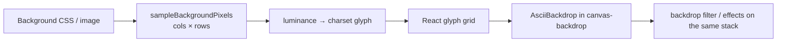

# ASCII backdrops

Turn the canvas background into a glyph grid. ASCII is a **backdrop texture**, not a layer: it samples the committed background (solid, gradient, or image), maps luminance to a character set, and paints a monospace overlay. Pattern textures and ASCII share the Texture control under Backdrop — they are separate tabs, not stacked.

Keyframeable in Animate mode (`ascii` effect). Glass frames frost whatever ASCII is showing through the panes ([device-frames.md](./device-frames.md#glass-frames)).

---

## State

`canvas.backdrop.ascii?: BackdropAscii` (`state-types.ts`). Optional so older drafts hydrate as off.

```ts
BackdropAscii {
  enabled: boolean
  resolution: number            // column count, 20–200 (Zod `asciiResolution`)
  charset: BackdropAsciiCharset // standard | dense | blocks | binary | dots | circles | stars
  colored: boolean              // sample colour from the background vs a solid
  inverted: boolean
  color: string                 // used when colored === false
  opacity: number               // 0–100
}
```

`DEFAULT_BACKDROP_ASCII` in `lib/editor/ascii-backdrop.ts`. `resolveBackdropAscii` clamps resolution/opacity. `isAsciiBackdropActive` is `enabled && background.type !== "none"` — there is nothing to sample on an empty canvas.

Inactive ASCII is still stored so toggling it back on restores the last charset / resolution.

---

## Sampling & paint



| Concern | Behavior |
|---|---|
| Cell aspect | `ASCII_CELL_ASPECT = 0.5` — monospace glyphs are ~2× taller than wide, so the grid keeps the background's aspect |
| Font | `ASCII_FONT_FAMILY` — ui-monospace stack |
| Colour | `colored` samples per-cell RGB from the downsample; otherwise `color` |
| Invert | Flips luminance before charset lookup |
| Opacity | CSS on the overlay (also a live-preview var) |
| Filter | ASCII sits in the backdrop stack, so backdrop grade/filter apply to the glyphs |

The grid is **async**. Changing background, resolution, or charset queues a sample; the last painted grid stays up until the new one commits. `sampleBackgroundPixels` registers every in-flight sample so export can wait.

UI: Texture tab in `inspector/backdrop-section-parts/pattern-control.tsx`. Reset restores `DEFAULT_BACKDROP_ASCII`.

---

## Live preview

Opacity drags write a CSS var **without** a store commit (same pattern as
[live-preview.md](./live-preview.md)); resolution cannot, because changing the
column count changes the glyph grid itself:

| Control | Mechanism |
|---|---|
| Opacity | `--bd-ascii-opacity`, cleared on pointer-up after the commit paints |
| Resolution | `setAsciiResolutionPreview(canvasId, cols)` — the grid resamples for real at the dragged column count |

The resolution preview lives in `ascii-backdrop.ts` (a `Map` keyed by canvas +
`useSyncExternalStore`), not in the editor store, so a drag stays off the undo
stack and re-renders only the ASCII layers. Notifications coalesce to one per
animation frame, and the resample is latest-wins.

It is keyed by canvas so a drag doesn't restyle other canvases in bulk edit;
preset thumbnails resolve their key through `useCanvasSourceId()`, which is how
they track the drag despite mounting under a synthetic scope id.

Earlier revisions faked the preview by scaling the painted grid with a
`--bd-ascii-resolution` var. Don't reintroduce that: a scaled stale grid is
either the wrong glyph density or too small to cover the canvas, and Blink and
WebKit disagreed about which half of the compensating `calc()` applied.

---

## Animate mode

`ascii` is a layered overlay effect, grouped with pattern / overlay (additive crossfade), **and** it rides along when a clip owns `background` or `filter` — an ASCII-only keyframe still inherits the timeline's background so glyphs have something to sample.

```ts
clipOwnsAsciiLayer =
  clipOwns("ascii") || clipOwns("background") || clipOwns("filter")
```

`resolveAnimateAsciiStack` in `animation-playback.ts` returns `{ base, layers[] }`. Each layer carries its own `ascii` + `background` + `filter`. Opacity vars: `--canvas-ascii-op-${clipId}` and `--canvas-ascii-op-base`.

Rules that differ from a plain pattern stack:

- **Reveal each base axis from the clip that owns that axis.** An ASCII-only keyframe must not snap the background; a background keyframe must not snap the charset.
- **ASCII-only keyframes inherit the timeline's background** — never sample mid-animation from a `none` rest.
- **Read the open keyframe's background live**, never a mid-sample leftover, so inspector edits while a clip is selected match playback.

Paint: one `AsciiBackdrop` per stack layer in `canvas-backdrop.tsx`. At rest, only the selected keyframe's layer is opaque (`restOpaque`).

Commit path: `commitCanvasEffect(..., "ascii")` from the backdrop ASCII setter.

---

## Export

Every still / animation / video capture awaits `waitForAsciiBackdrops()` **before cloning**, not before rasterizing. A sample that has settled in JS is still only React state — the helper also waits two animation frames so the glyph grid is in the DOM the exporter reads.

| Rule | Why |
|---|---|
| No deadline | A bounded wait would hand the exporter a half-drawn grid |
| Empty pending set is not "ready" | The tracking handler empties a microtask before `setPixels` paints |
| Skip only if nothing ever sampled | `hasSampled === false` → no glyphs can exist |
| Loop until empty | A settling sample can queue another one |

Glass frost then samples the **painted** ASCII (or the background under it) as the pane underlay.

---

## Template

**ASCII Glass** (`ascii-effect` in `lib/editor/templates/ascii-effect.ts`) pairs Glass Cascade with a binary, inverted ASCII cloud background. Catalog id `ascii-effect`, display name "ASCII Glass". See [templates.md](./templates.md).

---

## Key files

| Path | Role |
|---|---|
| `lib/editor/ascii-backdrop.ts` | Charsets, defaults, sample, wait, live-preview transform |
| `lib/editor/state-types.ts` | `BackdropAscii`, `AnimationEffect` `"ascii"` |
| `lib/editor/animation-playback.ts` | `resolveAnimateAsciiStack`, `asciiDiffer` |
| `components/editor/canvas/ascii-backdrop.tsx` | Glyph grid |
| `components/editor/canvas/canvas-backdrop.tsx` | Stack paint |
| `components/editor/inspector/backdrop-section-parts/pattern-control.tsx` | Texture tab UI |
| `lib/editor/templates/ascii-effect.ts` | ASCII Glass template |
| `tests/lib/editor/ascii-backdrop.test.ts` | Sample wait / paint |
| `tests/lib/editor/animation-ascii.test.ts` | Stack / ownership |
| `tests/lib/editor/animation-ascii-frame.test.ts` | Export frame |
| [styling-canvas.md](./styling-canvas.md) | Backdrop inspector |
| [animate-mode.md](./animate-mode.md) | Effect ownership |
| [still-export.md](./still-export.md) | Clone wait |
