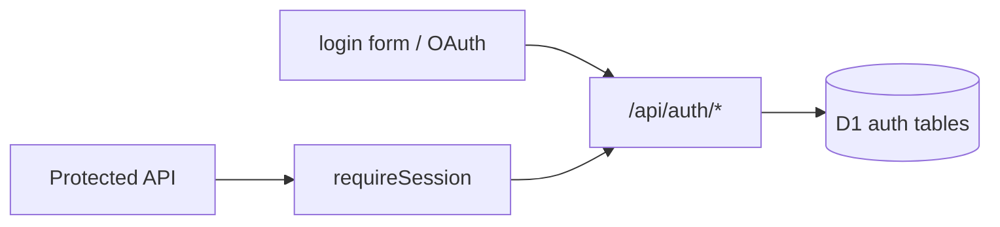
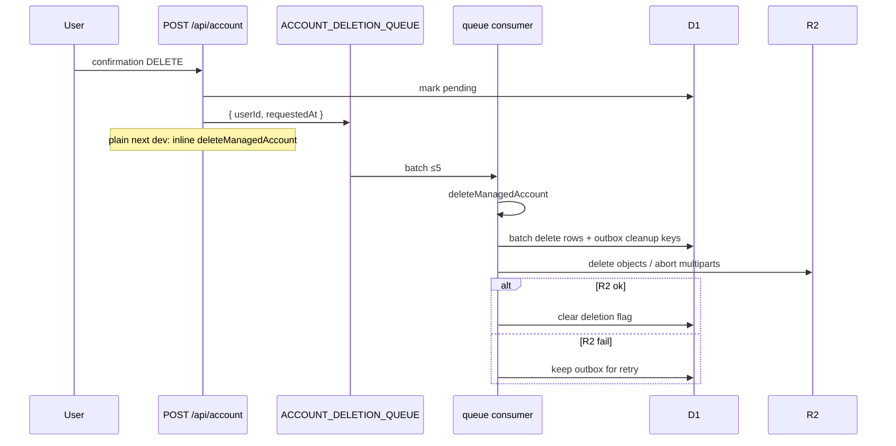

# Auth, sessions, preferences, account deletion

Identity and account lifecycle. Editor work does not require sign-in; cloud drafts, presets, and share **do**.

---

## Auth stack

| Piece | Detail |
|---|---|
| Library | better-auth |
| Adapter | Cloudflare D1 (`getD1Database()`) |
| Providers | Email/password + Google OAuth |
| Cookies | `nextCookies()` plugin |
| Routes | `/api/auth/[...all]` |
| Client | `lib/auth-client.ts` — `useSession`, `signIn`, `signOut` |
| Server | `lib/auth.ts` — `getAuth()` singleton |
| Env | `BETTER_AUTH_SECRET`, `BETTER_AUTH_URL`, optional Google keys |

### Rate limits (better-auth)

Production only; counters in **D1** (not per-isolate memory):

| Path | Window | Max |
|---|---|---|
| Default | 60s | 100 |
| `/sign-in/email` | 60s | 5 |
| `/sign-up/email` | 60s | 5 |
| `/forget-password` | 60s | 3 |
| `/reset-password` | 60s | 5 |

### Session create hook

If `account_deletions` is `pending` or `processing` for the user:

- Email API → `FORBIDDEN`
- OAuth callback → redirect `/login?error=account_deleted`

Terminal `failed` deletions do **not** block login.

---

## API auth helpers (`lib/api-auth.ts`)

| Helper | Behavior |
|---|---|
| `requireSession(request)` | `{ ok, session }` or 401 JSON |
| `assertOwner({ session, ownerId })` | 404 if mismatch (no existence leak) |
| `assertTemplateMaintainer(session)` | email in `TEMPLATE_MAINTAINER_EMAILS` or 403 |

---

## Account API (`/api/account`)

| Method | Action |
|---|---|
| `GET` | List sessions (device/location labels from UA + `cf` geo) |
| Session body | `revoke` one / `revoke-all` others |
| Delete body | `{ confirmation: "DELETE" }` → queue account deletion |

Also triggers best-effort `retryPendingAccountCleanups` on GET.

UI: `components/editor/settings/settings-dialog.tsx`, account avatar menu.

---

## Preferences (`/api/preferences`)

| Field | Purpose |
|---|---|
| `exportFilenameFormat` | Download name template |

| Storage | `user_preferences` D1 table |
| Code | `lib/user-preferences-db.ts`, `lib/schemas/preferences.ts` |

---

## Account deletion

Heavy cleanup runs asynchronously so the delete request returns quickly.

| Module | Role |
|---|---|
| `lib/account-deletion.ts` | Flag status, queue binding, stale listing |
| `lib/account-management.ts` | `deleteManagedAccount`, outbox retry, request entry |
| `app/api/internal/account-deletion/*` | Cron/reconcile endpoints |
| `worker.ts` | Queue consumer + cron trigger (`*/15`) |

### What gets deleted

- D1: drafts, draft_media, custom_presets, shares, share_uploads, preferences, auth user rows (via managed delete path)
- R2: draft JSON/thumbs/media, share objects/posters, incomplete multiparts aborted

D1 and R2 are not transactional — **cleanup outbox** makes R2 deletion durable/idempotent.

Statuses: `pending` → `processing` → cleared, or terminal `failed`.

---

## Unauthenticated vs authenticated UX

| Action | No session | With session |
|---|---|---|
| Edit / export download | ✅ full client | ✅ |
| IndexedDB autosave | ✅ | ✅ |
| Cloud draft / preset / share | Prompt login after `saveCurrentEditorDraft()` | ✅ |
| Share gallery `/app/shares` | Redirect login | ✅ |

`ProtectedTopBarAction` pattern in top-bar flushes local draft before redirecting to login.

---

## Key files

| Path | Role |
|---|---|
| `lib/auth.ts` | Server better-auth instance |
| `lib/auth-client.ts` | Client hooks |
| `lib/api-auth.ts` | Route guards |
| `lib/account-deletion.ts` | Deletion flags + queue |
| `lib/account-management.ts` | Full delete + cleanup retry |
| `lib/user-preferences-db.ts` | Preferences CRUD |
| `app/api/auth/[...all]/route.ts` | Auth handler |
| `app/api/account/route.ts` | Sessions + delete |
| `app/api/preferences/route.ts` | Preferences |
| `app/login/*` | Login UI |
| `app/api/internal/account-deletion/**` | Reconcile |
| `worker.ts` | Queue + cron |
