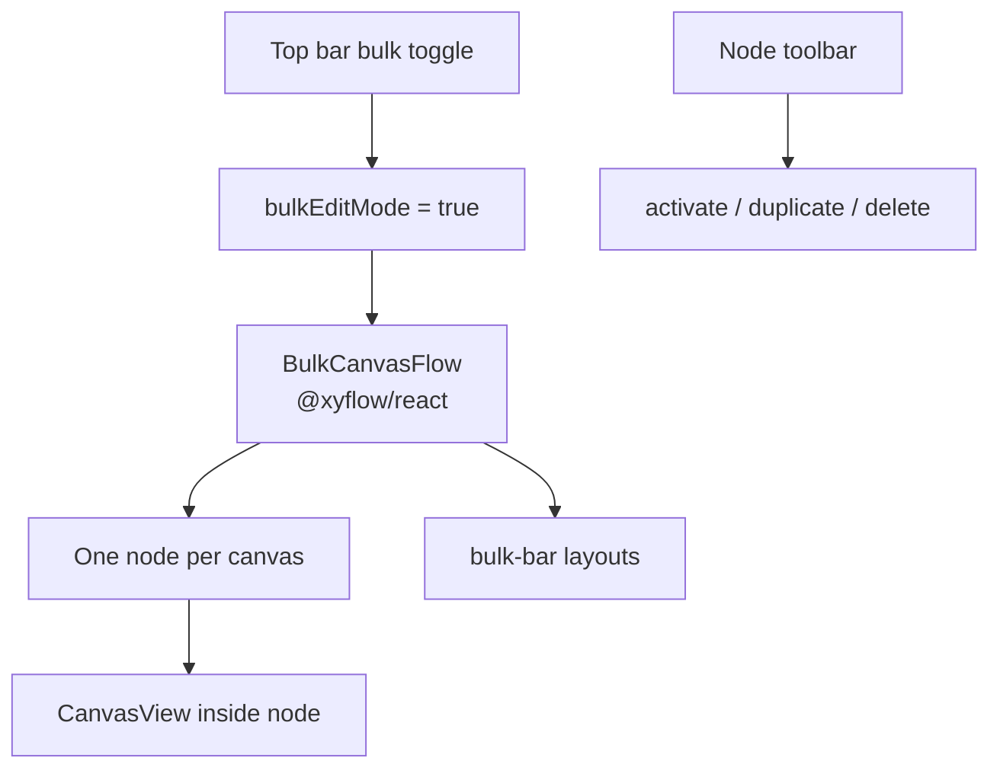
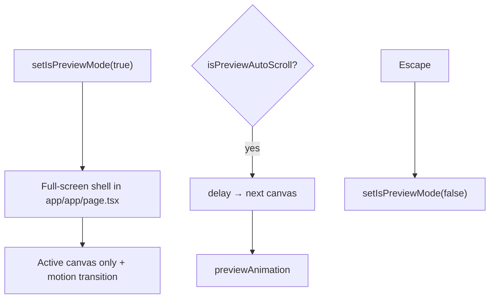

# Bulk edit & preview mode

Two multi-canvas UX modes on top of the same `present.canvases[]` store:

1. **Bulk edit** — infinite canvas of all project canvases (React Flow / `@xyflow/react`)
2. **Preview** — full-screen autoplay presentation of canvases with slide/fade/zoom/flip

Neither changes per-canvas styling model; they change **viewport chrome** and which canvas is active.

---

## Store flags

| Field | Role | Default |
|---|---|---|
| `bulkEditMode` | Show bulk flow vs single canvas | `false` (true when >1 canvas after add) |
| `bulkCanvasDragging` | Drag gesture in progress | `false` |
| `bulkViewportZoom` | React Flow viewport zoom | `1` |
| `isPreviewMode` | Full-screen preview | `false` |
| `isPreviewAutoScroll` | Auto-advance canvases | `false` |
| `previewAutoScrollDelay` | ms between advances | `3000` |
| `previewAnimation` | `slide` \| `fade` \| `zoom` \| `flip` | `slide` |
| `canvas.position` | `{ x, y }` on bulk plane | per canvas |

Actions: `setBulkEditMode`, `setIsPreviewMode`, `setPreviewAnimation`, `setPreviewAutoScrollDelay`, `setCanvasPositions`, `requestBulkFitView`, …

Draft/template UI snapshot can restore bulk/preview prefs ([drafts.md](./drafts.md)).

---

## Bulk edit

### Implementation

| Piece | Path |
|---|---|
| Flow shell | `components/editor/bulk-canvas-flow.tsx` |
| Layout helpers | `floating-toolbar-parts/geometry.ts` (`computeArrangedPositions`, `BulkLayout`) |
| Bulk toolbar | `floating-toolbar-parts/bulk-bar.tsx` |
| Entry | Top bar / overflow — `setBulkEditMode` in `top-bar/index.tsx` |

### Behavior

- Each canvas is a React Flow **node** sized from aspect (`BASE_CANVAS_WIDTH` × height).
- Drag updates `canvas.position` (store); fit-view recenters.
- Node toolbar: activate (set active canvas id), duplicate, delete (with confirm).
- Cap: `MAX_CANVASES` (20) — add button toast when full.
- Bulk bar layouts: row / column / grid / reset positions → `setCanvasPositions` + `requestBulkFitView`.
- Annotation tool mode may hide some bulk chrome (`activeTool === "arrow"`).
- Theme-aware React Flow styles; inverse-zoom scaling so toolbars stay readable when zoomed out.

### When bulk turns on automatically

Store often sets `bulkEditMode: true` when canvas count becomes **> 1** (add/duplicate paths). Explicit toggle can force single-canvas editor even with multiple canvases.

---

## Preview mode

| Piece | Role |
|---|---|
| `app/app/page.tsx` | Preview shell, Escape handler, exit controls |
| `motion/react` | slide / fade / zoom / flip between canvases |
| Top bar / mobile overflow | Enter preview |

Preview is **not** Animate-mode playback — it advances **whole canvases** in the project, not keyframe clips. For timeline preview see [animate-mode.md](./animate-mode.md).

Escape also deselects in normal edit (shared shortcut semantics — [shortcuts.md](./shortcuts.md)).

---

## Interaction with other systems

| System | Bulk / preview note |
|---|---|
| Export / share | Still operate on **active** canvas (or export UI choice) |
| Inspector | Edits active canvas; bulk only changes which is selected |
| Autosave | Positions + bulk/preview flags in UI snapshot |
| Mobile | Bulk/preview entry via overflow menu; flow still desktop-oriented |

---

## Key files

| Path | Role |
|---|---|
| `components/editor/bulk-canvas-flow.tsx` | React Flow multi-canvas |
| `components/editor/floating-toolbar-parts/bulk-bar.tsx` | Arrange layouts |
| `components/editor/floating-toolbar-parts/geometry.ts` | Position math |
| `app/app/page.tsx` | Preview mode shell |
| `lib/editor/store.tsx` | Flags + actions |
| [editor-store.md](./editor-store.md) | Store shape |
| [shortcuts.md](./shortcuts.md) | Escape / history |
