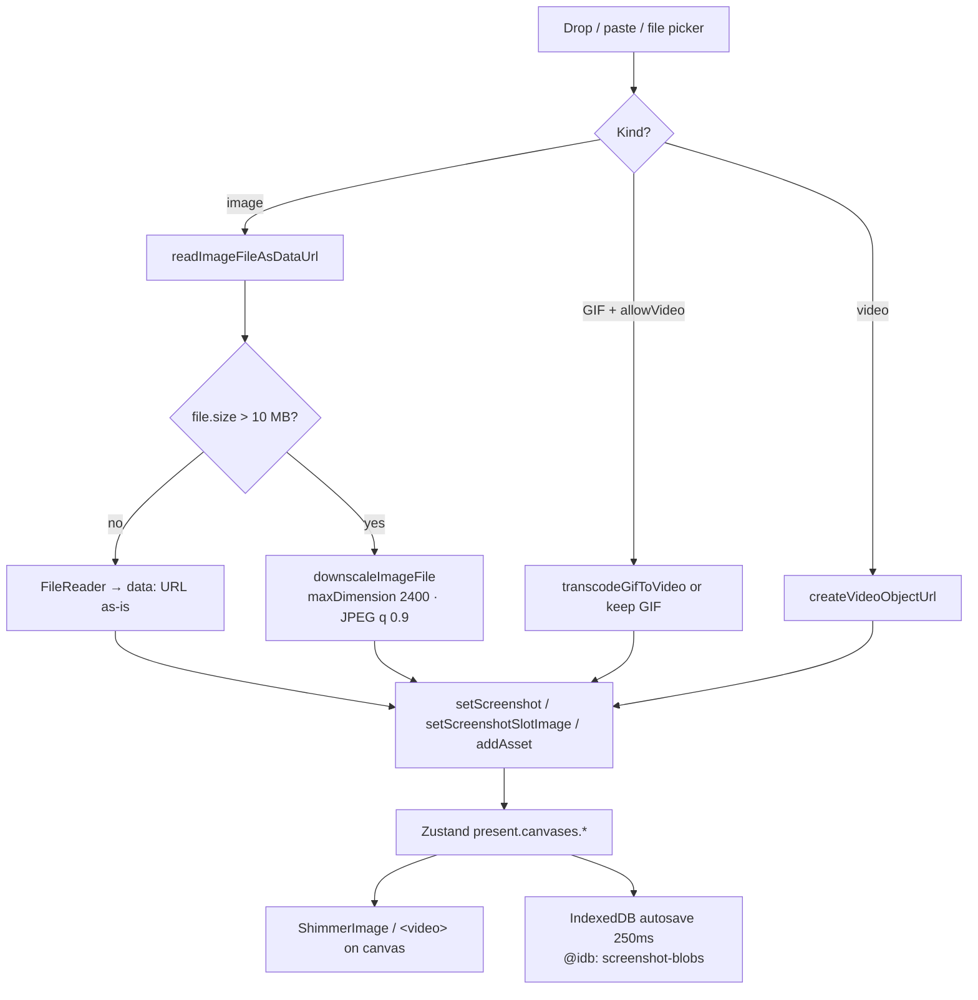
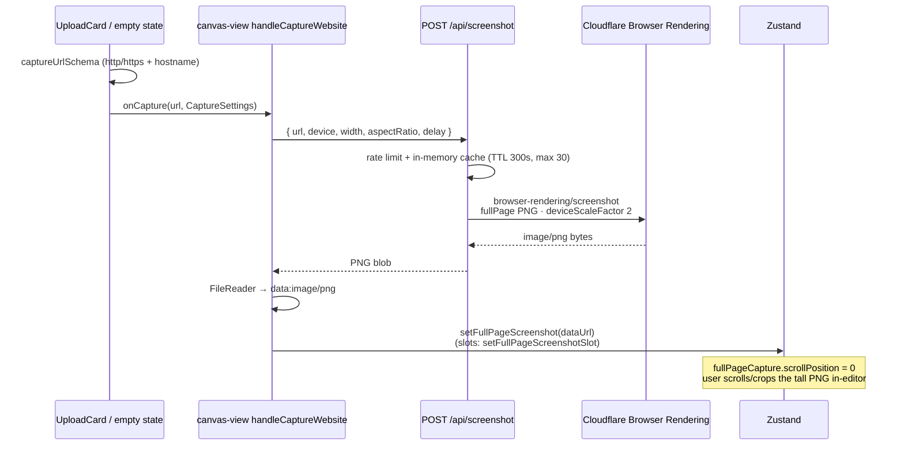
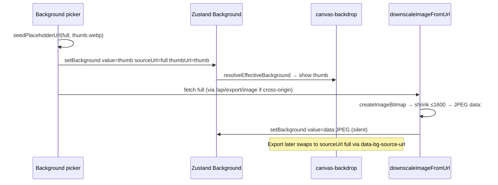
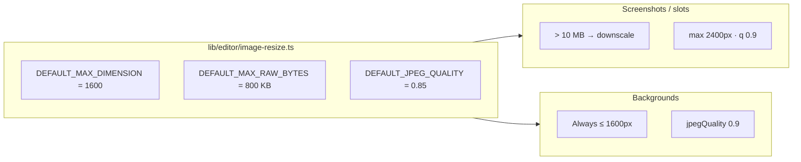
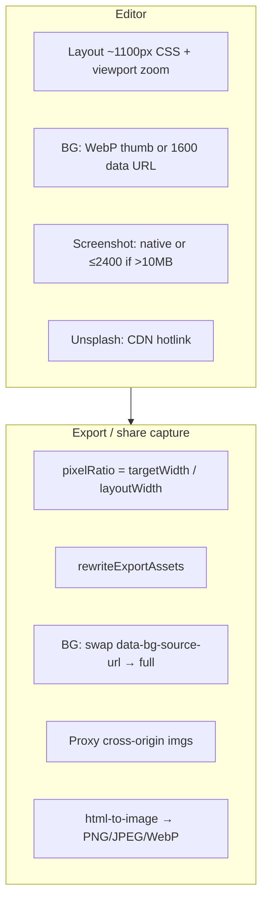

# Canvas image loading

How images get onto the editor canvas: file drop, **URL → screenshot capture**, **X / Bluesky post cards**, background WebP-thumb-first paint, and how oversized uploads are kept from blowing up Zustand / IndexedDB.

Core helpers live in `lib/editor/image-resize.ts`. Website capture goes through `POST /api/screenshot` (Cloudflare Browser Rendering). Social posts go through `GET /api/tweet` into a DOM card. Display uses `ShimmerImage` (bitmaps) or `TweetCardView` (posts); there is no LQIP / blurhash pipeline.

---

## Mental model

| Asset | Edit-time strategy | Why |
|---|---|---|
| **Screenshot / slot (file)** | Pixel-perfect data URL; downscale only if file **> 10 MB** → max **2400px** | Fidelity for the user’s content |
| **Screenshot (URL capture)** | Server PNG via Cloudflare Browser Rendering → `data:` + `fullPageCapture` | Full-page site capture; client never loads the remote DOM |
| **X / Bluesky post** | Structured `TweetCard` DOM mock (not a PNG screenshot) via `/api/tweet` | Faithful post card with theme/metrics; media stays hotlinked |
| **Background (library)** | Paint CDN **WebP thumb** immediately → async client downscale to **1600px JPEG** `data:` | Fast first paint; avoid re-rasterizing 4K on every filter tick |
| **Background (Unsplash)** | Hotlink CDN (`regular`); never convert to `data:` | API compliance |
| **Background (upload)** | Always downscale to **1600px** | User uploads are often huge |
| **Overlay / device mockup** | Picker shows `.webp` thumbs; canvas uses full asset | Separate picker vs paint assets |
| **Asset layers** | Same size gate as screenshots; replace path max **1600px** | Keep project JSON smaller |

Export can upgrade backgrounds from the editor’s downscaled `value` back to full `sourceUrl` — see [Edit vs export](#edit-vs-export).

---

## Drop / upload → canvas



**Entry points**

| Path | File | Limits |
|---|---|---|
| Main canvas drop/paste | `components/editor/canvas/use-image-file-intake.ts` | `SCREENSHOT_DOWNSCALE_THRESHOLD = 10 MB`, max dim **2400** |
| Extra slots | `screenshot-slot-element.tsx` | same 10 MB / 2400 |
| Assets (replace) | `asset-element.tsx` | 10 MB / **1600** |
| Custom background upload | `background-section.tsx` | always downscale @ **1600**, `maxRawBytes: 0` |

Decode tech: `createImageBitmap` → 2D canvas → `toDataURL` (PNG kept when source is PNG; else JPEG). No dedicated image Worker.

---

## URL → screenshot (website capture)

Empty canvas / replace menu accepts an `http(s)` URL. That path does **not** hotlink the remote page — the server renders a PNG, then the client stores it like any other screenshot.



### Entry UI

| Surface | Handler |
|---|---|
| Main empty / mockup empty / replace menu | `handleCaptureWebsite` in `canvas-view.tsx` |
| Extra screenshot slots | `handleSlotCapture` in `screenshot-slot-element.tsx` |
| URL form | `UploadCard` in `upload-card.tsx` (`Capture Screenshot`) |

Settings (`CaptureSettings`): `device` (`desktop` \| `tablet` \| `mobile`), `width`, `aspectRatio`, `delay` (`none` \| `2s` \| `5s`). Device picks UA + viewport touch flags; height is derived from width × aspect.

### API (`app/api/screenshot/route.ts`)

| Piece | Detail |
|---|---|
| Auth | Public, IP rate-limited (`HEAVY_RATE_LIMITER` / `screenshot`) |
| Validation | `captureUrlSchema` — trim, `http:`/`https:`, valid hostname |
| Render | Cloudflare `/browser-rendering/screenshot` |
| Options | `fullPage: true`, `type: "png"`, `deviceScaleFactor: 2`, nav timeout 30s, request timeout 45s |
| Delay | `waitForTimeout` 0 / 2000 / 5000 ms after load |
| Cache | Process memory Map — key = url+device+width+aspect+delay; TTL **300s**; max **30** entries; `X-Screenshot-Cache: HIT\|MISS` |
| Env | `CLOUDFLARE_ACCOUNT_ID`, `CLOUDFLARE_BROWSER_API_TOKEN` (503 if missing) |

### Into the canvas

1. Response blob → `FileReader.readAsDataURL` → `data:image/png;base64,…`
2. Main: `setMainScreenshotImage(dataUrl, true)` → `setFullPageScreenshot` (sets `screenshot` + `fullPageCapture: { scrollPosition: 0 }`)
3. Slot: `setFullPageScreenshotSlot(slotId, dataUrl)` — same full-page semantics
4. Editor can scroll the tall PNG (`setFullPageScreenshotScrollPosition`) and crop later

No client downscale on this path — the PNG is already sized by the capture viewport (`width` ≤ 3840, height from aspect, ×2 DPR). Oversized results still go through normal IDB blob extraction on autosave.

### Demo shortcut

`pickRandomDemoScreenshot()` loads pre-captured R2 PNGs through the same `setFullPageScreenshot` path (`lib/editor/demo-screenshots.ts`).

### URL routing (website vs social)

```mermaid
flowchart TD
  URL["User pastes URL in UploadCard"] --> Parse{"tweetUrlSchema first?"}
  Parse -->|x.com / twitter.com / bsky.app post| Tweet["onLoadTweet → TweetCard<br/>see below"]
  Parse -->|other http(s)| Cap["POST /api/screenshot"]
  Cap --> PNG["PNG data URL"]
  PNG --> FP["setFullPageScreenshot / Slot"]
  Demo["Demo button"] --> FP
  FP --> Paint["ShimmerImage + full-page scroll"]
  Tweet --> Card["TweetCardView DOM on canvas"]
```

X / Bluesky links **never** hit `/api/screenshot` — they become a live post card layer instead of a rasterized page.

---

## X (Twitter) & Bluesky post cards

Not a screenshot. The editor fetches post JSON, normalizes it to `TweetData`, and paints a styled DOM card (`TweetCardView`) on the canvas. Theme, metrics, avatar, images, quote, font are editable after load.

```mermaid
sequenceDiagram
  participant UI as UploadCard
  participant View as canvas-view handleLoadTweet
  participant Client as fetchTweetData
  participant API as GET /api/tweet?url=
  participant X as cdn.syndication.twimg.com
  participant Bsky as public.api.bsky.app

  UI->>UI: tweetUrlSchema → SocialPostRef
  UI->>View: onLoadTweet(url, TweetCardSettings)
  View->>Client: fetchTweetData(url)
  Client->>API: GET /api/tweet?url=…
  API->>API: rate limit + tweetUrlSchema
  alt platform = x
    API->>X: tweet-result?id&token=syndicationToken(id)
    X-->>API: SyndicationTweet JSON
    API->>API: normalize → TweetData source=x
  else platform = bluesky
    API->>Bsky: app.bsky.feed.getPostThread<br/>at://{handle\|did}/app.bsky.feed.post/{rkey}
    Bsky-->>API: thread.post JSON
    API->>API: normalizeBlueskyPost → TweetData source=bluesky
  end
  API-->>Client: { tweet }
  Client-->>View: TweetData
  View->>View: setTweet({ data, …settings })
  Note over View: TweetCardView renders card;<br/>avatar/media stay CDN hotlinks
```

### URL parsing (`lib/editor/tweet-url.ts`)

| Input | Resolves to |
|---|---|
| `https://x.com/{user}/status/{id}` or `twitter.com/…` | `{ platform: "x", id }` |
| Bare numeric id (`^\d{1,20}$`) | `{ platform: "x", id }` |
| `https://bsky.app/profile/{identifier}/post/{rkey}` | `{ platform: "bluesky", identifier, rkey }` |

`syndicationToken(id)` — deterministic token for the public X syndication endpoint (react-tweet style; no OAuth secret).

### API (`GET /api/tweet`)

| Piece | Detail |
|---|---|
| Auth | Public, IP rate-limited (`HEAVY_RATE_LIMITER` / `tweet-fetch`) |
| Query | `?url=` validated by `tweetUrlSchema` |
| X fetch | `https://cdn.syndication.twimg.com/tweet-result?id&token&lang=en` |
| Bluesky fetch | `https://public.api.bsky.app/xrpc/app.bsky.feed.getPostThread` with `at://…` URI, `depth=0` |
| Timeout | 10s per upstream |
| Cache | `Cache-Control: public, max-age=3600, stale-while-revalidate=86400` |
| Errors | 404 unavailable/deleted/private; 502 upstream; 504 timeout |

### Normalization → `TweetData`

Shared shape for both platforms (`lib/editor/state-types.ts`):

```ts
TweetData {
  source: "x" | "bluesky"
  id, url, text, createdAt
  author: { name, handle, avatarUrl, verified }
  media?: TweetMedia[]          // photos
  linkPreview?: TweetLinkPreview
  quotedTweet?: TweetData       // one level deep
  metrics: { likes, replies, reposts, views? }
}
```

Notable transforms:

- **X avatars** — `_normal` → `_400x400` crop  
- **X text** — expand t.co entities; strip trailing media t.co when photos present  
- **X media** — merge `photos` + `mediaDetails` (dedupe by URL)  
- **X cards** — summary/thumbnail bindings → `linkPreview`  
- **Bluesky** — images from embed views; external embed → link preview; nested record → quoted post  

### Onto the canvas

1. `handleLoadTweet` → `setTweet({ data, ...TweetCardSettings })`  
2. Canvas paints `TweetCardView` (not `ShimmerImage` screenshot)  
3. Settings defaults (`DEFAULT_TWEET_SETTINGS`): dark theme, metrics/avatar/images/timestamp/quote on  
4. Inspector `tweet-section.tsx` + replace via `handleReplaceTweet` / `tweet-url-popover.tsx`  
5. Layers panel labels: “X Post” vs “Bluesky Post” from `data.source`  
6. Export still rasterizes the card DOM; remote avatars/media go through `/api/export/image` like other cross-origin imgs  

### Why not `/api/screenshot`?

| | Website capture | X / Bluesky |
|---|---|---|
| Output | Full-page PNG bitmap | Structured JSON → DOM card |
| Editability | Crop / scroll only | Theme, metrics, font, hide images/quote… |
| Source | Cloudflare headless browser | Public syndication / AT Proto APIs |
| Media | Baked into PNG | Hotlinked CDN URLs |

---

## Background progressive load (WebP thumb → optimized)

This is the real “load small WebP first, then the working copy” path.



### `Background` state

| Field | Role |
|---|---|
| `value` | What paints now (thumb, hotlink, or downscaled `data:`) |
| `sourceUrl` | Canonical full URL — export + identity |
| `thumbUrl` | CDN / Unsplash small URL for first paint |

### `resolveEffectiveBackground` (paint order)

In `canvas-backdrop.tsx`:

1. Already `data:` → use as-is  
2. Unsplash → hotlink (never force data URL)  
3. Else if `sourceUrl` + `thumbUrl` → show **thumb** while downscale is in-flight  
4. Else → `remoteImagePreviewUrl(value)` (same-origin proxy; resize query params are currently unused server-side)

On mount/hydration, `canvas-view.tsx` re-runs `downscaleImageFromUrl` for non-Unsplash `sourceUrl` when `value` is not yet `data:`.

### Library vs Unsplash

| Source | Thumb | Full | Edit paint | Export |
|---|---|---|---|---|
| Library (`backgrounds-data.json`) | CDN `.webp` thumb | CDN full | thumb → 1600 `data:` | upgrade to `sourceUrl` |
| Unsplash | `urls.small` | `urls.regular` | hotlink | hotlink via proxy |
| Custom upload | — | — | 1600 `data:` | data URL as painted |

---

## Big-image rules



| Constant | Value | Where |
|---|---|---|
| `DEFAULT_MAX_DIMENSION` | 1600 | `image-resize.ts` |
| `DEFAULT_MAX_RAW_BYTES` | 800 KB | re-encode trigger inside `downscaleImageFile` |
| Screenshot threshold | 10 MB | `use-image-file-intake.ts` |
| Screenshot max dim | 2400 | when threshold hit |
| `BACKGROUND_MAX_DIMENSION` | 1600 | `background-section-parts/constants.ts` |
| GIF transcode max dim | 1600 | `gif-to-video.ts` |
| GIF max frames | 3000 | else keep animated `` |
| Video size limit | 1 GB | draft / intake |
| Export image proxy | 30 MB | `/api/export/image` |
| Editor layout base width | 1100 CSS px | `CANVAS_BASE_W` |
| Export widths | 1920 / 3840 / 7680 | HD / 4K / 8K |

Problems this solves (from `image-resize.ts` header):

1. Huge base64 data URLs bloat Zustand + stall IndexedDB.  
2. Native 4K+ backgrounds re-rasterize on every CSS filter tick and make the editor sluggish.

---

## Other canvas assets

| Asset | Picker | Live canvas |
|---|---|---|
| Overlay textures | `thumbs/NNN.webp` | Full `NNN.png` as CSS `background-image` |
| Device mockups | `…/thumbnails/{id}.webp` | Full `{file}.webp` bezel + screenshot media |
| Asset layers | file → data URL | `ShimmerImage` |
| Videos | object URL / draft media URL | `<video>` (metadata-only until play); GIF may transcode to WebM |

`ShimmerImage` / `ShimmerBox` are CSS load placeholders — not pixel LQIP.

---

## Edit vs export



- **Edit:** paint whatever is in store (often a softer background for speed).  
- **Export:** scale to HD/4K/8K; backgrounds upgrade to full `sourceUrl`; external URLs go through `/api/export/image` for CORS.  
- **Share still:** capture @ 1920; PNG > 4 MB → JPEG quality ladder.  
- **Draft grid thumb:** separate 480px JPEG — not the editor pixels.

Implication: a library background can look soft in-editor (1600 data URL) but sharp on export (full CDN).

---

## IndexedDB / memory

Screenshots, image backgrounds, and slot `src` are extracted out of the draft JSON into the `screenshot-blobs` store (`@idb:` sentinels). See [drafts.md](./drafts.md).

Asset layers currently stay inline as data URLs in JSON — they are the heavier path if many large assets are added.

Object URLs for videos/blobs are tracked in `lib/editor/media-type.ts` (`registerObjectUrl`).

---

## Key files

| Area | Path |
|---|---|
| Resize / caches / placeholders | `lib/editor/image-resize.ts` |
| Drop/paste intake | `components/editor/canvas/use-image-file-intake.ts` |
| URL capture UI | `components/editor/canvas/upload-card.tsx` |
| URL → main screenshot | `canvas-view.tsx` → `handleCaptureWebsite` |
| URL → slot screenshot | `screenshot-slot-element.tsx` → `handleSlotCapture` |
| URL validation (sites) | `lib/editor/capture-url.ts` |
| Server site capture | `app/api/screenshot/route.ts` |
| Demo screenshots | `lib/editor/demo-screenshots.ts` |
| X / Bluesky URL parse | `lib/editor/tweet-url.ts` |
| Client fetch helper | `lib/editor/load-tweet.ts` → `fetchTweetData` |
| Post API | `app/api/tweet/route.ts` |
| Card settings | `lib/editor/tweet-settings.ts` |
| Card render | `components/editor/canvas/tweet-card.tsx` |
| Card inspector | `components/editor/inspector/tweet-section.tsx` |
| Replace URL popover | `components/editor/canvas/tweet-url-popover.tsx` |
| BG progressive select | `components/editor/inspector/background-section.tsx` |
| Paint resolution | `components/editor/canvas/canvas-backdrop.tsx` |
| Hydration downscale | `components/editor/canvas/canvas-view.tsx` |
| Screenshot display | `screenshot-bare.tsx`, `screenshot-mockup.tsx` |
| Shimmer placeholder | `components/ui/shimmer-image.tsx` |
| Overlay / bg library URLs | `lib/editor/presets.ts`, `backgrounds-data.json` |
| Device mockups | `lib/mockups/index.ts` |
| Export rewrite | `lib/editor/export.ts`, `lib/editor/export-assets.ts` |
| CORS proxy | `app/api/export/image/route.ts` |
| IDB blobs | `lib/editor/store/draft-persistence.ts` |

---

## Takeaways

1. **File screenshots stay sharp** until the file is huge (>10 MB).  
2. **URL screenshots** are server-rendered PNGs (Cloudflare Browser Rendering, always full-page) → `data:` + `fullPageCapture` for in-editor scroll/crop.  
3. **X / Bluesky URLs** skip site capture — they load structured post JSON and render an editable `TweetCard` DOM.  
4. **Backgrounds load WebP thumbs first**, then swap to a client-downscaled JPEG for edit performance.  
5. **Export restores full background URLs** so downloads stay high-res.  
6. **Unsplash stays hotlinked** — never forced into `data:`.  
7. **No image Worker / no server-side resize** in the export proxy today (query params are ignored).
