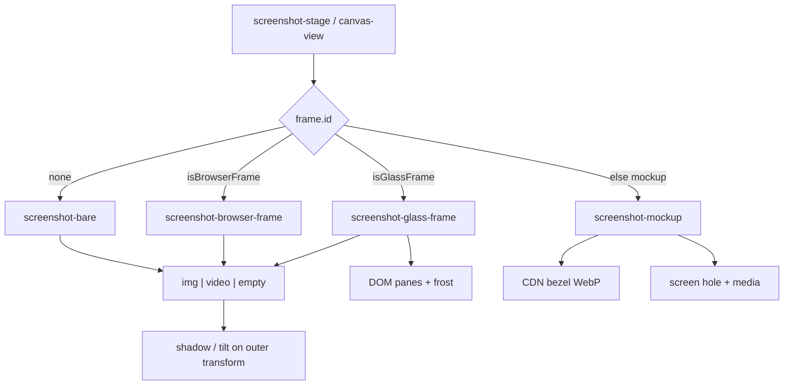
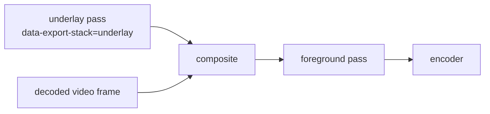

# Device, browser & glass frames

Frames wrap the main screenshot (image, video, or tweet) in device bezels, browser chrome, or glass panes. Device mockup assets are CDN-hosted; geometry (screen hole, radius, scale) is code. Glass and browser chrome are DOM, not WebP. Export must re-project chrome correctly when tilt flattens inside foreignObject — shared with [video-export](./video-export.md) / WebKit layered animate. Glass frost is baked in pixels because `backdrop-filter` does not survive that raster.

---

## Three frame families

| Family | IDs | Assets | State |
|---|---|---|---|
| **None** | `frame.id === "none"` | — | Bare screenshot |
| **Device mockups** | e.g. `iphone_17_pro`, `macbook_pro_14__5th_gen` | WebP bezels on R2 CDN | `DeviceFrame` |
| **Browser chrome** | `browser` (Safari), `chrome`, `arc` | React SVG/components | same `DeviceFrame` + `frameAddress` |
| **Glass** | `glass-card`, `glass-stack`, `glass-stack-2` | DOM panes (`GlassFrame`) | same `DeviceFrame` (`dark` / `light`) |

```ts
DeviceFrame {
  id: string              // "none" | deviceId | browser id | glass id
  color: string           // mockup color variant, or dark/light for browser + glass
  orientation: "vertical" | "horizontal"
}
```

Picker UI: `components/editor/frame-popover.tsx`. Paint: `screenshot-mockup.tsx` vs `screenshot-browser-frame.tsx` vs `screenshot-glass-frame.tsx` (chosen in `canvas-view` / `screenshot-frame-content`).

`isGlassFrame` / `isBrowserFrame` short-circuit mockup lookup — glass and browser IDs are not CDN device files.

---

## Device mockups

### Catalog (`lib/mockups/index.ts`)

```
https://assets.tokokino.com/Device-Mockups/device-mockups/
  {file}.webp                 # full bezel
  thumbnails/{deviceId}.webp  # picker thumb
```

File naming:

```
{deviceId}__{color}_{portrait|landscape}.webp
```

Examples: `iphone_17_pro__deep_blue_portrait.webp`, `macbook_pro_16__5th_gen__silver_landscape.webp`.

Parsed into:

| Type | Fields |
|---|---|
| `DeviceMockup` | `id`, `name`, `thumbnailSrc`, `colors[]`, `orientations[]`, `assets[]` |
| `DeviceMockupAsset` | `deviceId`, `color`, `orientation`, `file`, `src` |

Helpers: `getDeviceMockup`, `getDeviceMockupAsset`, `getDeviceMockupSrc`, `defaultCaptureDeviceForFrame` (maps frame → website-capture device preset: phone → mobile, iPad → tablet, else desktop).

### Screen geometry (`DEVICE_MOCKUP_SPECS`)

Per-device CSS layout of the **screen hole** inside the bezel image:

```ts
{
  aspectRatio: string        // outer mockup box
  screen: {
    aspectRatio: string
    scale: number
    offsetX?: number
    offsetY?: number
    borderRadius: number
  }
}
```

Used by `screenshot-mockup.tsx` + canvas helpers (`mockupScreenTransform`, `mockupScreenClipStyle`, `framePositionedStyle` in `canvas/helpers.ts`). Media (image **or** `<video>`) is clipped/positioned into that hole; enhance/inner lighting overlays sit on the media layer.

| Paint concern | Behavior |
|---|---|
| Image | `ShimmerImage` / object-fit |
| Video | `<video>` + idle poster + registry hook (`onMediaElement`) |
| Desktop mockups | `isDesktopMockup` layout tweaks |
| Live drag | optional `readMainPreviewVars` so slots ignore main's live CSS vars |
| Export stack | shell/chrome participate in `data-export-stack` underlay/media |

---

## Browser frames

Constants: `lib/browser-frame.ts`.

| ID | Name | Colors | Approx size |
|---|---|---|---|
| `browser` | Safari | dark / light | ~1200×700 |
| `chrome` | Chrome | dark / light | ~1200×700 |
| `arc` | Arc | dark / light | ~1200×700 |

UI chrome: `components/ui/safari.tsx`, `chrome.tsx`, `arc.tsx` (+ `browser-frame-media.tsx`).

| Extra state | Role |
|---|---|
| `canvas.frameAddress` | URL string in the address bar (default `your-url.com`) |

Browser frames are **not** device mockup WebPs — they are DOM chrome around the media.

---

## Glass frames

Three DOM-painted looks, catalogued in `lib/glass-frame.ts`. No CDN bezel — each spec is a 1200×750 card with a screen inset and zero or more offset rear panes.

| ID | Name | Rear panes | Color |
|---|---|---|---|
| `glass-card` | Glass Card | 1 (slightly offset) | dark / light |
| `glass-stack` | Glass Cascade | 2 stacked *under* the canvas | dark / light |
| `glass-stack-2` | Glass Crown | 2 stacked *behind / above* the canvas | dark / light |

```ts
GlassFrameSpec {
  id, name
  size: { width: 1200, height: 750 }
  aspectRatio: "1200 / 750"
  screen: GlassFrameRect   // media hole (9px inset, radius 11)
  front: GlassFrameRect    // front pane (radius 20)
  layers: GlassFrameRect[] // offset rear panes (x, y, rotation, radius)
  colors: ["dark", "light"]
}
```

Helpers: `getGlassFrame`, `isGlassFrame`, `resolveGlassFrameColor`, `glassFrameScreenAspect` (crop + layout use the screen hole, not the outer 1200×750).

### Paint

`components/ui/glass-frame.tsx` + `glass-frame-styles.ts` (backdrop blur, corner shape, screen clip). Editor wrapper: `screenshot-glass-frame.tsx`.

| Attribute | Role |
|---|---|
| `data-glass-frame-layer` | Frost panes (`front` / rear). Export bakes blur here. |
| `data-glass-frame-layer="chrome"` | Highlight ring + sheen. Not frosted. |

Live look: translucent gradient + `backdrop-filter: blur(18px) saturate(1.35)` so the background / ASCII / pattern reads through the panes. Rear layers are transformed (offset + slight rotation) and sit behind the screen; the screenshot clips into the front screen hole.

Glass participates in the same outer tilt/scale as mockups. Video clip radius walks up from the `<video>` to the first rounded ancestor (`resolveVideoClipRadius`) so the media corners follow the glass screen, not the square outer shell.

### Export frost

`backdrop-filter` does not survive SVG `foreignObject` in any engine: WebKit drops it, Chromium can spread the blur across the whole backdrop. Still export therefore:

1. **Neutralize** live blur on the clone (`neutralizeUnsupportedExportBackdropFilters`).
2. **Flatten** the chrome inset ring to a border (`flattenGlassChromeRing`) — WebKit floods a sub-pixel inset shadow into a bright corner wedge.
3. **Bake** frost per pane (`bakeGlassFrost`): rasterize what sits *behind* that pane, sample through the pane's transform, blur in `lib/editor/image-blur.ts` (Safari has no `ctx.filter`), and slide the texture under the authored translucent gradient.

"Behind" is per pane, not shared. The front shell frosts the rear panes showing through it; a rear pane frosts only the canvas. One shared underlay left the few pixels of glass around the screen frosting bare background.

Underlays settle with a shorter WebKit budget (`UNDERLAY_SETTLE_MAX_ATTEMPTS = 4`) because they are read through an 18px blur at ≤960px. Details: [still-export.md](./still-export.md#glass-frost).

---

## Aspect compatibility

`lib/editor/frame-aspect-compatibility.ts` warns when canvas aspect and frame shape diverge badly (fit coverage &lt; ~0.42).


Warnings are soft UX (title + description) — rendering still proceeds, frame may look small with empty space.

---

## Paint tree placement



Outer 3D tilt/scale usually wraps the **whole** framed unit (bezel + media), not media alone — so export must either FO-capture the unit (Chromium) or **warp** untransformed textures onto projected quads (WebKit / video-media).

---

## Export: frames + video / tilt

### Still export

`html-to-image` captures the live DOM (bezel img, browser chrome, or glass panes + media). Layout uses pre-transform `offsetWidth` so `cqw`/`cqh` mockup sizing stays correct under viewport zoom. On WebKit the SVG raster is **settled** (sampled until coverage plateaus) so a large screenshot inside glass or a mockup is not dropped mid-decode. Glass frost is baked as pixels before serialization. Details: [still-export.md](./still-export.md).

### Styled video-media (`exportVideoMedia`)

Once-rasterize **underlay** (backdrop + **frame chrome / shadow / plate**) and **foreground** (text, overlays, annotations); blit decoded video into the measured media slot every frame.



- Flat: `region.ts` object-fit rects  
- Tilted: `frame-geometry.ts` projected quads + `warp-gl.ts`  
- Chrome over media: `buildFrameChromeLayer`  
- Stack visibility: `export-stack.ts` (`data-export-stack`)

### Keyframe animation on WebKit

`webkit-layered-frame.ts` reuses the same texture/warp primitives so a tilting device shell does not flatten wrong in FO. Chromium keeps single-pass FO when `supportsObjectViewBox()`.

Details: [video-export.md](./video-export.md), [animation-export.md](./animation-export.md).

---

## Interaction with other features

| Feature | Interaction |
|---|---|
| Website capture | `defaultCaptureDeviceForFrame` seeds mobile/tablet/desktop |
| Layout presets | `portraitDevice` geometry when phone-like frame ([presets / present-presets](./styling-canvas.md)) |
| Multi-slots | Slots can use mockups independently; main frame separate |
| Tweet card | Usually bare, browser, or glass; mockup less common but same frame field |
| Animate | Frame chrome moves with tilt keyframes on the media shell |
| ASCII backdrop | Glass frost samples the ASCII grid behind the panes ([ascii-backdrop.md](./ascii-backdrop.md)) |
| Offline | Bezel WebPs are network assets — not part of offline shell cache. Glass is CSS-only. |

---

## Adding a device mockup

1. Upload bezel WebP(s) to CDN path above with `deviceId__color_orientation.webp` naming.  
2. Add filename(s) to `DEVICE_MOCKUP_FILES`.  
3. Add `DEVICE_MOCKUP_SPECS[deviceId]` screen metrics (measure against asset).  
4. Thumbnail at `thumbnails/{deviceId}.webp`.  
5. Smoke: picker → paint → still export → (if video) video-media export with tilt.

Browser frames: extend `BROWSER_FRAMES` + UI component in `components/ui/`.

Glass frames: add a `GlassFrameSpec` to `GLASS_FRAMES` in `lib/glass-frame.ts`, paint via `components/ui/glass-frame.tsx` (no CDN upload). Measure screen inset against the 1200×750 card. Smoke: picker → live frost over an image *and* ASCII background → still export on Safari and Chrome → video-media export with tilt.

---

## Key files

| Path | Role |
|---|---|
| `lib/mockups/index.ts` | Device catalog, assets, specs, helpers |
| `lib/browser-frame.ts` | Safari/Chrome/Arc constants |
| `lib/glass-frame.ts` | Glass Card / Cascade / Crown specs |
| `lib/editor/image-blur.ts` | Pixel frost (Safari has no `ctx.filter`) |
| `lib/editor/frame-aspect-compatibility.ts` | Aspect warnings |
| `components/editor/frame-popover.tsx` | Frame picker |
| `components/editor/canvas/screenshot-mockup.tsx` | Device paint |
| `components/editor/canvas/screenshot-browser-frame.tsx` | Browser paint |
| `components/editor/canvas/screenshot-glass-frame.tsx` | Glass paint |
| `components/editor/canvas/screenshot-bare.tsx` | No frame |
| `components/editor/canvas/screenshot-frame-content.tsx` | Slot / shared frame dispatch |
| `components/editor/canvas/helpers.ts` | Screen transform / clip math |
| `components/ui/{safari,chrome,arc}.tsx` | Browser chrome |
| `components/ui/glass-frame.tsx` | Glass pane tree |
| `components/ui/glass-frame-styles.ts` | Frost / corner / clip CSS |
| `lib/editor/animation-export/video-media/export-stack.ts` | Capture layer tags |
| `lib/editor/animation-export/video-media/frame-geometry.ts` | 3D projection + glass clip radius |
| `lib/editor/animation-export/video-media/warp-gl.ts` | Perspective warp |
| [still-export.md](./still-export.md) | WebKit settle + glass frost bake |
| [video-canvas.md](./video-canvas.md) | Video inside frames |
| [styling-canvas.md](./styling-canvas.md) | Broader paint pipeline |
