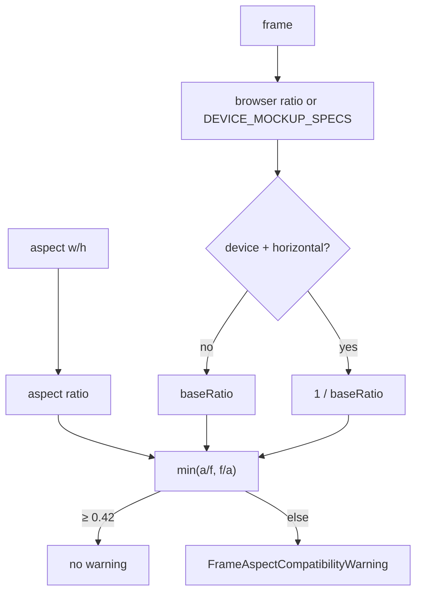
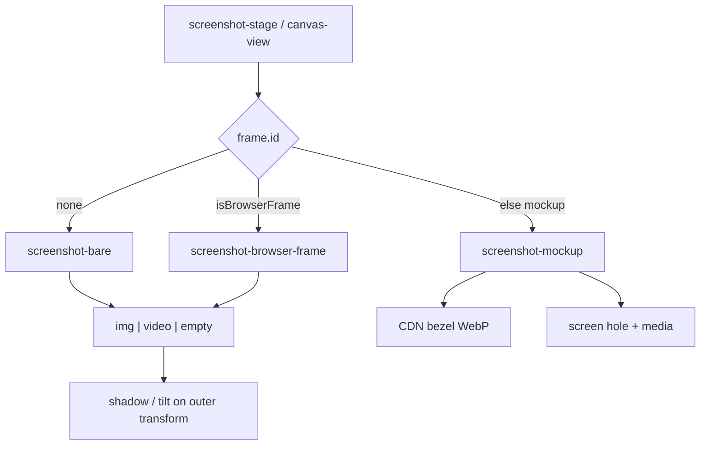
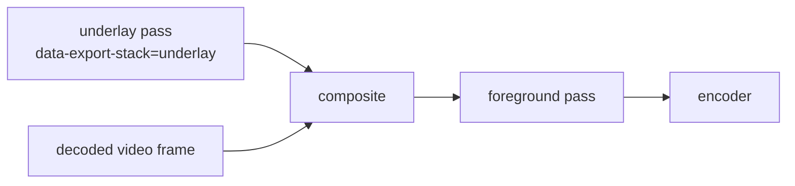

# Device & browser frames

Frames wrap the main screenshot (image, video, or tweet) in device bezels or browser chrome. Assets are CDN-hosted; geometry (screen hole, radius, scale) is code. Export must re-project chrome correctly when tilt flattens inside foreignObject — shared with [video-export](./video-export.md) / WebKit layered animate.

---

## Two frame families

| Family | IDs | Assets | State |
|---|---|---|---|
| **None** | `frame.id === "none"` | — | Bare screenshot |
| **Device mockups** | e.g. `iphone_17_pro`, `macbook_pro_14__5th_gen` | WebP bezels on R2 CDN | `DeviceFrame` |
| **Browser chrome** | `browser` (Safari), `chrome`, `arc` | React SVG/components | same `DeviceFrame` + `frameAddress` |

```ts
DeviceFrame {
  id: string              // "none" | deviceId | browser id
  color: string           // mockup color variant or browser dark/light
  orientation: "vertical" | "horizontal"
}
```

Picker UI: `components/editor/frame-popover.tsx`. Paint: `screenshot-mockup.tsx` vs `screenshot-browser-frame.tsx` (chosen in `canvas-view` / stage).

---

## Device mockups

### Catalog (`lib/mockups/index.ts`)

```
https://assets.tokokino.com/Device-Mockups/device-mockups/
  {file}.webp                 # full bezel
  thumbnails/{deviceId}.webp  # picker thumb
```

File naming:

```
{deviceId}__{color}_{portrait|landscape}.webp
```

Examples: `iphone_17_pro__deep_blue_portrait.webp`, `macbook_pro_16__5th_gen__silver_landscape.webp`.

Parsed into:

| Type | Fields |
|---|---|
| `DeviceMockup` | `id`, `name`, `thumbnailSrc`, `colors[]`, `orientations[]`, `assets[]` |
| `DeviceMockupAsset` | `deviceId`, `color`, `orientation`, `file`, `src` |

Helpers: `getDeviceMockup`, `getDeviceMockupAsset`, `getDeviceMockupSrc`, `defaultCaptureDeviceForFrame` (maps frame → website-capture device preset: phone → mobile, iPad → tablet, else desktop).

### Screen geometry (`DEVICE_MOCKUP_SPECS`)

Per-device CSS layout of the **screen hole** inside the bezel image:

```ts
{
  aspectRatio: string        // outer mockup box
  screen: {
    aspectRatio: string
    scale: number
    offsetX?: number
    offsetY?: number
    borderRadius: number
  }
}
```

Used by `screenshot-mockup.tsx` + canvas helpers (`mockupScreenTransform`, `mockupScreenClipStyle`, `framePositionedStyle` in `canvas/helpers.ts`). Media (image **or** `<video>`) is clipped/positioned into that hole; enhance/inner lighting overlays sit on the media layer.

| Paint concern | Behavior |
|---|---|
| Image | `ShimmerImage` / object-fit |
| Video | `<video>` + idle poster + registry hook (`onMediaElement`) |
| Desktop mockups | `isDesktopMockup` layout tweaks |
| Live drag | optional `readMainPreviewVars` so slots ignore main's live CSS vars |
| Export stack | shell/chrome participate in `data-export-stack` underlay/media |

---

## Browser frames

Constants: `lib/browser-frame.ts`.

| ID | Name | Colors | Approx size |
|---|---|---|---|
| `browser` | Safari | dark / light | ~1200×700 |
| `chrome` | Chrome | dark / light | ~1200×700 |
| `arc` | Arc | dark / light | ~1200×700 |

UI chrome: `components/ui/safari.tsx`, `chrome.tsx`, `arc.tsx` (+ `browser-frame-media.tsx`).

| Extra state | Role |
|---|---|
| `canvas.frameAddress` | URL string in the address bar (default `your-url.com`) |

Browser frames are **not** device mockup WebPs — they are DOM chrome around the media.

---

## Aspect compatibility

`lib/editor/frame-aspect-compatibility.ts` warns when canvas aspect and frame shape diverge badly (fit coverage &lt; ~0.42).



Warnings are soft UX (title + description) — rendering still proceeds, frame may look small with empty space.

---

## Paint tree placement



Outer 3D tilt/scale usually wraps the **whole** framed unit (bezel + media), not media alone — so export must either FO-capture the unit (Chromium) or **warp** untransformed textures onto projected quads (WebKit / video-media).

---

## Export: frames + video / tilt

### Still export

`html-to-image` captures the live DOM (bezel img + media). Layout uses pre-transform `offsetWidth` so `cqw`/`cqh` mockup sizing stays correct under viewport zoom ([still-export.md](./still-export.md)).

### Styled video-media (`exportVideoMedia`)

Once-rasterize **underlay** (backdrop + **frame chrome / shadow / plate**) and **foreground** (text, overlays, annotations); blit decoded video into the measured media slot every frame.



- Flat: `region.ts` object-fit rects  
- Tilted: `frame-geometry.ts` projected quads + `warp-gl.ts`  
- Chrome over media: `buildFrameChromeLayer`  
- Stack visibility: `export-stack.ts` (`data-export-stack`)

### Keyframe animation on WebKit

`webkit-layered-frame.ts` reuses the same texture/warp primitives so a tilting device shell does not flatten wrong in FO. Chromium keeps single-pass FO when `supportsObjectViewBox()`.

Details: [video-export.md](./video-export.md), [animation-export.md](./animation-export.md).

---

## Interaction with other features

| Feature | Interaction |
|---|---|
| Website capture | `defaultCaptureDeviceForFrame` seeds mobile/tablet/desktop |
| Layout presets | `portraitDevice` geometry when phone-like frame ([presets / present-presets](./styling-canvas.md)) |
| Multi-slots | Slots can use mockups independently; main frame separate |
| Tweet card | Usually bare or browser; mockup less common but same frame field |
| Animate | Frame chrome moves with tilt keyframes on the media shell |
| Offline | Bezel WebPs are network assets — not part of offline shell cache |

---

## Adding a device mockup

1. Upload bezel WebP(s) to CDN path above with `deviceId__color_orientation.webp` naming.  
2. Add filename(s) to `DEVICE_MOCKUP_FILES`.  
3. Add `DEVICE_MOCKUP_SPECS[deviceId]` screen metrics (measure against asset).  
4. Thumbnail at `thumbnails/{deviceId}.webp`.  
5. Smoke: picker → paint → still export → (if video) video-media export with tilt.

Browser frames: extend `BROWSER_FRAMES` + UI component in `components/ui/`.

---

## Key files

| Path | Role |
|---|---|
| `lib/mockups/index.ts` | Catalog, assets, specs, helpers |
| `lib/browser-frame.ts` | Safari/Chrome/Arc constants |
| `lib/editor/frame-aspect-compatibility.ts` | Aspect warnings |
| `components/editor/frame-popover.tsx` | Frame picker |
| `components/editor/canvas/screenshot-mockup.tsx` | Device paint |
| `components/editor/canvas/screenshot-browser-frame.tsx` | Browser paint |
| `components/editor/canvas/screenshot-bare.tsx` | No frame |
| `components/editor/canvas/helpers.ts` | Screen transform / clip math |
| `components/ui/{safari,chrome,arc}.tsx` | Browser chrome |
| `lib/editor/animation-export/video-media/export-stack.ts` | Capture layer tags |
| `lib/editor/animation-export/video-media/frame-geometry.ts` | 3D projection |
| `lib/editor/animation-export/video-media/warp-gl.ts` | Perspective warp |
| [video-canvas.md](./video-canvas.md) | Video inside frames |
| [styling-canvas.md](./styling-canvas.md) | Broader paint pipeline |
