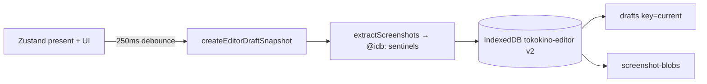
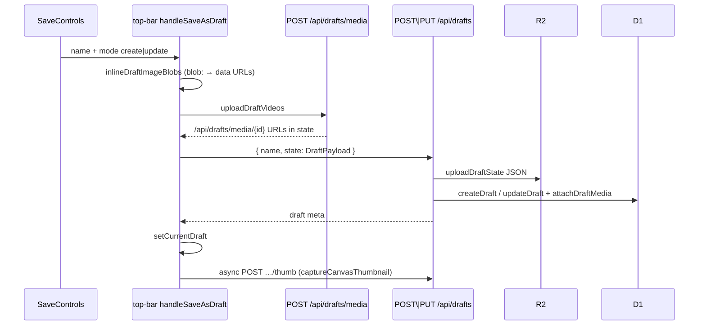
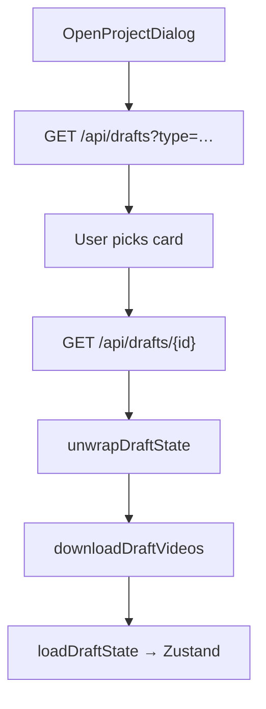

# Drafts (local autosave + cloud save / open)

Drafts keep the full editor project: canvases, screenshots, video media, Animate clips, and UI chrome (active draft, animate mode, preset tabs, etc.).

There are **two layers**:

1. **Local IndexedDB** — always-on autosave (250 ms debounce), no auth required
2. **Cloud drafts** — named projects in D1 + R2, auth required

---

## Entry UI

| Action | Component |
|---|---|
| Save | `SaveControls` / `MobileSaveDialog` → “Save as draft” / “Update …” |
| Name / overwrite | `NameDialog`, `DraftChoiceDialog` (“Update existing” vs “Save as new”) |
| Open | `OpenControls` → `OpenProjectDialog` |
| Orchestration | `components/editor/top-bar/index.tsx` — `handleSaveAsDraft`, `handleOpenDraft` |
| Local autosave | `EditorProvider` in `lib/editor/store/provider.tsx` |

---

## Local autosave (IndexedDB)

| Piece | Detail |
|---|---|
| DB | `tokokino-editor` (v2) |
| Stores | `drafts` (keyPath `id`, key `"current"`), `screenshot-blobs` |
| Helpers | `writeEditorDraft` / `readEditorDraft` / `applyEditorDraft` in `lib/editor/store/draft-persistence.ts` |
| Images | Extracted to Blob store; JSON keeps `@idb:…` sentinels |
| Videos | Stay as IDB blobs (not fully materialized into memory on restore) |
| Flush before login | `saveCurrentEditorDraft()` so auth dialogs don’t lose work |

---

## Cloud draft APIs

| Method | Path | Body | Response |
|---|---|---|---|
| `GET` | `/api/drafts?limit&offset&sort&type` | — | `{ drafts[], total, hasMore, storage }` |
| `POST` | `/api/drafts` | `{ name, state: DraftPayload }` | `{ draft: { id, name, canvasCount, byteSize, type } }` |
| `GET` | `/api/drafts/[id]` | — | `{ draft: { …, state } }` |
| `PUT` | `/api/drafts/[id]` | `{ name?, state }` | updated draft meta |
| `PATCH` | `/api/drafts/[id]` | `{ name }` | rename only |
| `DELETE` | `/api/drafts/[id]` | — | `{ ok: true }` |
| `POST` | `/api/drafts/[id]/thumb` | raw image bytes | thumbnail uploaded |
| `GET` | `/api/drafts/[id]/thumb` | — | JPEG/PNG stream |
| `POST` | `/api/drafts/media` | raw `video/mp4` \| `video/webm` | `{ id, url: "/api/drafts/media/{id}" }` |
| `GET` | `/api/drafts/media/[id]` | — | ranged video stream |
| `POST` | `/api/drafts/media/[id]/copy` | — | copy media for “save as new” |

All require session auth. List filter `type` is `"style" | "video" | "animate"` via `resolveDraftType`.

---

## Storage

**D1 `drafts`:** `id, userId, name, canvasCount, byteSize, type, stateKey, thumbnailKey, createdAt, updatedAt`

**D1 `draft_media`:** `id, userId, draftId?, objectKey, contentType, sizeBytes, …`

**R2 keys:**

| Object | Key |
|---|---|
| Full state JSON | `drafts/{userId}/{id}.json` |
| Thumbnail | `drafts/{userId}/{id}-thumb.jpg` |
| Source video | `drafts/{userId}/media/{id}.mp4\|webm` |

### Budgets

| Limit | Value |
|---|---|
| Per-user draft storage | 1 GB |
| Draft JSON state | 15 MB |
| Thumbnail | 1 MB |
| Source video upload | 1 GB |

---

## Cloud save flow

**Save-as UX branching** (`DraftChoiceDialog`):

- No `currentDraft` → `NameDialog` → `POST /api/drafts`
- Has `currentDraft` → Update (`PUT`) **or** Save as new (`POST`, copies media via `/media/[id]/copy`)

Wire shape: `DraftPayload { schemaVersion: 1, present, ui }` (`lib/schemas/draft.ts`). Helpers: `unwrapDraftState`, `resolveDraftType`.

---

## Open project flow

---

## Draft types

| `type` | Meaning |
|---|---|
| `style` | Still / Present project |
| `video` | Main screenshot is video |
| `animate` | Has animation clips |

Used for Open Project filters and list badges — not a separate save API.

---

## Key files

| Path | Role |
|---|---|
| `lib/editor/store/draft-persistence.ts` | IndexedDB read/write |
| `lib/editor/store/provider.tsx` | Autosave schedule + flush |
| `lib/draft-db.ts` | D1 CRUD |
| `lib/draft-storage.ts` | R2 state / thumb / media |
| `lib/draft-media-upload-client.ts` | Client video/image prep |
| `lib/schemas/draft.ts` | Payload validation + type resolve |
| `app/api/drafts/**` | HTTP routes |
| `components/editor/top-bar/open-project-dialog.tsx` | Open UI |
