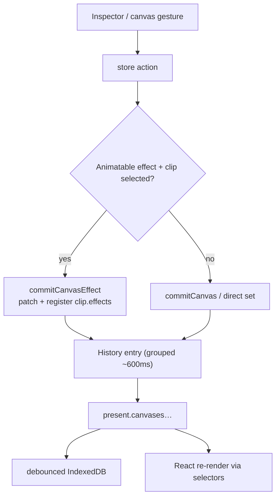
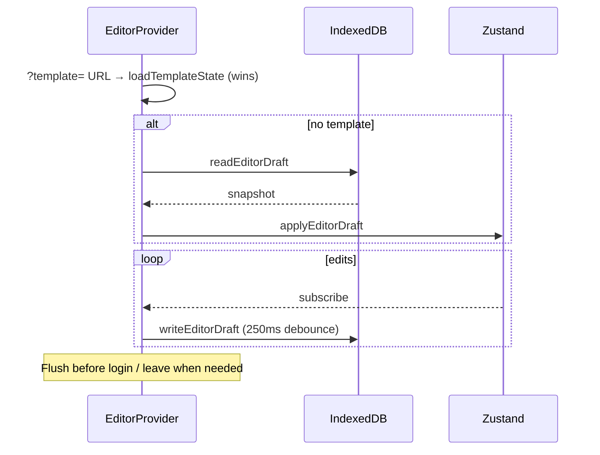

# Editor store (Zustand)

All editor state lives in one Zustand store (`lib/editor/store.tsx`) with temporal-style undo/redo and IndexedDB autosave. The store is the single source of truth for canvases, tools, Animate clips, bulk/preview UI flags, and custom-preset cache.

---

## Shape

```ts
// Conceptual top level (simplified)
{
  // UI outside undoable "present"
  past / present / future   // history of EditorState
  // plus ephemeral UI: selection, drag flags, dialogs, custom presets list, current draft, …

  present: EditorState {
    activeTool, aspect, canvasZoom, annotation,
    canvases: CanvasState[],
    activeCanvasId
  }
}
```

Full types: `lib/editor/state-types.ts`. Defaults: `lib/editor/store/defaults.ts`.

### `CanvasState` (one “card”)

Screenshot box + style + layers + optional animation:

| Group | Fields |
|---|---|
| Identity | `id`, `position` (bulk canvas) |
| Media | `screenshot`, `originalScreenshot`, `lastCropRegion`, `fullPageCapture`, `videoClips`, `objectFit`, `tweet` |
| Box style | `background`, `padding`, `borderRadius`, `canvasBorderRadius`, `border`, `backdrop` |
| Transform | `tilt`, `scale`, `screenshotPosition`, `screenshotOffset`, `screenshotLayer` |
| Effects | `shadow`, `overlay`, `frame`, `portrait`, `enhance`, `mediaAdjustments`, `mediaFilter` |
| Layers | `texts`, `assets`, `annotations`, `annotationShapes`, `screenshotSlots` |
| Misc | `frameAddress`, `aspect?`, `animation?` |

### Limits

| Constant | Value | Where |
|---|---|---|
| `MAX_CANVASES` | 20 | store |
| `MAX_SCREENSHOT_SLOTS` | 3 extra | store |
| History depth | ~100 | temporal middleware |
| Autosave debounce | 250 ms | `draft-persistence.ts` |

---

## Module layout

```
lib/editor/
├── store.tsx              # create store + all EditorActions
├── state-types.ts         # shared types
├── value-schemas.ts       # Zod ranges for inputs
└── store/
    ├── provider.tsx       # EditorProvider — hydrate, autosave, shortcuts, template URL
    ├── draft-persistence.ts
    ├── defaults.ts
    ├── canvas-helpers.ts
    ├── layer-stack.ts
    └── use-editor.tsx     # canvas-scoped hooks
```

---

## Read / write patterns

```ts
// Read — always select
const shadow = useEditorStore(s =>
  s.present.canvases.find(c => c.id === s.present.activeCanvasId)?.shadow
)

// Write — action only
const setShadow = useEditorStore(s => s.setShadow)
setShadow({ type: "drop", intensity: 60 })
```

Multi-field reads: `useShallow` from `zustand/react/shallow`.

Canvas-scoped convenience: `useActiveCanvasField` / helpers in `store/use-editor.tsx` and `CanvasScope` context.

---

## Commit paths



| Helper | Role |
|---|---|
| `commitCanvas` | Patch active (or target) canvas; history |
| `commitCanvasEffect` | Same + mark selected clip as owning effect keys |
| Combined actions | e.g. `setTiltAndScale`, `setScreenshotPlacement` — one undo step |
| History groups | Rapid sequential writes within ~600 ms merge |

**Rule:** if a property should animate in Animate mode, its setter must go through `commitCanvasEffect` with the effect name (see [animate-mode.md](./animate-mode.md)).

---

## Pose helpers (Animate)

| Function | Role |
|---|---|
| `captureClipPose` | Snapshot canvas → `ClipBaseline` when creating/updating a clip |
| `applyPoseToCanvas` | Apply a pose onto canvas fields |
| `resolveKeyframePose` | Resolve baseline/pose for a keyframe |
| `clearAnimationClipEffects` | Revert clip to baseline + clear `effects` |

---

## History & reset

| Action | Behavior |
|---|---|
| `undo` / `redo` | Keyboard `Cmd+Z` / `Cmd+Shift+Z` (provider) |
| `reset` | Defaults — clears project |
| `loadDraftState` / `loadTemplateState` | Replace present (+ UI flags) from payload |

Ephemeral UI (drag flags, selected ids, playhead) is generally **outside** the undoable present or excluded from snapshots carefully.

---

## Provider lifecycle



Also wires global shortcuts (copy canvas as PNG, undo/redo) and template apply toast. Full shortcut catalog: [shortcuts.md](./shortcuts.md). Bulk/preview flags: [bulk-preview.md](./bulk-preview.md).

---

## Key action groups

| Domain | Examples |
|---|---|
| Canvases | `addCanvas`, `removeCanvas`, `duplicateCanvas`, `setActiveCanvasId` |
| Screenshot | `setScreenshot`, `applyCroppedScreenshot`, `setFullPageScreenshot`, slots |
| Style | `setBackground`, `setPadding`, `setBorder`, `setTilt`, `setShadow`, … |
| Layers | `addText`, `updateAsset`, `addAnnotationStroke`, z-order helpers |
| Animation | clip CRUD, `setIsAnimateMode`, duration, easing |
| Bulk / preview | `setBulkEditMode`, `setIsPreviewMode`, preview animation |
| Presets | `setActiveLayoutPresetId`, custom preset cache mutators |
| Draft UI | `setCurrentDraft`, `loadDraftState` |

Full list: `EditorActions` in `store.tsx` (+ `CLAUDE.md` summary).

---

## Persistence boundary

| What | Where |
|---|---|
| Full project autosave | IndexedDB — [drafts.md](./drafts.md) |
| Named cloud projects | D1 + R2 drafts |
| Style-only snapshots | custom presets (no pixels) |
| Curated starters | templates (repo JSON) |

Screenshots/backgrounds are extracted to `screenshot-blobs` on IDB write (`@idb:` sentinels). Videos stay as blobs / draft media URLs.

---

## Key files

| Path | Role |
|---|---|
| `lib/editor/store.tsx` | Store + actions |
| `lib/editor/state-types.ts` | Types |
| `lib/editor/value-schemas.ts` | Input validation ranges |
| `lib/editor/store/provider.tsx` | Mount lifecycle |
| `lib/editor/store/draft-persistence.ts` | IDB |
| `lib/editor/store/defaults.ts` | `DEFAULT_CANVAS_BASE`, defaults |
| `lib/editor/store/layer-stack.ts` | z-index ordering |
| `lib/schemas/draft.ts` | Cloud/local draft payload schema |
