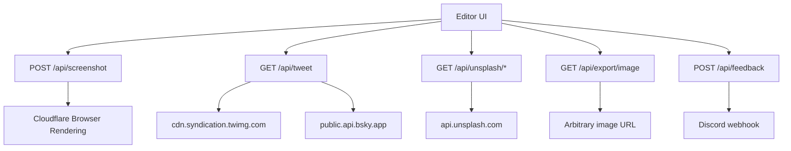

# Integrations — Unsplash, capture, social, proxy, feedback

Server-mediated integrations used by the editor. Rate-limited with `HEAVY_RATE_LIMITER` unless noted. Failures should degrade gracefully when env keys are missing.

---

## Map

Deep image-intake docs: [canvas.md](./canvas.md).

---

## 1. Website screenshot

| | |
|---|---|
| Route | `POST /api/screenshot` |
| Code | `app/api/screenshot/route.ts` |
| Client | `canvas-view` `handleCaptureWebsite`, `capture-url.ts` |
| Env | `CLOUDFLARE_ACCOUNT_ID`, `CLOUDFLARE_BROWSER_API_TOKEN` |

- Public + IP heavy rate limit (`scope: screenshot`).
- fullPage PNG, deviceScaleFactor 2, in-memory cache TTL 300s max 30 entries.
- Settings: device, width, aspect, delay.
- Result → `setFullPageScreenshot` (scrollable tall PNG).

Demo screenshots: `lib/editor/demo-screenshots.ts` (pre-captured R2 PNGs, no API).

---

## 2. X / Bluesky posts

| | |
|---|---|
| Route | `GET /api/tweet?url=` |
| Parse | `lib/editor/tweet-url.ts` |
| Client fetch | `lib/editor/load-tweet.ts` |
| Settings | `lib/editor/tweet-settings.ts` |
| Render | `components/editor/canvas/tweet-card.tsx` |
| Inspector | `inspector/tweet-section.tsx` |

- Not a raster capture — structured JSON → editable `TweetCard` DOM.
- X: syndication endpoint + deterministic token.
- Bluesky: public AT Proto `getPostThread`.
- Cache-Control: 1h + SWR 24h.
- Export rasterizes the card; remote media via image proxy.

---

## 3. Unsplash backgrounds

| | |
|---|---|
| Search | `GET /api/unsplash/search` |
| Download track | `GET /api/unsplash/download` (compliance ping) |
| Client | `lib/editor/unsplash.ts` |
| Schemas | `lib/schemas/unsplash.ts` |
| Env | `UNSPLASH_ACCESS_KEY` |
| UI | `inspector/background-section` image tab |

- Landscape, content_filter high, 12 per page.
- Editor **hotlinks** Unsplash CDN — never forces `data:` URLs ([canvas.md](./canvas.md)).
- Export still uses proxy when needed for CORS.

---

## 4. Export image CORS proxy

| | |
|---|---|
| Route | `/api/export/image` |
| Used by | `rewriteExportAssets`, background downscale, FO capture |
| Schema | `lib/schemas/image-proxy.ts` |
| Limit | ~30 MB body |

Allows `html-to-image` to paint cross-origin assets without tainting the canvas. Query resize params may be present but server-side resize is not the primary path today (client downscales for edit).

---

## 5. Feedback

| | |
|---|---|
| Route | `POST /api/feedback` |
| Body | optional `rating` 1–5 + optional `message` ≤2000 |
| Env | `FEEDBACK_DISCORD_WEBHOOK_URL` |
| RL | heavy / IP |

If webhook unset: accept silently (dev/self-host). Session optional for attribution when present.

---

## 6. Other external touches

| Integration | Where | Notes |
|---|---|---|
| Google OAuth | better-auth | [auth-account.md](./auth-account.md) |
| Google Fonts | `lib/editor/fonts.ts` | Client load in editor |
| Device mockups CDN | `lib/mockups/index.ts` | `assets.tokokino.com` |
| Background/overlay packs | `presets.ts`, build scripts | thumbs via `pnpm build:thumbs` / `build:backgrounds` |
| Sentry | instrumentation files | Optional error reporting |
| Web MCP | `web-mcp-provider.tsx` | Browser agent tools — [web-mcp.md](./web-mcp.md) |
| Landing / SEO | `components/landing/*`, llms.txt | [marketing-site.md](./marketing-site.md) |

---

## Rate limit scopes (examples)

| Scope | Limiter |
|---|---|
| `screenshot` | HEAVY |
| `tweet-fetch` | HEAVY |
| `unsplash-search` | HEAVY |
| `feedback` | HEAVY |
| export image | HEAVY |

See [platform.md](./platform.md) for binding limits (30/60s heavy, 60/60s write).

---

## Key files

| Path | Role |
|---|---|
| `app/api/screenshot/route.ts` | Site capture |
| `app/api/tweet/route.ts` | Social post JSON |
| `app/api/unsplash/**` | Background search |
| `app/api/export/image/route.ts` | CORS proxy |
| `app/api/feedback/route.ts` | Feedback |
| `lib/editor/capture-url.ts` | URL validation |
| `lib/editor/tweet-url.ts` / `load-tweet.ts` | Social client |
| `lib/editor/unsplash.ts` | Unsplash client |
| `lib/editor/export-assets.ts` | Proxy rewrite |
| `lib/rate-limit.ts` | Enforcement |
