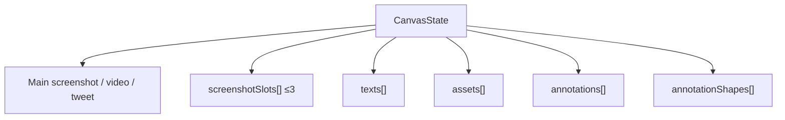
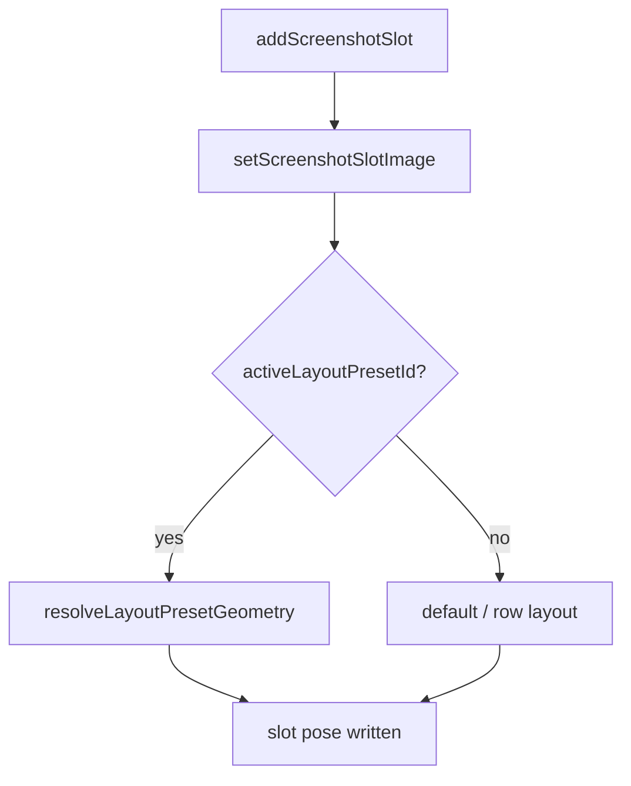

# Layers — text, assets, annotations, multi-screenshot

Beyond the main screenshot, each canvas holds free-floating layers and optional extra screenshot slots. All are pure client state on `CanvasState`.

---

## Layer kinds



Z-order helpers: `bring*ToFront` / `send*ToBack` via `lib/editor/store/layer-stack.ts`. Layers popover: `layers-popover.tsx`.

---

## Text (`TextElement`)

Free-floating type, positioned by `%` of canvas.

| Fields (highlights) | |
|---|---|
| Position | `xPct`, `yPct`, `rotation` |
| Type | `content`, `fontSize`, `fontFamily`, `fontWeight`, `lineHeight`, `letterSpacing`, `align` |
| Color | `color`, `autoColor`, stroke, `textShadow` |
| Box | `widthPx`, `heightPx`, border |
| Layer | `zIndex`, `opacity`, `blendMode`, `hidden` |

| Code | Role |
|---|---|
| `components/editor/text-element.tsx` | Render + drag |
| `text-element-parts/*` | Subcomponents |
| `text-toolbar.tsx` | Floating type controls |
| `font-family-picker-list.tsx` | Font list UI |
| `lib/editor/fonts.ts` | Google Fonts catalogue (100+) |

Actions: `addText`, `updateText`, `deleteText`, `duplicateText`, selection id on store.

---

## Assets (`AssetElement`)

Image/SVG layers (stickers, logos).

| Fields | |
|---|---|
| Media | `src`, `widthPct`, `heightPct`, `flipX/Y` |
| Pose | `xPct`, `yPct`, `rotation` |
| Look | `filter` (`AssetFilter`), `blendMode`, `opacity`, `hidden`, `zIndex` |

| Code | Role |
|---|---|
| `asset-element.tsx` | Render + replace (downscale max 1600) |
| Store | `addAsset`, `updateAsset`, `deleteAsset`, `duplicateAsset` |

Filters: `assetFilterCss` in `css-utils.ts` (`none`, `bw`, `sepia`, `vintage`, …).

### 3D shapes

The shapes library is an asset source, not a layer kind — picking one calls `addAsset`, so a shape moves, scales, rotates, filters, and reorders exactly like any other image layer.

| Piece | Path |
|---|---|
| Manifest (106 entries: `id`, `name`, `full`, `thumb`, `width`, `height`, `bytes`) | `lib/editor/shapes-data.json` |
| Picker UI | `components/editor/inspector/shapes-section.tsx` |
| Manifest/thumb build | `scripts/build-shapes.mjs` → `pnpm build:shapes` |

Assets are served from the CDN (`assets.tokokino.com/Shapes/…`), so they go through the export image proxy like any other remote image.

---

## Annotations

Two representations:

1. **Strokes** — freehand / pen paths (`AnnotationStroke`)
2. **Shapes** — arrow, rect, ellipse, etc. (`AnnotationShape`)

### Tool state (`Annotation` on editor present)

Mode, color, width, line style, blur effect — global tool settings, not per-shape until drawn.

| Mode examples | `AnnotationMode` |
|---|---|
| pen, highlighter, arrow, rect, ellipse, … | `state-types.ts` |

| Code | Role |
|---|---|
| `annotation-toolbar.tsx` | Tool chrome |
| `canvas/annotation-layer.tsx` | Paint layer |
| `canvas/use-annotation-interactions.ts` | Pointer → stroke/shape |
| `annotation-shape/*` | Shape elements + hit testing |
| `annotation-shape-element.tsx` | Bridge |

Actions: `setAnnotation`, `addAnnotationStroke`, `updateAnnotationStroke`, `deleteAnnotationStroke`, shape CRUD, `clearAnnotations`.

Annotations export as part of the canvas DOM (no separate server path).

---

## Multi-screenshot slots (`ScreenshotSlot`)

Up to **3** extra screenshots floating on the canvas.

```ts
{
  id, src,
  xPct, yPct, widthPct, heightPct,
  rotation, tilt, scale, zIndex,
  filter, hidden?, objectFit?,
  // + optional shadow / border fields used by animate poses
}
```



| Code | Role |
|---|---|
| `screenshot-slot-element.tsx` | Render, capture URL, replace |
| `screenshot-layout.ts` | `computeRowLayout` |
| `present-presets.ts` | `LAYOUT_PRESETS` |
| `preset-geometry.ts` | Portrait device overrides |

Slot image intake shares the 10 MB / 2400px gate with main screenshots ([canvas.md](./canvas.md)).

Animate: slots can own tilt/zoom/shadow tracks when targeted — [animate-mode.md](./animate-mode.md).

---

## Floating toolbars

| Toolbar | Target |
|---|---|
| `floating-toolbar.tsx` | Selection context (screenshot/asset/…) |
| `text-toolbar.tsx` | Active text |
| `annotation-toolbar.tsx` | Annotation tools |
| `hooks/use-floating-toolbar-rect.ts` | Positioning |

---

## Crop

| Piece | Role |
|---|---|
| `crop-modal.tsx` | UI |
| `lib/editor/crop-utils.ts` | Math + `supportsObjectViewBox` |
| Store | `applyCroppedScreenshot`, `lastCropRegion`, video crop animate |

Full-page website captures use `fullPageCapture.scrollPosition` before crop.

---

## Key files

| Path | Role |
|---|---|
| `lib/editor/state-types.ts` | Layer type defs |
| `lib/editor/store/layer-stack.ts` | z-order |
| `lib/editor/fonts.ts` | Font catalogue |
| `components/editor/text-element*.tsx` | Text |
| `components/editor/asset-element.tsx` | Assets |
| `components/editor/annotation*.tsx` | Annotations |
| `components/editor/screenshot-slot-element.tsx` | Slots |
| `lib/editor/screenshot-layout.ts` | Multi layout math |
