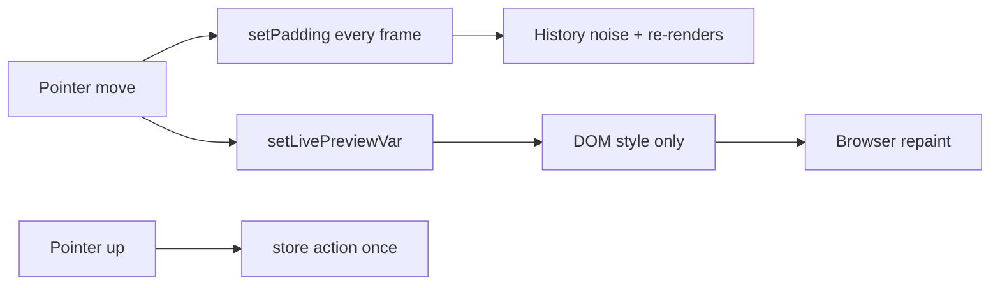
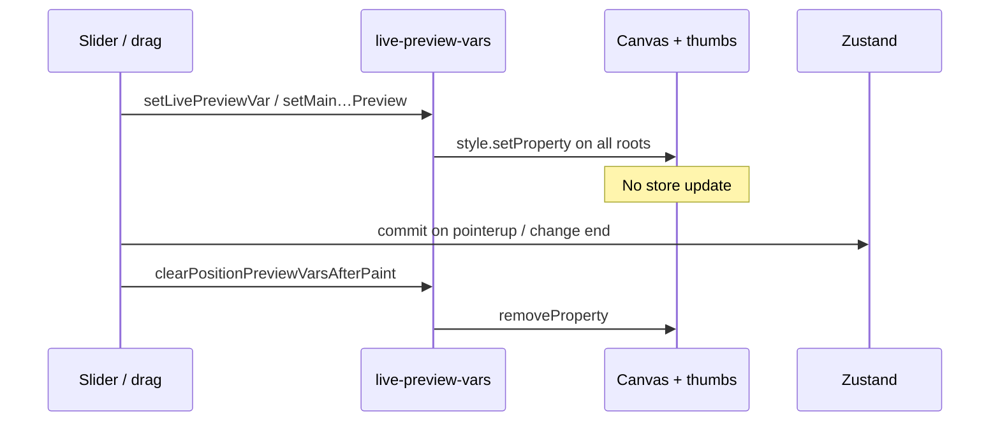

# Live preview CSS variables

While a slider or drag is in flight, the editor writes **CSS custom properties** on the canvas (and preset thumbnails) so paint updates **without a React re-render / store commit** on every pointer move. On release, the committed value goes through the Zustand action (and undo history).

This is separate from Animate-mode `--anim-*` vars ([animate-mode.md](./animate-mode.md)), which sample the timeline.

**Module:** `lib/editor/live-preview-vars.ts`

---

## Why

Preset thumbnails mirror the active canvas under synthetic roots. Writing vars only on the real `data-canvas-id` left thumbs frozen mid-drag. Live preview **fans out** to every registered root.

---

## Root fan-out

| Piece | Role |
|---|---|
| `LIVE_PREVIEW_ROOT_ATTR` (`data-live-preview-root`) | Marks a DOM root that mirrors a canvas |
| `livePreviewRoots(canvasId)` | Real canvas + all preview stages for that id |
| `setLivePreviewVar(canvasId, name, value)` | Set var on every root |

A preview that pins its own tilt (thumbnail showcase) sets the var on its stage element; inheritance loses to the more specific local value — intentional so canvas drag doesn't override a pinned preset pose.

---

## Variable families

### Generic slider previews

Examples (written by inspector sliders / elastic controls):

- `--editor-padding-preview`
- `--bd-ascii-opacity` — fade the painted ASCII grid while dragging. Resolution is the exception to this whole mechanism: it resamples the grid instead of scaling it ([ascii-backdrop.md](./ascii-backdrop.md#live-preview))
- Shadow / border / scale related preview vars (see call sites in inspector sections)

Pattern: read in canvas components as `var(--editor-…-preview, <committed>)` or apply only while dragging.

### Media colour grade

| Constant | Purpose |
|---|---|
| `MAIN_MEDIA_FX_PREVIEW_VAR` | Filter chain on the main screenshot/video |
| `slotMediaFxPreviewVar(slotId)` | Filter chain on one screenshot slot |

One var **per screenshot box**, not one canvas-wide var: the grade sliders honour
the current selection (a slot, the main screenshot, or all of them), so a shared
var would preview an edit on boxes the commit will not touch. `buildScreenshotImageStyle`
emits `filter: var(<box var>, <committed chain>)`; the fallback is deliberately
empty rather than `none`, because the same string is concatenated after a
`drop-shadow()` list for framed screenshots (where `none` would invalidate the
declaration) and any non-`none` identity would flatten the screenshot's 3D tilt.

### Main screenshot position

| Constant | Purpose |
|---|---|
| `POSITION_X_VAR` / `POSITION_Y_VAR` | Element position previews |
| `MAIN_POSITION_*` / `MAIN_ANCHOR_*` / `MAIN_OFFSET_*` | Main framed placement during pad drag |
| `MAIN_BARE_LEFT_VAR` / `MAIN_BARE_TOP_VAR` | Bare (unframed) pixel placement |

| API | Role |
|---|---|
| `setMainScreenshotPositionPreview` | Framed main drag |
| `setMainScreenshotBarePreviewPx` | Bare main drag |
| `setElementLivePosition` / `clearElementLivePosition` | Per-layer ids (text/assets) |
| `setElementPositionPreview` | Generic element |
| `clearPositionPreviewVars` | Immediate clear |
| `clearPositionPreviewVarsAfterPaint` | Clear after next paint (avoid one-frame flash) |
| `afterPositionPreviewCleared` | Schedule work after clear |

`POSITION_PREVIEW_VARS` lists the set cleared together.

---

## Lifecycle

Animate playback **suppresses** transform transitions and drives a different var set via `applyAnimationFrameAtTime` — do not mix the two systems for the same property in the same frame without clearing.

Mockups: slots set `readMainPreviewVars={false}` so main screenshot live-drag vars don't move slot media ([device-frames.md](./device-frames.md)).

---

## Related patterns

| Pattern | Module |
|---|---|
| Animate playback vars | `apply-animation-frame.ts`, `animation-layer.tsx` |
| Suppress transition during scrub | `animation-layer`, `use-suppress-transition-on-change` |
| Export | Ignores preview vars; committed styles only |

---

## Key files

| Path | Role |
|---|---|
| `lib/editor/live-preview-vars.ts` | All preview var APIs |
| `components/editor/inspector/*` | Slider write sites |
| `components/editor/canvas/*` | CSS `var(--…)` consumers |
| `components/editor/present-presets-section/*` | Preview stages / thumbs |
| [animate-mode.md](./animate-mode.md) | Timeline vars (different system) |
| [styling-canvas.md](./styling-canvas.md) | Committed paint path |
