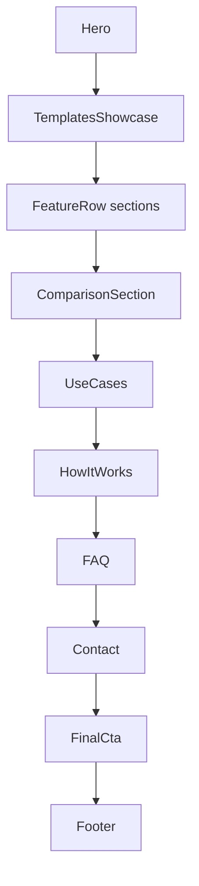
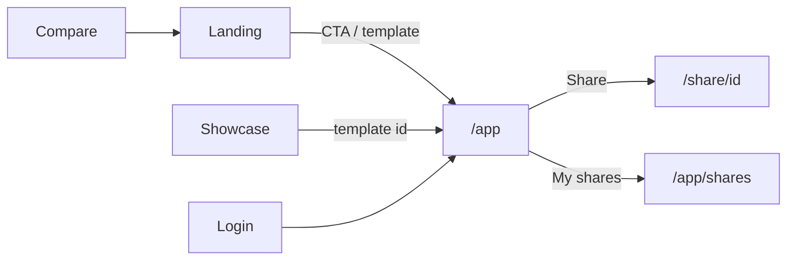

# Marketing & public content site

Public, mostly static App Router pages outside the editor. Shared visual language: dashed rails (`rail-styles.ts`), `Nav` / `Footer`, `DashedH` section breaks. Product engineering lives under `/app`; these routes are SEO, conversion, and legal.

---

## Route map

| Path | Purpose | Primary code |
|---|---|---|
| `/` | Landing | `app/page.tsx` → `landing-page-client.tsx` |
| `/showcase` | Template gallery (marketing) | `app/showcase/page.tsx` |
| `/compare` | Comparison index | `app/compare/page.tsx` |
| `/compare/[slug]` | Competitor page | `app/compare/[slug]/page.tsx` + `lib/compare/comparisons.ts` |
| `/glossary` | Feature glossary | `app/glossary/*` |
| `/changelog` | Release notes | `app/changelog/*` |
| `/privacy` | Privacy policy | `app/privacy/*` |
| `/terms` | Terms | `app/terms/*` |
| `/dpa` | DPA | `app/dpa/*` |
| `/login` | Auth | `app/login/*` — [auth-account.md](./auth-account.md) |
| `/share/[id]` | Public share | [share.md](./share.md) |
| `/app`, `/app/shares` | Product | editor / [shares-gallery.md](./shares-gallery.md) |

### Discovery / AI / SEO

| Path | Role |
|---|---|
| `sitemap.ts` | Indexable routes + landing hashes |
| `robots.ts` | Crawler rules |
| `/llms.txt` | Markdown product summary for LLM crawlers |
| `/auth.md` | Auth discovery for agents |
| `worker.ts` | `Accept: text/markdown` on `/` and `/share/{id}` |

---

## Landing (`/`)



| Component | Role |
|---|---|
| `nav.tsx` | Site nav + editor CTA |
| `hero.tsx` | Primary pitch |
| `templates-showcase.tsx` | Template marquee → `/app?template=` or showcase |
| `feature-row.tsx` | Capability rows |
| `comparison-section.tsx` | High-level vs competitors |
| `use-cases-section.tsx` | Personas |
| `how-it-works.tsx` | Steps |
| `faq.tsx` | FAQ |
| `contact-section.tsx` | Contact |
| `final-cta.tsx` | Bottom convert |
| `footer.tsx` | Links |
| `flickering-grid` | Background texture |
| `motion/react` | Entrance (respects `useReducedMotion`) |

Constants / easing: `components/landing/constants.ts`. Section anchors appear in sitemap (`/#features`, `/#templates`, …).

---

## Showcase (`/showcase`)

Browse ready-made templates with marketing chrome; selecting one opens the editor (same catalog as in-app Templates — [templates.md](./templates.md)). Uses `ShowcaseGrid` + shared Nav/Footer rails.

---

## Compare

Data-driven pages from `lib/compare/comparisons.ts`:

```ts
Comparison {
  slug, competitor, summary, eyebrow,
  metaTitle, metaDescription,
  intro[], rows[{ feature, tokokino, competitor }],
  pickTokokino[], pickCompetitor[]
}
```

| Detail | Notes |
|---|---|
| Checked-at stamp | `COMPARISONS_CHECKED_AT` (e.g. July 2026) — bump when claims re-verified |
| Pricing | Prefer free vs paid framing, not hard prices (competitors change) |
| Index | Lists all slugs; detail page renders feature matrix |

Known slugs (sitemap): `tokokino-vs-postspark`, `tokokino-vs-pika`, `tokokino-vs-shots-so`, `tokokino-vs-canva`.

---

## Glossary & changelog

Content-heavy index pages (`glossary-index.tsx`, `changelog-index.tsx`) with loading skeletons. No D1 — content is code/markdown-in-TSX as authored.

---

## Legal

| Page | Pattern |
|---|---|
| Privacy / Terms / DPA | Index component + optional skeleton |
| Shared | `legal-page-skeleton.tsx` for loading |

Not product APIs — update when policy changes; no store coupling.

---

## Site chrome & theming

| Piece | Role |
|---|---|
| Root layout | Fonts (Geist + many Google families for editor), `ThemeProvider`, Toaster, **WebMcpProvider** |
| Metadata | `metadataBase` https://tokokino.com, OG image `/opengraph.png` |
| Top loader | `nextjs-toploader` |

Editor loads additional fonts from `lib/editor/fonts.ts` at runtime; root layout preloads a subset for marketing + first paint.

---

## Relationship to product



Templates deep link: `/app?template=<id>` applied in `EditorProvider` before IndexedDB hydrate ([templates.md](./templates.md)).

---

## Key files

| Path | Role |
|---|---|
| `components/landing/*` | Landing sections |
| `lib/compare/comparisons.ts` | Competitor matrices |
| `app/sitemap.ts` / `robots.ts` | SEO |
| `app/llms.txt/route.ts` | LLM summary |
| `app/auth.md/route.ts` | Auth agent notes |
| `worker.ts` | Markdown Accept |
| [web-mcp.md](./web-mcp.md) | In-page agent tools |
| [templates.md](./templates.md) | Template catalog |
| [shares-gallery.md](./shares-gallery.md) | User share library |
