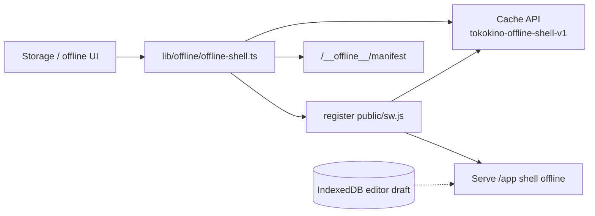
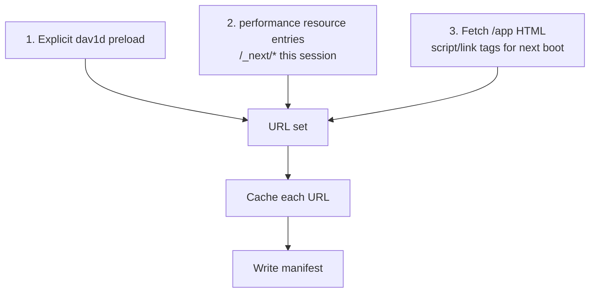

# Offline editor shell

Users can cache the **editor app shell** so `/app` still boots without network. Project data already lives in IndexedDB (see [drafts.md](./drafts.md)); offline mode does **not** sync designs — it only keeps the code/UI available.

---

## Architecture

| Piece | Role |
|---|---|
| `public/sw.js` | Service worker — serve cached shell, gate on manifest |
| `lib/offline/offline-shell.ts` | Register SW, fetch shell file list, fill cache, clear |
| UI | Settings / storage dialog + `offline-progress.tsx` |

---

## What is cached

- Editor route shell (`/app`) and its static assets listed by offline manifest generation.
- Optional decorative: `/favicon.ico`, `/logo.png` (may 404 without failing).
- **dav1d AV1 fallback** chunk + `decoder.wasm` (see below).
- **Not** cached as part of this feature: user screenshots/videos (already IDB), cloud APIs, Unsplash, share CDN, device-mockup WebPs.

Concurrency: up to 6 parallel fetches while downloading the shell.

---

## How shell URLs are collected

`cacheEditorShell` → `collectShellUrls` merges **three** sources (none alone is complete):

| Source | Why |
|---|---|
| Performance timeline | Chunks already executed this session |
| `/app` document markup | Chunks the **next** cold boot requests before any app code runs |
| **dav1d preload** | Lazy AV1 decoder never appears in either list until export fails native AV1 |

### dav1d / WASM (offline AV1 export)

The Safari AV1 decode fallback lives under `lib/editor/animation-export/video-media/dav1d-wasm/` and is **code-split** so normal `/app` boots and offline captures never load it until needed.

`collectShellUrls` therefore:

1. Dynamic-imports `dav1d-preload.ts`  
2. `preloadDav1dChunk()` — fetches the decoder JS chunk into browser cache without instantiating a decoder  
3. Adds `dav1dWasmUrl` (`decoder.wasm`) to the shell URL set  

Without this, an offline user who never triggered AV1 export online would cache a shell that **cannot** export AV1 video offline. Details of the decoder path: [video-export.md](./video-export.md). Product video flow: [video-canvas.md](./video-canvas.md).

---

## Lifecycle

| API | Behavior |
|---|---|
| `isOfflineSupported()` | `serviceWorker` + `caches` present |
| `registerOfflineServiceWorker()` | Register `/sw.js` scope `/` |
| Fill shell | Fetch asset list → put into `SHELL_CACHE` → write manifest record `{ savedAt, files, bytes }` |
| `getOfflineShell()` | Read manifest from cache |
| `clearOfflineShell()` | Delete manifest first (stops SW top-up), then cache + unregister |

Deleting the **manifest** is the authoritative “offline off” signal — in-flight top-ups cannot outlive it.

If any **required** shell URL fails to cache, `cacheEditorShell` throws and the caller should drop a partial cache (manifest is only written on full success).

---

## Constraints

1. Offline = shell only; cloud save/share/open still need network + auth.  
2. Cache name must stay in sync between `offline-shell.ts` and `sw.js` (`tokokino-offline-shell-v1`).  
3. After a deploy, users may need to re-download the shell to pick up new code.  
4. Not a PWA install product surface beyond this shell cache — keep scope small.  
5. Device mockups / Unsplash / share media remain network-dependent even when the shell is offline.  
6. dav1d preload must stay wired in `collectShellUrls` whenever the AV1 fallback chunk graph changes.

---

## Key files

| Path | Role |
|---|---|
| `lib/offline/offline-shell.ts` | Client offline API + URL collection |
| `lib/editor/animation-export/video-media/dav1d-preload.ts` | WASM URL + lazy chunk warm |
| `lib/editor/animation-export/video-media/dav1d-wasm/` | decoder.mjs / decoder.wasm |
| `public/sw.js` | Service worker |
| `components/editor/offline-progress.tsx` | Progress UI |
| `components/editor/storage-dialog.tsx` | Entry (with storage info) |
| [drafts.md](./drafts.md) | Local project persistence |
| [video-export.md](./video-export.md) | When dav1d is used at export time |
