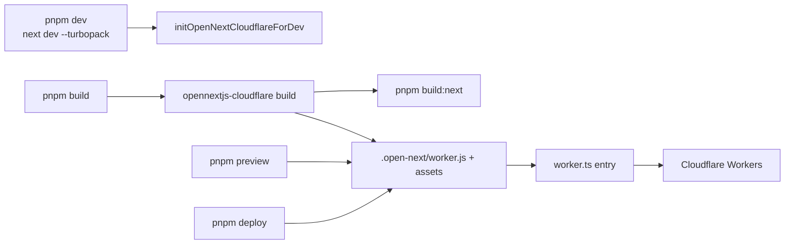
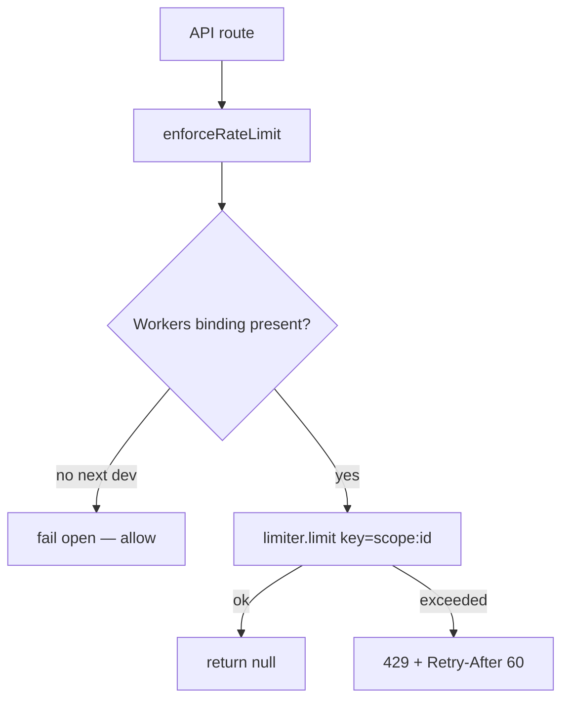

# Platform — deploy, D1, R2, rate limits, env

How Tokokino runs on Cloudflare and what bindings/services exist outside the editor.

---

## Deploy path

| Config | Role |
|---|---|
| `next.config.mjs` | Next + OpenNext dev init |
| `open-next.config.ts` | `defineCloudflareConfig`, framework build script |
| `wrangler.jsonc` | Worker name, assets, D1, browser, ratelimits, queues, cron |
| `worker.ts` | Wraps OpenNext handler; markdown Accept; queue consumer; scheduled |
| `lib/d1.ts` | `TOKOKINO_DB` → Drizzle / raw D1 |

**Do not** treat plain `next build` as the deploy artifact unless debugging OpenNext itself.

Commands: `pnpm typecheck`, `pnpm cf-typegen` after binding changes.

---

## Worker bindings (`wrangler.jsonc`)

| Binding | Type | Use |
|---|---|---|
| `ASSETS` | static assets | `.open-next/assets` |
| `TOKOKINO_DB` | D1 | App + better-auth data |
| `TOKOKINO_BROWSER` | Browser Rendering | Optional; screenshot API also uses REST |
| `HEAVY_RATE_LIMITER` | ratelimit 30/60s | Unauthenticated / expensive |
| `WRITE_RATE_LIMITER` | ratelimit 60/60s | Authenticated writes |
| `ACCOUNT_DELETION_QUEUE` | Queue producer | Account deletion jobs |
| Queue consumer | `tokokino-account-deletion` | max batch 5, DLQ |
| Cron | `*/15 * * * *` | Deletion reconcile / cleanup |

Compatibility: `nodejs_compat`, observability enabled.

---

## `worker.ts` extras

Beyond OpenNext `fetch`:

1. **Markdown content negotiation** — `Accept: text/markdown` on `/` and `/share/{id}` returns short MD summaries for AI crawlers.
2. **Queue consumer** — account deletion messages.
3. **Scheduled** — stale deletion retry / reconcile.

---

## D1

| Access | Module |
|---|---|
| Binding read | `lib/d1.ts` — `getD1Database()`, `getDb()` (Drizzle) |
| Schema | `lib/db/schema.ts` |
| Migrations | `migrations/*.sql` |

App tables (non-auth): drafts, draft_media, custom_presets, shares, share_views, share_uploads, share_upload_parts, user_preferences, account_deletions (+ cleanup outbox).

better-auth owns its user/session/account tables in the same DB.

---

## R2

| Client | `lib/r2-client.ts` (S3-compatible), timeouts in `r2-request-timeout.ts` |
| Env | `R2_BUCKET`, `R2_S3_ENDPOINT`, `R2_ACCESS_KEY_ID`, `R2_SECRET_ACCESS_KEY` |

| Key prefix | Content |
|---|---|
| `drafts/{userId}/…` | Project JSON, thumbs, media |
| `shares/{id}.…` | Public media + posters |
| Public CDN assets | `assets.tokokino.com` (mockups, templates, backgrounds) — separate from user bucket ops |

Storage modules: `draft-storage.ts`, `share-storage.ts`, `template-storage.ts`.

---

## Rate limiting (`lib/rate-limit.ts`)

| Limiter | Typical use |
|---|---|
| `HEAVY_RATE_LIMITER` | screenshot, tweet, unsplash, feedback, export proxy |
| `WRITE_RATE_LIMITER` | drafts, presets, share create, preferences, account |

Key = `{scope}:{userId|ip}` via `getClientIp` (`cf-connecting-ip` preferred).

---

## Environment variables

Validated in `lib/env.ts` (Zod). Optional vars degrade features; `requireAuthConfig` / `requireR2Config` throw when a path needs them.

| Var | Feature |
|---|---|
| `BETTER_AUTH_*` | Auth |
| `GOOGLE_CLIENT_*` | Google OAuth |
| `R2_*` | Drafts / shares storage |
| `CLOUDFLARE_ACCOUNT_ID` + `CLOUDFLARE_BROWSER_API_TOKEN` | URL screenshot |
| `UNSPLASH_ACCESS_KEY` | Background search |
| `FEEDBACK_DISCORD_WEBHOOK_URL` | Feedback → Discord |
| `TEMPLATE_MAINTAINER_EMAILS` | Template thumb publish |
| `NEXT_PUBLIC_ENABLE_TEMPLATE_COPY` | Dev “Copy template” UI |
| `NEXT_PUBLIC_ENABLE_DEBUG_PRESETS` | Debug preset UI |

---

## Schemas package

| Path | Validates |
|---|---|
| `lib/schemas/draft.ts` | Draft payload + type resolve |
| `lib/schemas/preset.ts` | Custom preset body |
| `lib/schemas/preferences.ts` | Preferences |
| `lib/schemas/unsplash.ts` | Search query/response |
| `lib/schemas/image-proxy.ts` | Export proxy URL |
| `lib/schemas/common.ts` | Shared bits |

Always `import { z } from "zod/v4"`.

---

## Testing

| Area | Location |
|---|---|
| Lib unit tests | `tests/lib/**` |
| API route tests | `tests/app/api/**` |
| Component tests | `tests/components/**` |
| Runner | Vitest (`pnpm` test scripts in package.json) |

Prefer `pnpm typecheck` for quick correctness unless the user asks for full test/build.

---

## Key files

| Path | Role |
|---|---|
| `worker.ts` | Worker entry |
| `wrangler.jsonc` | Bindings |
| `open-next.config.ts` | OpenNext |
| `lib/d1.ts` | DB access |
| `lib/db/schema.ts` | Tables |
| `lib/r2-client.ts` | R2 S3 client |
| `lib/rate-limit.ts` | RL helpers |
| `lib/env.ts` | Env validation |
| `migrations/` | SQL migrations |
