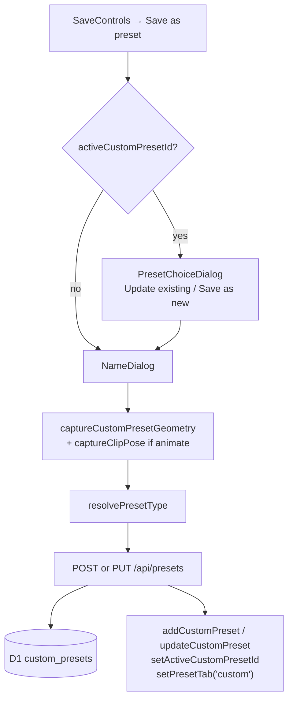
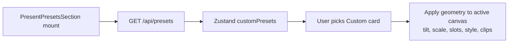
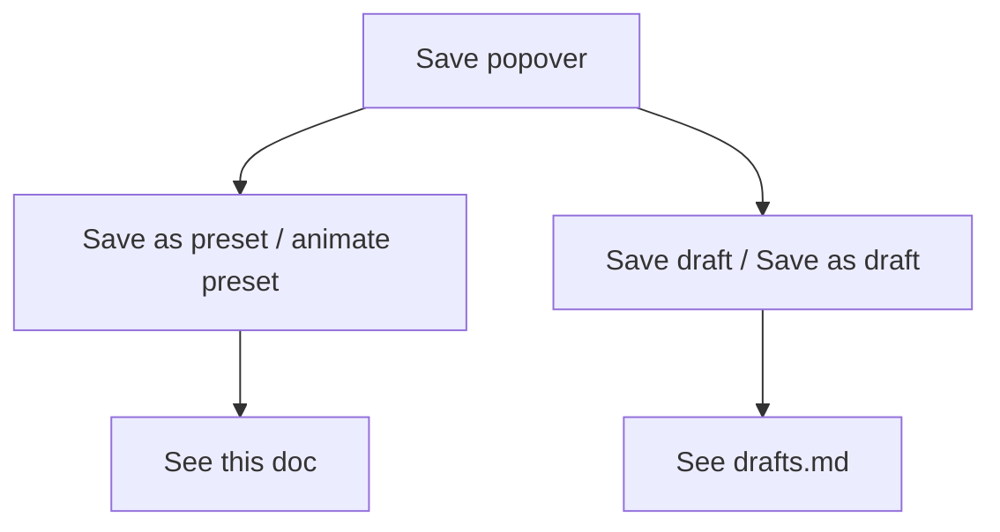

# Custom presets (save / load / apply)

Custom presets store **geometry + style** (and optionally Animate clips) — never screenshot pixels. They live entirely in D1 as JSON; there is no R2 object for presets.

Built-in layout / tilt presets (`PRESENT_PRESETS`, `LAYOUT_PRESETS` in `lib/editor/present-presets.ts`) are code, not this system.

---

## Entry UI

| Action | Component |
|---|---|
| Save | `SaveControls` → “Save as preset” / “Save as animate preset” |
| Overwrite vs new | `PresetChoiceDialog` when `activeCustomPresetId` is set |
| Name | `NameDialog` |
| Load / apply / rename / delete | `components/editor/present-presets-section.tsx` (Custom tab) |
| Orchestration | `top-bar/index.tsx` — `openSavePresetFlow` |

---

## Types

| Concept | Values / shape |
|---|---|
| `CustomPresetType` | `"style" \| "animate"` via `resolvePresetType(isAnimateMode, canvas)` |
| `StoredPresetGeometry` | `canvasTilt, canvasScale, slots[], mainOffset?, relativeSlotPositions?, canvasStyle?, animation?` |
| Animate payload | `{ durationMs, clips[], sourceSlotIds? }` — requires ≥1 clip |
| Style presets | Strip `animation` before save |

Cap: **1 MB** serialized geometry (`MAX_PRESET_BYTES`). Bulky data-URLs are stripped by `captureCustomPresetGeometry`.

---

## APIs

| Method | Path | Body | Response |
|---|---|---|---|
| `GET` | `/api/presets` | — | `{ presets: [{ id, name, slotCount, type, geometry, createdAt, updatedAt }] }` |
| `POST` | `/api/presets` | `{ name, type, geometry }` | created preset |
| `PUT` | `/api/presets/[id]` | `{ name?, type?, geometry? }` | updated preset |
| `DELETE` | `/api/presets/[id]` | — | `{ ok: true }` |

Session auth required. Rate-limited create.

---

## Storage

**D1 `custom_presets`:** `id, userId, name, slotCount, type, geometry (JSON), createdAt, updatedAt`

No R2. Geometry is the full payload.

---

## Save flow

Rules:

- Animate mode → type `"animate"`; must have ≥1 clip (open-clip pose captured via `captureClipPose`).
- Present / style mode → type `"style"`; animation field stripped.
- Never embeds screenshot / video bytes.

---

## Load / apply flow

Delete / rename go through `DELETE` / `PUT` on `/api/presets/[id]` and update the client cache.

---

## Save-as UX (presets vs drafts)

Both live under the same Save popover; labels flip for Animate mode:

Unauthenticated Save → `saveCurrentEditorDraft()` then login (`ProtectedTopBarAction`).

---

## Key files

| Path | Role |
|---|---|
| `lib/preset-db.ts` | D1 CRUD |
| `app/api/presets/route.ts` | List + create |
| `app/api/presets/[id]/route.ts` | Update + delete |
| `components/editor/top-bar/index.tsx` | `openSavePresetFlow`, geometry capture call sites |
| `components/editor/present-presets-section.tsx` | Custom tab UI |
| `lib/editor/present-presets.ts` | Built-in presets (not custom) |
