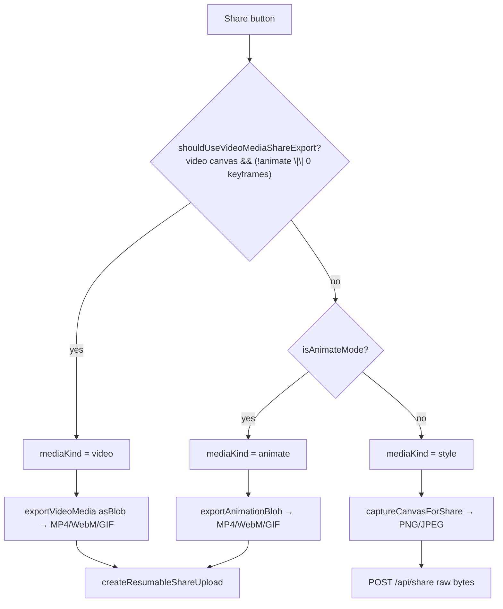
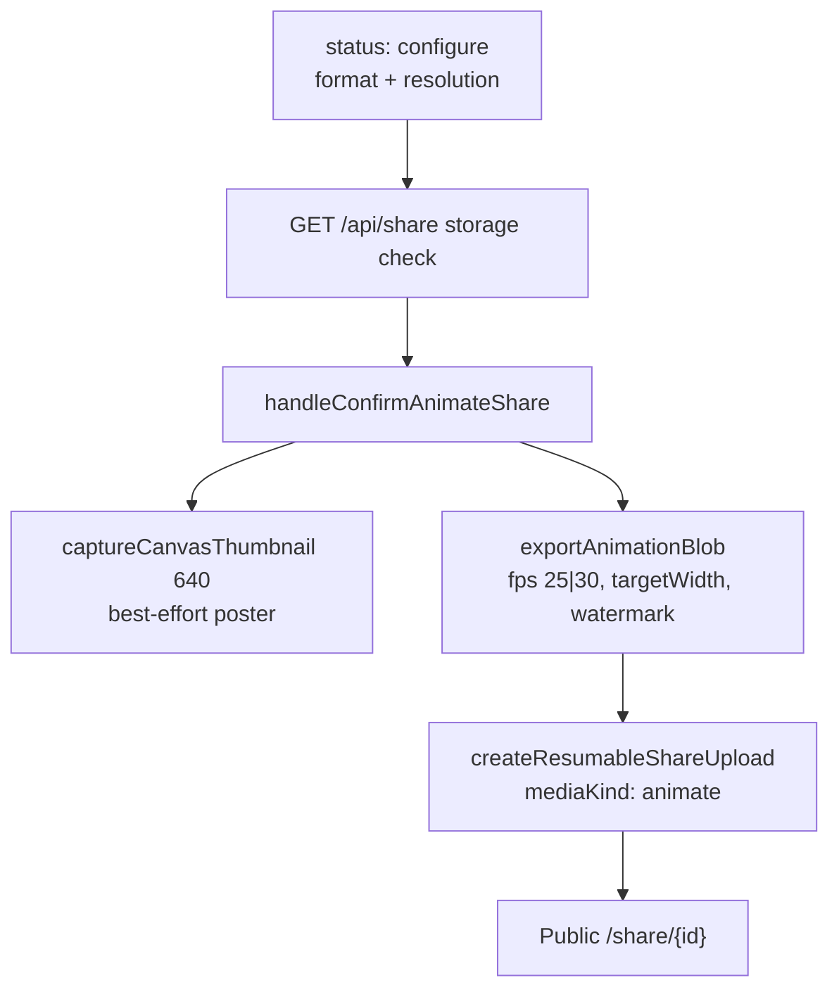
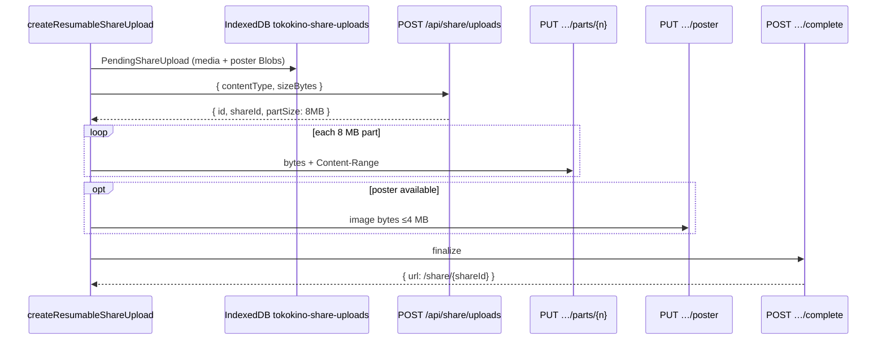
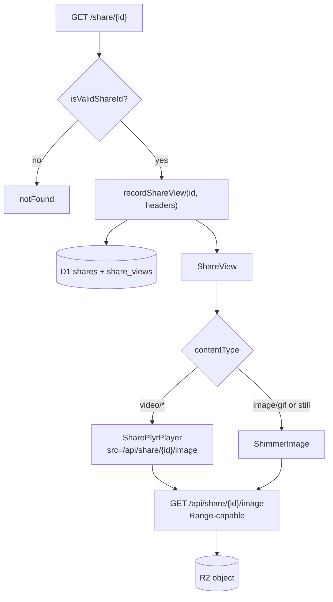

# Share (image, animation, video) + public playback

Share creates a public `/share/{id}` link. Encoding is always on-device; the server only stores the resulting blob in R2 and metadata in D1.

UI `mediaKind` is `"style" | "animate" | "video"`. D1 `ShareType` is only `"style" | "animate"` — styled video shares are stored as `type: "animate"` (content-type driven).

---

## Path selection



Exact gate: `lib/editor/share-export-choice.ts` + `TopBar.handleShare` in `components/editor/top-bar/index.tsx`.

| Condition | `mediaKind` | Encoder | Upload |
|---|---|---|---|
| Present + still image | `style` | `captureCanvasForShare` | Direct `POST /api/share` |
| Animate + keyframes | `animate` | `exportAnimationBlob` | Resumable multipart |
| Video canvas + (Present **or** Animate with 0 clips) | `video` | `exportVideoMedia({ asBlob: true })` | Resumable multipart |

Server mapping (`shareTypeForContentType`): png/jpeg → `"style"`; gif/mp4/webm → `"animate"`.

---

## Entry UI

| Role | Component |
|---|---|
| Share button / dialog | `ShareControls` / `MobileShareDialog` |
| Animate/video configure | Format (mp4/webm/gif) + resolution (hd/fullhd/4k) before encode |
| Orchestration | `handleShare`, `handleConfirmAnimateShare` in `top-bar/index.tsx` |
| History gallery | `app/app/shares/shares-gallery.tsx` |
| Public page | `app/share/[id]/page.tsx` → `ShareView` |

---

## 1. Share image (still)

```mermaid
sequenceDiagram
  participant UI as ShareControls
  participant Cap as captureCanvasForShare
  participant API as POST /api/share
  participant R2 as R2
  participant D1 as D1

  UI->>Cap: canvasId (+ watermark signature)
  Note over Cap: 1920px; PNG if ≤4MB else JPEG quality ladder
  Cap->>API: raw image/png or image/jpeg
  API->>R2: shares/{id}.png|jpg
  API->>D1: shares type=style
  API-->>UI: { id, url: /share/{id}, imageUrl, views, storage }
```

| Limit | Value |
|---|---|
| Client JPEG fallback threshold | 4 MB (`CLIENT_MAX_SHARE_BYTES`) |
| Direct POST body | 40 MB |
| Per-user share storage | 1 GB |

Also: `GET /api/share` (list + storage), `DELETE /api/share` (all), `DELETE /api/share/[id]` (one).

---

## 2. Share animation (keyframes)

When Animate mode has visual keyframes (and video-media gate is false):



See [animation-export.md](./animation-export.md) for the encode pipeline.

---

## 3. Share video (styled video-media)

Same configure UX as animation share, but encode via:

```ts
exportVideoMedia(activeCanvasId, { …exportOptions, asBlob: true })
```

then `createResumableShareUpload({ mediaKind: "video", media, poster })`.

Server still writes `ShareType = "animate"`. See [video-export.md](./video-export.md).

---

## Resumable upload (animation + video)

Large MP4/WebM/GIF use multipart upload with client-side resume.



| Route | Role |
|---|---|
| `POST /api/share/uploads` | Start R2 multipart; create `share_uploads` row |
| `GET /api/share/uploads/[id]` | Status + confirmed parts (resume) |
| `PUT /api/share/uploads/[id]/parts/[partNumber]` | Upload one part |
| `PUT /api/share/uploads/[id]/poster` | Optional poster still |
| `POST /api/share/uploads/[id]/complete` | Complete → `createShareRecord` |
| `DELETE /api/share/uploads/[id]` | Cancel |

| Limit | Value |
|---|---|
| Max upload | 1 GB |
| Part size | 8 MB |
| Poster | 4 MB |
| Upload session TTL | 24 h |

**R2:** `shares/{shareId}.mp4|webm|gif`, optional `shares/{shareId}-poster.png`  
**D1:** `shares`, `share_uploads`, `share_upload_parts`

---

## 4. Public shared media viewing / playback



### Public media routes (no auth)

| Path | Role |
|---|---|
| `GET /api/share/[id]/image` | Inline stream; Range support for video seeking |
| `GET /api/share/[id]/download` | `Content-Disposition: attachment` |
| `GET /api/share/[id]/poster` | Poster still for animate/video |

### `ShareView` behavior

| Content | UI |
|---|---|
| `video/*` | `SharePlyrPlayer` streaming from `/image` |
| Still / GIF | `ShimmerImage` |
| Copy | Still/GIF only → fetch `/download` → clipboard PNG |
| Download | Anchor → `/download` (browser streams; avoids loading whole file into JS) |

### View tracking

- `recordShareView` hashes client IP with `BETTER_AUTH_SECRET`
- Updates `shares.viewCount` / `uniqueViewCount`
- Per-IP rows in `share_views`
- Page falls back to `getShareById` if view tracking fails

---

## Storage budgets (share)

| Budget | Limit |
|---|---|
| Per-user share storage | 1 GB |
| Direct still body | 40 MB |
| Resumable animate/video | 1 GB |
| Poster | 4 MB |
| Multipart part | 8 MB |

---

## Key files

| Path | Role |
|---|---|
| `lib/editor/share-export-choice.ts` | Image vs animation vs video gate |
| `lib/share.ts` | URL helpers, ID validation, content-type helpers |
| `lib/share-db.ts` | D1 share CRUD + view tracking |
| `lib/share-storage.ts` | R2 upload / multipart / poster |
| `app/api/share/**` | Direct create + list + delete |
| `app/api/share/uploads/**` | Resumable multipart |
| `app/api/share/[id]/image/route.ts` | Public stream (+ Range) |
| `app/share/[id]/page.tsx` | SSR view + recordShareView |
| `app/share/[id]/share-view.tsx` | Image / GIF / Plyr player UI |
| `components/share/share-plyr-player.tsx` | Video player |
| `components/editor/top-bar/index.tsx` | `handleShare`, `handleConfirmAnimateShare` |
| `lib/editor/export.ts` | `captureCanvasForShare` |
| [animation-export.md](./animation-export.md) / [video-export.md](./video-export.md) | Encode pipelines used before upload |
