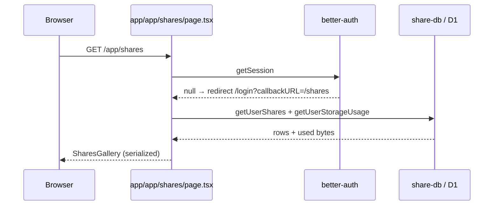

# Shares gallery (user library)

Authenticated UI at **`/app/shares`** for listing, filtering, downloading, and deleting the current user’s public shares. Encoding and public playback live in [share.md](./share.md); this page is the **management** surface.

Route files: `app/app/shares/*` (App Router under the `/app` product segment).

---

## Page load

| Detail | Value |
|---|---|
| Auth | Required; `runtime = "nodejs"`, `dynamic = "force-dynamic"` |
| Storage limit | `MAX_USER_SHARE_STORAGE_BYTES` (1 GB) |
| Serialization | id, imageUrl, posterUrl, viewCount, sizeBytes, createdAt, type, contentType |

Poster URL only when `posterKey` set (`getSharePosterUrl`).

---

## Client gallery (`shares-gallery.tsx`)

Client state owns filters and optimistic deletes after SSR initial list.

### Filters & sort (`shares-data.ts`)

| Dimension | Values |
|---|---|
| Type | `all` \| `style` (Present) \| `animate` (Animate/video shares) |
| Date | all / today / last 7d / 30d / 3 months |
| Sort | latest, oldest, most viewed, least viewed |
| Page size | **9** (`PAGE_SIZE`) |

`filterAndSortShares` runs entirely client-side on the loaded array (not server pagination today).

Type badges: Present = still style; Animate = gif/mp4/webm (server `ShareType` — see [share.md](./share.md)).

### Toolbar (`shares-toolbar.tsx`)

Filter controls, stats entry, delete-all, storage hint.

### Cards (`share-card.tsx`)

| Action | Behavior |
|---|---|
| Open public | Link `/share/{id}` |
| Download | `/api/share/{id}/download` via `triggerAnchorDownload` |
| Delete one | Confirm → `DELETE /api/share/{id}` → drop from local state, subtract bytes |
| Delete all / filtered | `DELETE /api/share` (+ query if scoped) |

### Stats dialog (`stats-dialog.tsx`)

| Stat | Source |
|---|---|
| Saved shares | `shares.length` |
| Total views | sum of `viewCount` |
| Storage | `usedBytes / storageLimit` bar; warn ≥ 90% |

Copy mentions “1 GB” when near full. View counts are **aggregate** from D1 (`shares.viewCount`); unique IP tracking is on the public page path ([share.md](./share.md#view-tracking)).

---

## APIs used

| Method | Path | Role |
|---|---|---|
| (SSR) | `getUserShares` / `getUserStorageUsage` | Initial data |
| `DELETE` | `/api/share/{id}` | Delete one |
| `DELETE` | `/api/share` | Delete all (optional query filters) |
| `GET` | `/api/share/{id}/download` | Attachment download |
| `GET` | `/api/share/{id}/image` | Media (cards / public) |
| `GET` | `/api/share/{id}/poster` | Poster still |

Create flow is **not** on this page — top-bar Share → [share.md](./share.md).

---

## Layout / UX notes

- Brand logo + breadcrumb back toward editor.  
- Pagination via `buildPageItems` (`lib/pagination.ts`).  
- Loading: `app/app/shares/loading.tsx`.  
- Toasts on delete/download failure (`sonner`).

---

## Key files

| Path | Role |
|---|---|
| `app/app/shares/page.tsx` | SSR auth + data |
| `app/app/shares/shares-gallery.tsx` | Client grid |
| `app/app/shares/shares-data.ts` | Filters, formatters, types |
| `app/app/shares/shares-toolbar.tsx` | Filters / bulk actions |
| `app/app/shares/share-card.tsx` | Card UI |
| `app/app/shares/stats-dialog.tsx` | Library stats |
| `lib/share-db.ts` | D1 queries |
| `lib/share.ts` | URL helpers |
| [share.md](./share.md) | Upload + public playback |
| [auth-account.md](./auth-account.md) | Session |
