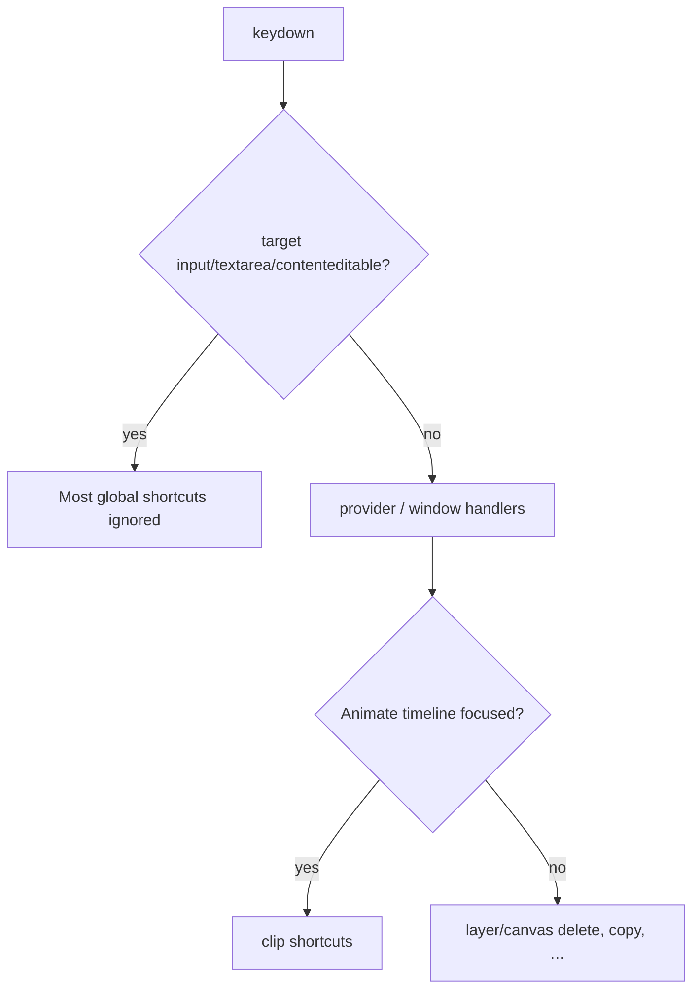

# Keyboard shortcuts

Catalog of shortcuts **actually wired** in the editor. Display list lives in `lib/editor/shortcuts.ts` (`SHORTCUT_GROUPS`) and is shown in Settings → Shortcuts. Handlers are scattered; this doc maps each binding to its source.

---

## Catalog

`mod` = ⌘ on Apple, Ctrl elsewhere. Display via `formatShortcutKey` / `isApplePlatform()`.

### History

| Action | Keys | Handler |
|---|---|---|
| Undo | `mod+Z` | `EditorProvider` (`store/provider.tsx`) |
| Redo | `mod+Shift+Z` (also `mod+Y` in provider) | same |

### Editing

| Action | Keys | Handler |
|---|---|---|
| Paste image | `mod+V` | Window paste → `use-image-file-intake.ts` (not only clipboard text) |
| Delete selection | `Delete` / `Backspace` | `EditorProvider` |
| Deselect / Exit preview | `Esc` | canvas-surface / canvas-view / preview shell in `app/app/page.tsx` |

### Export

| Action | Keys | Handler |
|---|---|---|
| Copy canvas | `mod+C` | `EditorProvider` → `copyCanvasAsPng` (skipped when focus is editable field) |

### Animate (timeline)

| Action | Keys | Handler |
|---|---|---|
| Cut tool (razor) | `S` | `use-animate-timeline.ts` |
| Duplicate clip | `mod+D` | same |
| Remove clip effects | `mod+Shift+Delete` | same |
| Deselect clip | `mod+Shift+A` | same |
| Delete clip | `Delete` | same (when clip selected; competes with layer delete — timeline owns focus context) |

---

## Wiring rules

1. **Editable targets** — `isEditableKeyboardTarget` in provider suppresses undo/copy/delete so typing works.  
2. **Animate vs present** — razor/`S` only meaningful in Animate UI.  
3. **Settings UI** — read-only list; changing bindings requires code + `SHORTCUT_GROUPS` update.  
4. **Platform glyphs** — never hardcode ⌘ in UI copy; use `formatShortcutKey`.

---

## Settings surface

| Piece | Path |
|---|---|
| Catalog data | `lib/editor/shortcuts.ts` |
| Settings section | `components/editor/settings/settings-dialog.tsx` → `ShortcutsSection` |
| Provider handlers | `lib/editor/store/provider.tsx` |
| Timeline handlers | `components/editor/animate/use-animate-timeline.ts` |
| Paste intake | `components/editor/canvas/use-image-file-intake.ts` |

---

## Adding a shortcut

1. Implement the keydown handler in the correct owner (provider vs timeline vs canvas).  
2. Guard editable targets and mode (animate/preview).  
3. Append to `SHORTCUT_GROUPS` so Settings stays accurate.  
4. Prefer `mod` token over platform-specific key names.

---

## Related

| Doc | Link |
|---|---|
| Store / history | [editor-store.md](./editor-store.md) |
| Animate timeline | [animate-mode.md](./animate-mode.md) |
| Bulk / preview Escape | [bulk-preview.md](./bulk-preview.md) |
| Copy canvas encode | [still-export.md](./still-export.md) |
