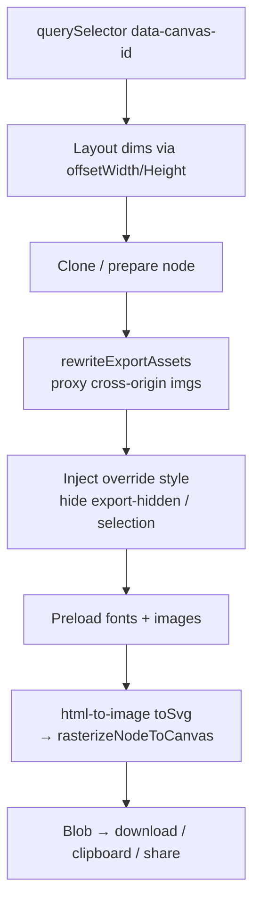
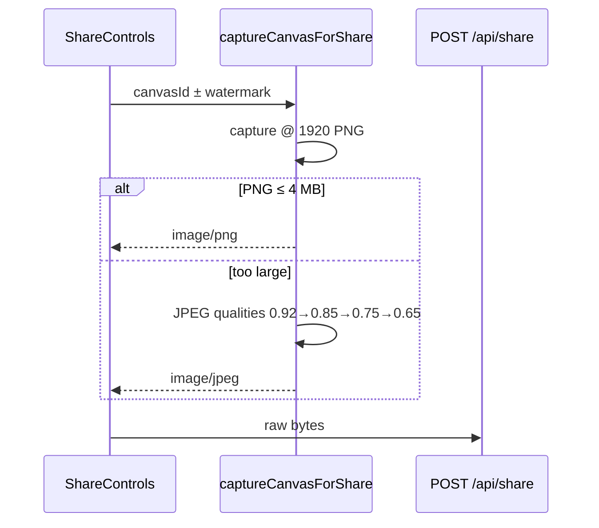

# Still image export

Client-side capture of a single canvas frame as PNG / JPEG / WebP for download, clipboard, share, or thumbnails. Animation and styled-video encodes are separate — see [animation-export.md](./animation-export.md) and [video-export.md](./video-export.md).

**Entry:** `lib/editor/export.ts`

---

## Public APIs

| Function | Use |
|---|---|
| `exportCanvas(canvasId, format, resolution, opts?)` | Download PNG/JPEG/WebP at HD/4K/8K |
| `copyCanvasAsPng` / `copyCanvasAsFormat` | Clipboard @ 1080p |
| `captureCanvasAsPngBlob(canvasId, targetWidth?)` | Raw PNG blob |
| `captureCanvasForShare(canvasId)` | Share still: 1920px; PNG ≤4 MB else JPEG ladder |
| `captureCanvasThumbnail` / `createImageThumbnailBlob` | Small JPEG thumbs (drafts, posters) |
| `prepareAnimationCapture` / `prepareFastAnimationCapture` | Clone prep for animation/video export |

Resolutions:

| Key | Width |
|---|---|
| `hd` | 1920 |
| `4k` | 3840 |
| `8k` | 7680 |
| Share still | 1920 (`SHARE_RESOLUTION_WIDTH`) |
| Copy | 1080 |

---

## Capture pipeline

### Constraints

1. Canvas root **must** have `data-canvas-id="{id}"`.
2. UI chrome: `data-export-hidden="true"`.
3. Selection rings: `data-selection-border="true"` (stripped via CSS).
4. Layout size is **pre-transform** (`offsetWidth`) so device-frame `cqw`/`cqh` stay correct under viewport zoom.
5. `pixelRatio = targetWidth / layoutWidth` for resolution scaling. Applied as a CSS `transform: scale()` on the captured content (`exportScaleStyle`), **not** via html-to-image's `pixelRatio` nor an SVG `viewBox` — WebKit applies neither to `<foreignObject>` content and paints the scene at 1× in the top-left corner. That broke every capture above 1×: 4K/8K stills, Full HD+ video and animation exports, and 1920px shares. The box keeps its rendered size so `cqw`/`cqh` still resolve correctly; both capture paths share the helper.
6. Backgrounds may upgrade from edit-time downscaled `value` to full `sourceUrl` via `data-bg-source-url` — see [canvas.md](./canvas.md#edit-vs-export).

---

## Asset rewrite & CORS

`lib/editor/export-assets.ts` + `shouldProxyAssetUrl`:

- Cross-origin images → `/api/export/image?url=…` so FO capture isn't tainted.
- Proxy limits: ~30 MB body (see route).

Unsplash and other hotlinked CDN images go through the same path when needed.

---

## Share still specifics

Server direct-upload body cap: 40 MB. User storage: 1 GB. Details: [share.md](./share.md).

---

## Animation capture prep (shared)

Still export helpers also build an **`AnimationCapture`** used by keyframe/video encoders:

| Mode | Function | Notes |
|---|---|---|
| Legacy / Precise | `prepareAnimationCapture` | `toSvg` + `rasterizeNodeToCanvas` every frame; video-media always uses this |
| Fast | `prepareFastAnimationCapture` | Bake styles; serialize FO cheaper |
| Auto | try fast → fall back legacy | animation export default |

Video frames in still clones: `replaceCloneVideosWithFrames` (`export-video-frames.ts`) freezes a frame for one-shot stills.

---

## Filenames & preferences

| Module | Role |
|---|---|
| `export-filename.ts` | Build download name from template |
| User preference | `exportFilenameFormat` via `/api/preferences` |
| Watermark | Optional logo + “Designed by Tokokino” on share/export |

---

## Key files

| Path | Role |
|---|---|
| `lib/editor/export.ts` | Capture + download + share still |
| `lib/editor/export-assets.ts` | Proxy rewrite |
| `lib/editor/export-filename.ts` | Naming |
| `lib/editor/export-video-frames.ts` | Freeze video for still FO |
| `app/api/export/image/route.ts` | CORS proxy |
| `components/editor/top-bar/*export*` | UI entry |
| `lib/download.ts` | Anchor download helper |
