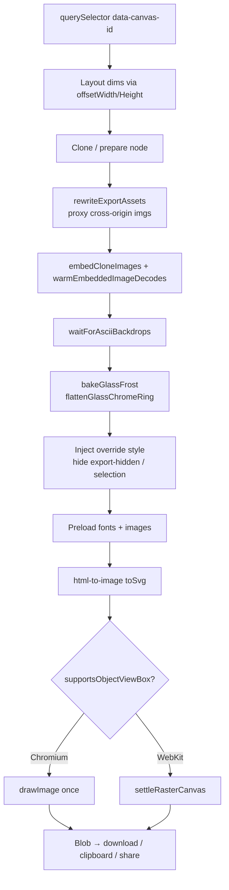
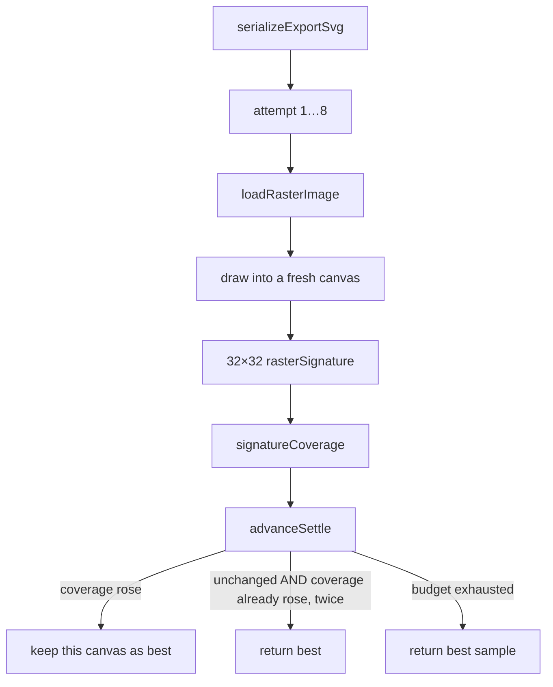
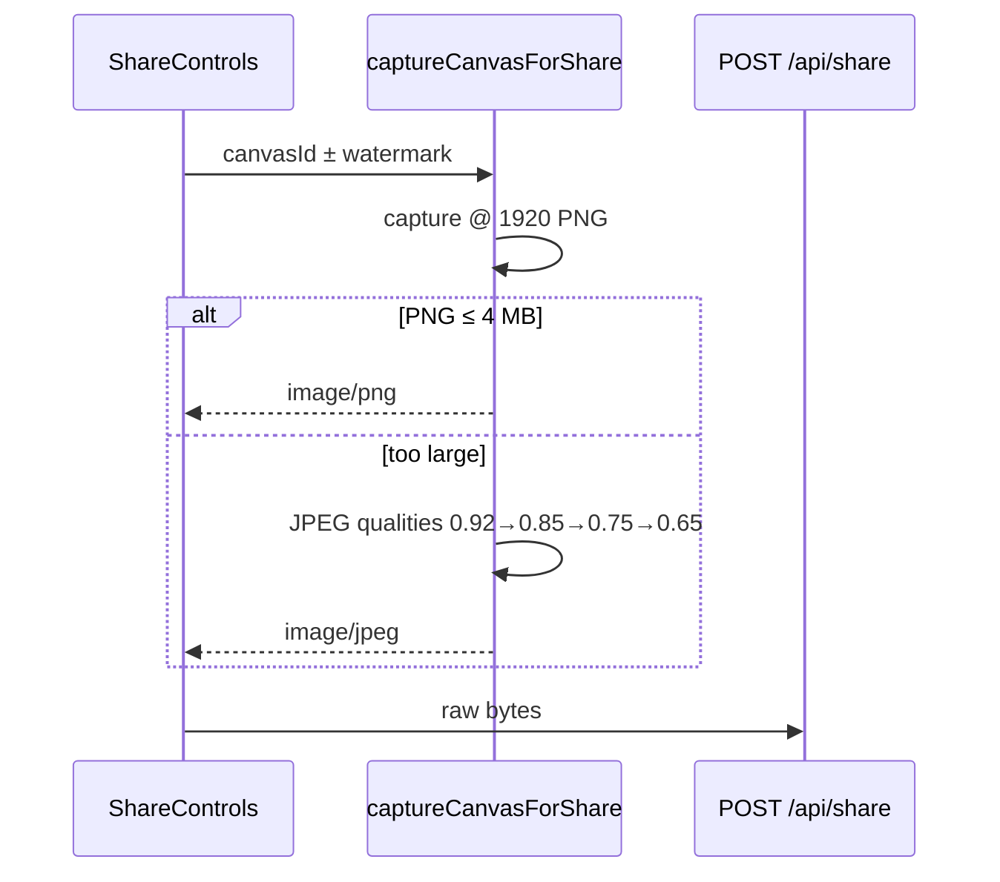

# Still image export

Client-side capture of a single canvas frame as PNG / JPEG / WebP for download, clipboard, share, or thumbnails. Animation and styled-video encodes are separate — see [animation-export.md](./animation-export.md) and [video-export.md](./video-export.md).

**Entry:** `lib/editor/export.ts`

---

## Public APIs

| Function | Use |
|---|---|
| `exportCanvas(canvasId, format, resolution, opts?)` | Download PNG/JPEG/WebP at HD/4K/8K |
| `copyCanvasAsPng` / `copyCanvasAsFormat` | Clipboard @ 1080p |
| `captureCanvasAsPngBlob(canvasId, targetWidth?)` | Raw PNG blob |
| `captureCanvasForShare(canvasId)` | Share still: 1920px; PNG ≤4 MB else JPEG ladder |
| `captureCanvasThumbnail` / `createImageThumbnailBlob` | Small JPEG thumbs (drafts, posters) |
| `prepareAnimationCapture` / `prepareFastAnimationCapture` | Clone prep for animation/video export |

Resolutions:

| Key | Width |
|---|---|
| `hd` | 1920 |
| `4k` | 3840 |
| `8k` | 7680 |
| Share still | 1920 (`SHARE_RESOLUTION_WIDTH`) |
| Copy | 1080 |

---

## Capture pipeline

### Constraints

1. Canvas root **must** have `data-canvas-id="{id}"`.
2. UI chrome: `data-export-hidden="true"`.
3. Selection rings: `data-selection-border="true"` (stripped via CSS).
4. Layout size is **pre-transform** (`offsetWidth`) so device-frame `cqw`/`cqh` stay correct under viewport zoom.
5. `pixelRatio = targetWidth / layoutWidth` for resolution scaling. Applied as a CSS `transform: scale()` on the captured content (`exportScaleStyle`), **not** via html-to-image's `pixelRatio` nor an SVG `viewBox` — WebKit applies neither to `<foreignObject>` content and paints the scene at 1× in the top-left corner. That broke every capture above 1×: 4K/8K stills, Full HD+ video and animation exports, and 1920px shares. The box keeps its rendered size so `cqw`/`cqh` still resolve correctly; both capture paths share the helper.
6. Backgrounds may upgrade from edit-time downscaled `value` to full `sourceUrl` via `data-bg-source-url` — see [canvas.md](./canvas.md#edit-vs-export).
7. ASCII glyphs must be sampled and painted before clone (`waitForAsciiBackdrops`) — see [ascii-backdrop.md](./ascii-backdrop.md).
8. Glass frost is baked as pixels; live `backdrop-filter` is stripped — see [Glass frost](#glass-frost) and [device-frames.md](./device-frames.md).

---

## WebKit raster settle

Safari paints an SVG image's `<foreignObject>` with whichever data-URI subresources have decoded at that instant. Every `drawImage` of that SVG **re-rasterizes** it and races the decode again. The result oscillates: a canvas can come back complete, then the next draw of the same `HTMLImageElement` drops the screenshot, the background, or both. The largest image loses most often — a glass frame over a gradient with the screenshot missing was the canonical bug.

Chromium (`supportsObjectViewBox()`) draws once. WebKit goes through `settleRasterCanvas`:

| Helper | Role |
|---|---|
| `rasterSignature` | Downsample to 32×32 RGBA fingerprint |
| `rasterSignatureDelta` | Mean per-channel difference; ≤1.5 = same image |
| `signatureCoverage` | Opaque fraction + colour variety — a missing screenshot reads flatter |
| `advanceSettle` | Keep the best; only confirm a plateau **after** coverage has risen once |
| `settleDelayMs` | Exponential backoff, 20 ms → cap 400 ms. Early retries stay short; a stuck 8K decode gets a longer window |

Rules that matter:

- A raster that **only ever repeated itself** is not settled. WebKit reproduces an incomplete capture exactly; three identical rasters missing the screenshot is a shape this bug actually takes. Coverage must have *risen* first.
- An essentially empty raster is never confirmed, even if it repeats.
- Exhausting the budget is not a failure: the first raster may already have been complete (nothing improves on it). There is no oracle for "complete", so exhaustion returns the best sample.
- Each attempt draws into its **own** output canvas. The one handed back is a canvas that was scored, not a redraw of the image that produced it.

### Decode before rasterize

`warmEmbeddedImageDecodes` is the cause of the settling loop rather than another mitigation of it. After `embedCloneImages` inlines every `` as a data URL, the clone's data-URI images (and CSS `background-image` data URIs) are decoded **in this document** via `image.decode()` before the first SVG raster. Warming those decodes costs one pass over the images instead of repeated passes over a multi-megabyte SVG.

It reduces the race, it does not close it: the decode cache is the engine's to evict. `settleRasterCanvas` still backs it up. Timeout: `EMBEDDED_DECODE_TIMEOUT_MS` = 8 s.

Glass frost underlays use a shorter settle budget (`UNDERLAY_SETTLE_MAX_ATTEMPTS = 4`) because every pixel is read through an 18px blur at ≤960px.

---

## Glass frost

`backdrop-filter` does not survive FO in any engine. Still export:

1. `neutralizeUnsupportedExportBackdropFilters` — drop live blur on `[data-glass-frame-layer]` panes (keep chrome).
2. `flattenGlassChromeRing` — rewrite the chrome's sub-pixel inset shadow as a border so WebKit does not flood a bright corner wedge.
3. `bakeGlassFrost` — for each pane in paint order, rasterize the scene with that pane and everything above it hidden, sample through the pane's transform, blur in `lib/editor/image-blur.ts` (Safari has no `ctx.filter`), and set the result as the pane's `background-image` under the authored translucent gradient.

Per-pane underlays, not one shared texture: the front shell frosts the rear panes showing through it. A skirt of repeated edge pixels avoids a dark halo where the blur samples past the canvas.

Full geometry: [device-frames.md](./device-frames.md#glass-frames).

---

## Asset rewrite & CORS

`lib/editor/export-assets.ts` + `shouldProxyAssetUrl`:

- Cross-origin images → `/api/export/image?url=…` so FO capture isn't tainted.
- Proxy limits: ~30 MB body (see route).

Unsplash and other hotlinked CDN images go through the same path when needed.

---

## Share still specifics

Server direct-upload body cap: 40 MB. User storage: 1 GB. Details: [share.md](./share.md).

---

## Animation capture prep (shared)

Still export helpers also build an **`AnimationCapture`** used by keyframe/video encoders:

| Mode | Function | Notes |
|---|---|---|
| Legacy / Precise | `prepareAnimationCapture` | `toSvg` + `rasterizeNodeToCanvas` every frame; video-media always uses this |
| Fast | `prepareFastAnimationCapture` | Bake styles; serialize FO cheaper |
| Auto | try fast → fall back legacy | animation export default |

Video frames in still clones: `replaceCloneVideosWithFrames` (`export-video-frames.ts`) freezes a frame for one-shot stills.

---

## Filenames & preferences

| Module | Role |
|---|---|
| `export-filename.ts` | Build download name from template |
| User preference | `exportFilenameFormat` via `/api/preferences` |
| Watermark | Optional logo + “Designed by Tokokino” on share/export |

---

## Key files

| Path | Role |
|---|---|
| `lib/editor/export.ts` | Public barrel — re-exports the modules below |
| `lib/editor/export-still.ts` | `exportCanvas`, `captureCanvasAsPngBlob`, clipboard copy |
| `lib/editor/export-share.ts` | Share capture + JPEG size fallback |
| `lib/editor/export-thumbnail.ts` | Draft + image thumbnails |
| `lib/editor/export-clone.ts` | Offscreen clone, override stylesheet, watermark |
| `lib/editor/export-raster.ts` | foreignObject serialization + canvas encoding |
| `lib/editor/export-settle.ts` | WebKit raster settle loop |
| `lib/editor/export-glass.ts` | Glass frost bake + chrome ring flatten |
| `lib/editor/export-embed.ts` | Data-URI inlining + decode warm-up |
| `lib/editor/export-asset-rewrite.ts` | Clone asset proxying + preload |
| `lib/editor/export-dom.ts` | Canvas lookup + layout measurement |
| `lib/editor/export-constants.ts` | Formats, resolutions, output widths |
| `lib/editor/export-assets.ts` | Proxy rewrite |
| `lib/editor/export-filename.ts` | Naming |
| `lib/editor/export-video-frames.ts` | Freeze video for still FO |
| `lib/editor/image-blur.ts` | Pixel frost / saturate (no `ctx.filter` on Safari) |
| `lib/editor/ascii-backdrop.ts` | `waitForAsciiBackdrops` before clone |
| `app/api/export/image/route.ts` | CORS proxy |
| `components/editor/top-bar/*export*` | UI entry |
| `lib/download.ts` | Anchor download helper |
| `tests/lib/editor/export.test.ts` | Settle signatures, empty rasters, backoff |
| `tests/lib/editor/export-glass-effects.test.tsx` | Frost bake + chrome ring |
