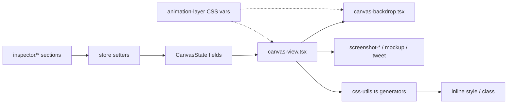

# Styling & canvas paint pipeline

How inspector controls become pixels: **UI → store → CSS helpers → canvas React tree**. No server involvement for style edits.

---

## End-to-end

---

## Inspector sections

| Section | Controls | Store fields |
|---|---|---|
| Background | solid / gradient / image / auto / Unsplash | `background` |
| Padding | outer padding | `padding` |
| Border | color, width, style, inner padding | `border` |
| Shadow | type, intensity, light, color | `shadow` |
| Tilt | rx/ry/rz + scale | `tilt`, `scale` |
| Position | placement grid + offset | `screenshotPosition`, `screenshotOffset` |
| Backdrop | effects, filter, pattern, **ASCII**, lighting, portrait, overlay | `backdrop.*`, `portrait`, `overlay`, `mediaAdjustments`, `mediaFilter` |
| Tweet | theme / metrics / font (when tweet loaded) | `tweet` |

The Backdrop section's **Effects** and **Filters** controls each carry an
"Apply to" toggle (`backdrop-section-parts/layer-target-toggle.tsx`). On
*Backdrop* they write `backdrop.effects` / `backdrop.filter`; on *Screenshot*
they write the media grade through `applyScreenshotStyle`, so the edit lands on
the selected slot, the main screenshot, or all of them. Noise and opacity are
backdrop-only channels and hide on the screenshot side.

Entry: `components/editor/inspector.tsx` + `inspector/*`. Mobile: `mobile-controls/*`.

Numeric inputs use `clampNumber` / `parseEditorNumber` / `editorValueSchemas` (`value-schemas.ts`).

---

## CSS generation (`lib/editor/css-utils.ts`)

| Function | Output |
|---|---|
| `backgroundCss(background)` | CSS background string |
| `shadowCss(shadow, tilt)` | box-shadow / filter shadow |
| `patternCssFor(pattern)` | SVG pattern background |
| `effectsFilterCss(effects)` | colour-grade filter string (backdrop or media) |
| `assetFilterCss(filter)` | layer filter presets |
| `enhanceFilterCss(enhance)` | enhance presets |
| `mediaFilterCss({enhance, filter, adjustments})` | the screenshot/video chain, in that order |

Color helpers: `lib/editor/color-utils.ts` (sampling, gradients for `background.type === "auto"`).

---

## Canvas tree (paint)

| Component | Role |
|---|---|
| `canvas.tsx` | Shell / scope |
| `canvas/canvas-view.tsx` | Main composition, media intake handlers |
| `canvas/canvas-backdrop.tsx` | BG, patterns, ASCII, lighting, animate stacks |
| `canvas/canvas-surface.tsx` | Surface chrome |
| `screenshot-bare.tsx` | Unframed screenshot |
| `screenshot-mockup.tsx` | Device mockup bezel + media |
| `screenshot-browser-frame.tsx` | Safari/Chrome/Arc chrome |
| `screenshot-glass-frame.tsx` | Glass Card / Cascade / Crown |
| `screenshot-stage.tsx` | Stage / placement |
| `tweet-card.tsx` | X/Bluesky DOM card |
| `inner-lighting-overlay.tsx` | Inner lighting paint |
| `annotation-layer.tsx` | Strokes / shapes |

### DOM contracts

| Attribute | Purpose |
|---|---|
| `data-canvas-id` | Export/query root |
| `data-export-hidden` | Hide from capture |
| `data-selection-border` | Strip selection UI |
| `data-export-stack` | underlay / media / foreground for video encode |
| `data-bg-source-url` | Full BG URL for export upgrade |
| `data-glass-frame-layer` | Glass frost panes vs chrome (export bake) |
| `data-editor-shadow-*` | Shadow filter/box targets for animate |

---

## Background types

`BgType`: `none` | `solid` | `gradient` | `image` | `auto`

| Type | Source |
|---|---|
| Library images | `backgrounds-data.json` + CDN |
| Gradients / solids | `lib/editor/presets.ts` |
| Unsplash | `/api/unsplash/*` — always hotlinked |
| User upload | downscaled data URL |
| Auto | palette from screenshot colors |

Edit-time progressive load: [canvas.md](./canvas.md).

**ASCII textures:** Texture tab under Backdrop. Samples the background into a glyph grid (seven charsets, resolution, colour from source or a solid). Keyframeable. Full pipeline: [ascii-backdrop.md](./ascii-backdrop.md).

---

## Device, browser & glass frames

| Kind | Code |
|---|---|
| Device mockups | `lib/mockups/index.ts` — assets on `assets.tokokino.com/Device-Mockups/…` |
| Browser frames | `lib/browser-frame.ts` + `components/ui/{safari,chrome,arc}.tsx` |
| Glass frames | `lib/glass-frame.ts` + `components/ui/glass-frame.tsx` — Glass Card, Cascade, Crown |
| Frame picker | `frame-popover.tsx`, inspector frame controls |
| Aspect vs frame | `frame-aspect-compatibility.ts` |

`DeviceFrame`: `{ id, color, orientation }`. `"none"` = bare screenshot. Glass IDs: `glass-card`, `glass-stack`, `glass-stack-2`.

**Full architecture** (catalog, screen specs, glass frost bake, export chrome/warp, video-in-frame): [device-frames.md](./device-frames.md). Live slider/drag vars (no store commit): [live-preview.md](./live-preview.md).

---

## Shadows, portrait, enhance

| Effect | Types / modes | CSS |
|---|---|---|
| Shadow | none, drop, soft, hard, glow, float, linear, contact, stack | `shadowCss` |
| Portrait DoF | off, soft, studio, spot, frame, iris, blur, stage | canvas + export polyfill |
| Enhance | off, auto, vivid, soft, dramatic, sharp | `enhanceFilterCss` |
| Overlay | texture id + opacity + overlay/underlay | CSS background-image |

Overlay thumbs: built via `pnpm build:thumbs`; full PNGs for paint.

---

## Layout / tilt presets (built-in)

Not custom D1 presets — code constants:

| Catalog | File | Role |
|---|---|---|
| `PRESENT_PRESETS` | `present-presets.ts` | Single-screenshot tilt/scale |
| `LAYOUT_PRESETS` | `present-presets.ts` | Multi-slot compositions |
| Geometry resolve | `preset-geometry.ts`, `screenshot-layout.ts` | Row layout + portrait overrides |
| Apply | `preset-application.ts`, `preset-fields.ts` | Patch canvas from preset |
| UI | `present-presets-section.tsx` | Single / multi / custom tabs |

Custom user presets: [presets.md](./presets.md).

---

## Bulk edit & preview

| Mode | Behavior |
|---|---|
| Bulk edit | Multiple canvases on infinite canvas (`bulk-canvas-flow.tsx`, `@xyflow`-style positioning) |
| Preview | Auto-scroll canvases with slide/fade/zoom/flip (`motion`) |

State flags live on the store outside pure `CanvasState` (see store UI fields).

**Full architecture:** [bulk-preview.md](./bulk-preview.md). Shortcuts including Escape: [shortcuts.md](./shortcuts.md).

---

## Key files

| Path | Role |
|---|---|
| `lib/editor/css-utils.ts` | Style strings |
| `lib/editor/presets.ts` | BG / overlay catalogues |
| `lib/editor/present-presets.ts` | Built-in layout/tilt |
| `lib/mockups/index.ts` | Device assets |
| `lib/browser-frame.ts` | Browser chrome constants |
| `lib/glass-frame.ts` | Glass Card / Cascade / Crown |
| `lib/editor/ascii-backdrop.ts` | ASCII sample + wait |
| `components/editor/inspector/*` | Controls |
| `components/editor/canvas/*` | Paint |
| [canvas.md](./canvas.md) | Image intake & sizes |
| [device-frames.md](./device-frames.md) | Mockups, browser chrome, glass |
| [ascii-backdrop.md](./ascii-backdrop.md) | ASCII texture |
| [animate-mode.md](./animate-mode.md) | Live CSS-var overrides |
