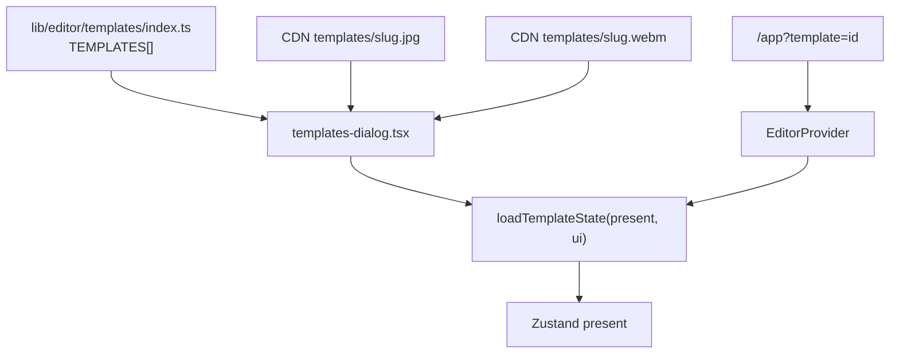

# Templates (curated starters)

Templates are **repo-baked** starting compositions shown in the Templates gallery. Unlike custom presets (D1, style-only) or drafts (full projects with user media), templates ship with the app as TypeScript modules containing a full `DraftPayload`-shaped state.

Poster/preview media lives on the public assets CDN (`assets.tokokino.com/templates/`).

---

## Mental model

| System | Stored | Pixels | Who |
|---|---|---|---|
| Templates | In-repo TS | Demo screenshots in state + CDN thumbs | Maintainers |
| Custom presets | D1 JSON | Never | End users |
| Drafts | D1 + R2 | Yes | End users |

Applying a template runs the same restore path as opening a draft (`unwrapDraftState` → media download if any → `loadTemplateState`) but starts a **new unsaved** project (clears `currentDraft`).

---

## Architecture



| Piece | Path |
|---|---|
| Types | `lib/editor/templates/types.ts` |
| Catalog | `lib/editor/templates/index.ts` |
| Individual templates | `lib/editor/templates/<slug>.ts` |
| Authoring notes | `lib/editor/templates/README.md` |
| Gallery UI | `components/editor/templates/templates-dialog.tsx` |
| Landing showcase | `components/landing/templates-showcase.tsx` |
| Thumb publish API | `POST /api/templates/thumb` |
| Storage helper | `lib/template-storage.ts` |

---

## Template shape

```ts
Template {
  id: string          // kebab-case slug
  name: string
  category: "image" | "animation"
  thumbnail: string   // CDN JPG
  preview?: string    // CDN WebM for animation templates
  state: DraftPayload // schemaVersion + present + ui
}
```

Categories drive gallery filters. Animation templates should include a short loop preview when possible.

---

## Apply flows

### From editor dialog

1. User opens Templates → picks card  
2. `unwrapDraftState(template.state)`  
3. Optional `downloadDraftVideos` if state references draft media URLs (usually none for curated)  
4. `loadTemplateState` → toast  

### From landing / deep link

`/app?template=<id>` — `EditorProvider` applies before IndexedDB hydrate so the template wins over autosave, then strips the query param.

---

## Authoring (maintainers)

Enabled when `NEXT_PUBLIC_ENABLE_TEMPLATE_COPY=true`:

1. Build composition in the editor.  
2. **Copy template** in top bar → kebab slug.  
3. Clipboard gets full `DraftPayload` JSON; poster published via `POST /api/templates/thumb` (requires email in `TEMPLATE_MAINTAINER_EMAILS`; disabled in production publish path as documented in templates README).  
4. Create `lib/editor/templates/<slug>.ts` and register in `index.ts`.  
5. Optionally upload `templates/<slug>.webm` for animation preview.

Auth gate: `assertTemplateMaintainer` in `lib/api-auth.ts`.

---

## Key files

| Path | Role |
|---|---|
| `lib/editor/templates/*` | Catalog + payloads |
| `components/editor/templates/templates-dialog.tsx` | UI |
| `lib/editor/store/provider.tsx` | URL template apply |
| `app/api/templates/thumb/route.ts` | Poster upload |
| `lib/template-storage.ts` | R2/CDN helper |
| [drafts.md](./drafts.md) | Shared draft payload shape |
