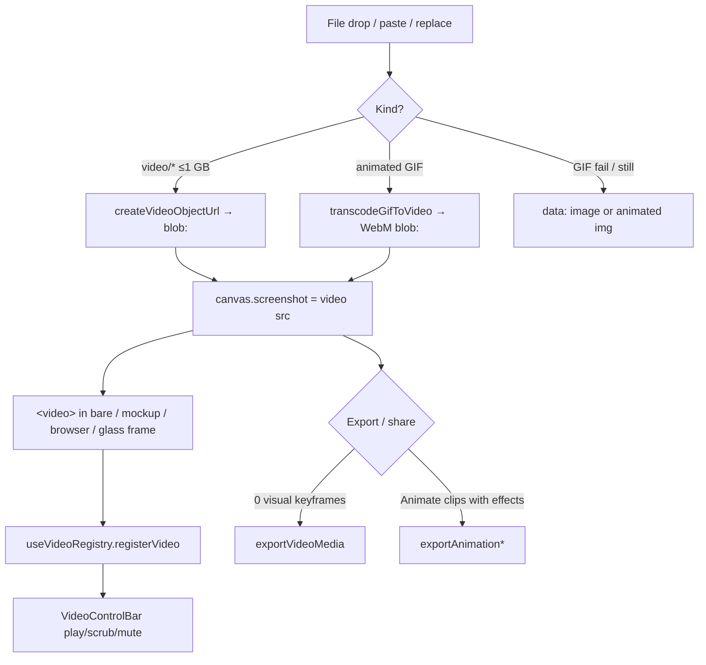
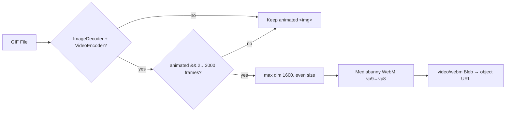
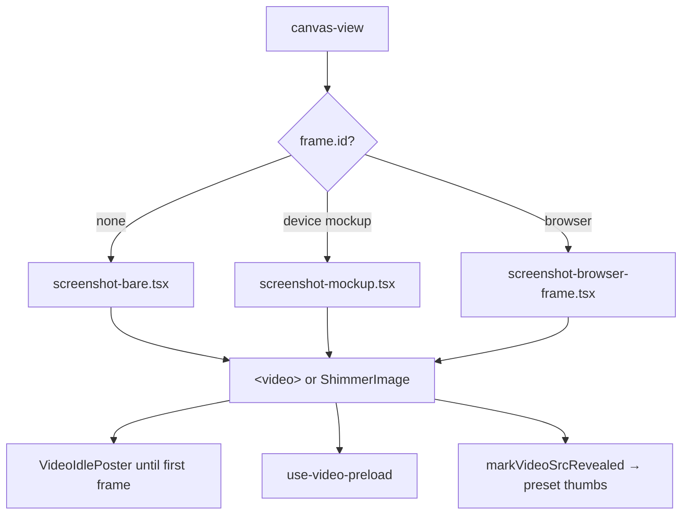
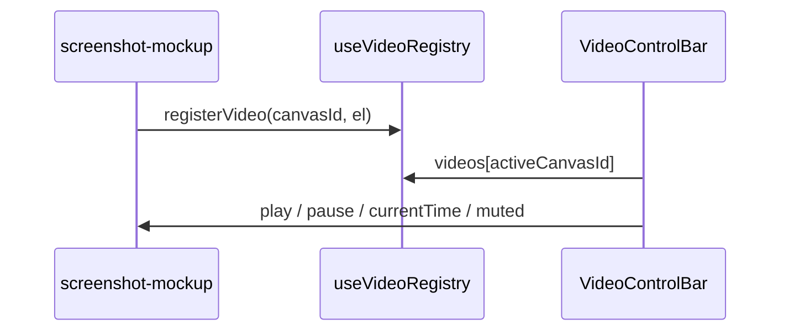

# Video canvas

When the main screenshot is a **video** (or a GIF that was transcoded to WebM), the canvas becomes a video project: docked transport controls, optional Animate **trim** clips (`videoClips`), device / browser / glass frames around live media, and export via **styled video-media** or **keyframe animation** depending on whether visual keyframes exist.

Stills and image-only intake: [canvas.md](./canvas.md). Encode pipelines: [video-export.md](./video-export.md) / [animation-export.md](./animation-export.md).

---

## Mental model



| Concept | Storage | Notes |
|---|---|---|
| Video src | `CanvasState.screenshot` | `blob:`, `data:video/…`, draft media URL, or `.mp4`/`.webm`/… |
| Detection | `isVideoSrc(src)` | blob: only if registered as video |
| Trim segments | `canvas.videoClips[]` | Timeline ↔ source mapping |
| Style keyframes | `canvas.animation.clips` | Separate from video trim |
| Mute pref | `localStorage tokokino:video-muted` | Default muted (autoplay policy) |

**Slots do not accept video** (`allowVideo={false}` on slot intake). Multi-screenshot layouts stay image-only; main canvas is the video target.

---

## Intake

### Video files

| Limit | Value |
|---|---|
| Max size | `VIDEO_SIZE_LIMIT` = **1 GB** |
| Types | `video/*` files; extensions mp4/webm/ogv/mov/m4v for URL heuristics |

Flow (`use-image-file-intake.ts`, top-bar / animate replace):

1. Size check → toast if over limit  
2. `createVideoObjectUrl(file)` → `registerObjectUrl` (tracks blob for IDB round-trip)  
3. `setScreenshot(blobUrl)`  

Cloud drafts re-host bytes via `POST /api/drafts/media` and rewrite src to `/api/drafts/media/{id}` — still `isVideoSrc` true ([drafts.md](./drafts.md)).

### GIF → WebM (`lib/editor/gif-to-video.ts`)

Animated GIFs are **not** left as looping `` when possible — they are re-encoded so they share the full video pipeline (control bar, non-destructive crop, MP4/WebM/GIF export).



| Guard | Behavior |
|---|---|
| No `ImageDecoder` / `VideoEncoder` | `null` → animated `` |
| Single-frame or not animated | `null` → still image path |
| `frameCount > 3000` | `null` → animated `` |
| Frame delay | honor `VideoFrame.duration`; min 20ms; default 100ms |
| Alpha | cleared each frame; WebM has no alpha (transparent → black) |
| UI | `GifTranscodeDialog` while work runs |

`allowVideo: false` (extra slots, some replace paths) skips video/GIF-as-video entirely.

---

## Detection & object URLs (`media-type.ts`)

```ts
isVideoSrc(src):
  data:video/*     → true
  other data:      → false
  blob:            → true only if registered in videoObjectUrls
  /api/drafts/media/{uuid} → true
  .mp4|.webm|…     → true
```

| API | Role |
|---|---|
| `registerObjectUrl` / `createVideoObjectUrl` | Create + remember blob |
| `getBlobForObjectUrl` | IDB persistence needs raw bytes |
| `revokeVideoObjectUrl` / `revokeObjectUrl` | Cleanup |
| `videoElementHasAudio` | Best-effort mute UI / audio export hints |

---

## Paint path



| Piece | Role |
|---|---|
| `screenshot-bare` / `screenshot-mockup` / `screenshot-browser-frame` | Host media; mockup clips to screen rect via `DEVICE_MOCKUP_SPECS` |
| `VideoIdlePoster` | Poster while decoding / idle |
| `video-frame-reveal.ts` | After one frame paints, other mounts of same `src` (preset thumbs) skip expensive multi-decode |
| `use-video-preload` | Metadata / readyState housekeeping |
| `onMediaElement` | Bubble `<video>` up for registry |

Device frame geometry details: [device-frames.md](./device-frames.md).

---

## Control bar & registry

Deep tree problem: `<video>` lives inside canvas; transport UI sits near the floating toolbar.



| Module | Role |
|---|---|
| `lib/editor/video-registry.ts` | Zustand map `canvasId → HTMLVideoElement` |
| `components/editor/video-control-bar.tsx` | Play/pause, scrub, mute, duration readout |
| `video-mute-preference.ts` | `localStorage`; default muted; `applyVideoMutedToAll` |

Registry applies saved mute when an element registers (JSX starts muted for autoplay safety).

---

## Timeline trim (`videoClips`) vs style keyframes

Two independent timelines can coexist:

| Data | Meaning |
|---|---|
| `VideoTimelineClip` | Source in/out + optional `timelineStartMs` shift on the **media** clock |
| `AnimationClip` | Style keyframes (tilt, shadow, …) on the **Animate** clock |

```ts
VideoTimelineClip {
  id
  timelineStartMs?  // where this segment sits on the editor timeline
  startMs           // source in-point
  endMs             // source out (null = to end)
  muted?
}
```

Mapping (`video-timeline-map.ts`):

- `videoClipAtTime(clips, ms, mediaDurationMs)` — which segment covers playhead  
- `sourceTimeAt(clips, ms, mediaDurationSec)` — seek target in source seconds  

Used by live Animate seek **and** crop dialog so poster frame matches canvas.

Default when `videoClips` empty: whole source from 0.

UI: `timeline-video-clip.tsx` + animate timeline interactions. Filmstrip thumbs: `useVideoFilmstrip(src)` in `video-filmstrip.ts`.

---

## Export / share routing

Gate (`lib/editor/share-export-choice.ts`):

```ts
shouldUseVideoMediaShareExport({
  isVideoCanvas,
  isAnimateMode,
  keyframeCount,
})
// → true when video && (!animate || keyframeCount === 0)
```

| Condition | Encoder | Doc |
|---|---|---|
| Video + Present, or Animate with **only** trim (0 style keyframes) | `exportVideoMedia` | [video-export.md](./video-export.md) |
| Video + Animate with visual keyframes | `exportAnimation*` | [animation-export.md](./animation-export.md) |
| Still image | `exportCanvas` / `captureCanvasForShare` | [still-export.md](./still-export.md) |

**Why:** Animate can be open just for trim UI; keyframe exporter has nothing to sample. Styled compositor once-rasterizes shell and blits decoded frames into the media slot (including device-frame chrome).

Audio:

- Video-media: `prepareSourceAudio` (remux / re-encode / silent)  
- Keyframe: `prepareAnimationAudio` (segment-aware retiming)

Decode on Safari/Firefox: WebCodecs; native AV1 reject → **dav1d WASM** ([video-export.md](./video-export.md)). Offline shell preloads that WASM ([offline.md](./offline.md)).

---

## Crop & full-page

- Non-destructive crop on video uses the same crop region model as images; Animate can own `crop` as an effect (source window only — box size fixed for encode).  
- Full-page website capture is **PNG**, not video — different path ([canvas.md](./canvas.md)).  
- `objectFit` contain/cover/fill applies to video in bare and framed slots (`region.ts` for export).

---

## Constraints

1. **Main only** — no video in extra screenshot slots.  
2. **1 GB** hard limit on intake and draft media.  
3. **blob: must stay registered** — reload restores via IDB blob map / draft media URLs.  
4. **GIF transcode best-effort** — failure keeps animated img (export still may rasterize as image).  
5. **Mute default true** — browser autoplay; preference is device-local only.  
6. **Export never streams raw source alone** — always styled composite (or keyframe FO) unless user downloads outside the app.

---

## Key files

| Path | Role |
|---|---|
| `lib/editor/media-type.ts` | Detection, object URLs, size limit |
| `lib/editor/gif-to-video.ts` | GIF → WebM |
| `lib/editor/video-registry.ts` | Element registry |
| `lib/editor/video-mute-preference.ts` | Mute localStorage |
| `lib/editor/video-timeline-map.ts` | Timeline ↔ source time |
| `lib/editor/video-filmstrip.ts` | Scrub thumbnails |
| `lib/editor/video-frame-reveal.ts` | First-frame fan-out |
| `lib/editor/share-export-choice.ts` | Encoder gate |
| `components/editor/video-control-bar.tsx` | Transport UI |
| `components/editor/canvas/gif-transcode-dialog.tsx` | Progress UI |
| `components/editor/canvas/video-idle-poster.tsx` | Idle poster |
| `components/editor/canvas/use-image-file-intake.ts` | Drop/paste intake |
| `components/editor/animate/timeline-video-clip.tsx` | Trim UI |
| [video-export.md](./video-export.md) | Styled encode + dav1d + warp |
| [animation-export.md](./animation-export.md) | Keyframe encode + video layer |
| [device-frames.md](./device-frames.md) | Frames around video |
