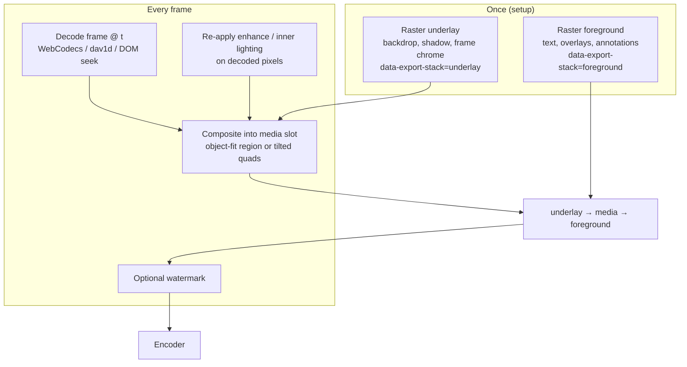
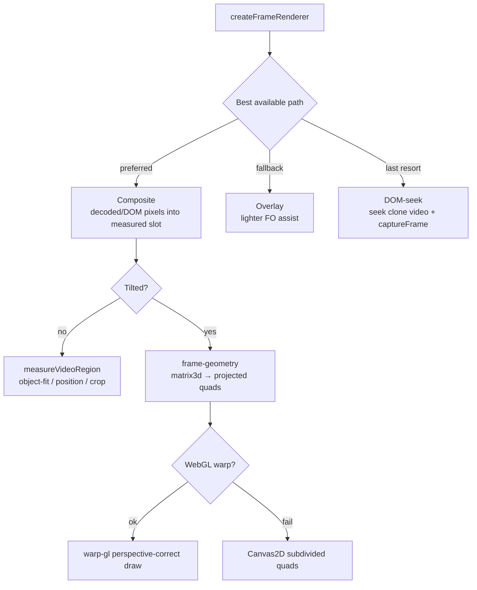
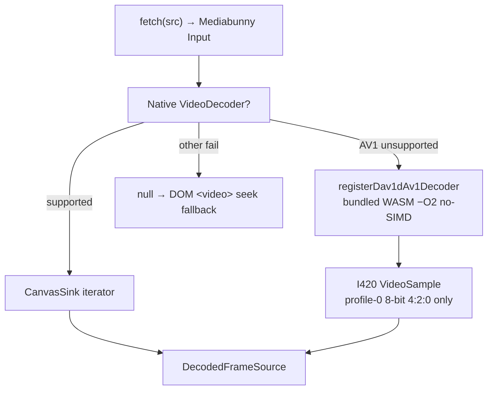
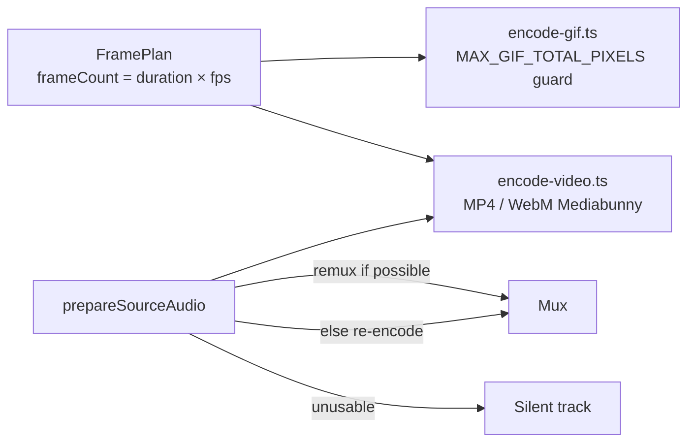

# Video-media export (styled video)

**Entry:** `lib/editor/animation-export/video-media/index.ts`  
**Public API:** `exportVideoMedia`, `canvasIsVideoMedia`

Turns a canvas whose main screenshot is a **video** into a downloadable MP4 / WebM / GIF with full styling (background, shadow, frame, tilt, crop, overlays, etc.).

This is **not** keyframe sampling. The styled scene is rasterized once (video hidden); decoded frames are composited into the media slot. Prefer this when:

```ts
isVideoCanvas && (!isAnimateMode || keyframeCount === 0)
```

When Animate mode has real keyframes on a video canvas, use [animation-export](./animation-export.md) instead — the video box may move every frame.

---

## Folder map

```
lib/editor/animation-export/video-media/
├── index.ts                 # Orchestrator — exportVideoMedia
├── frames.ts                # FramePlan + blitFrame
├── frame-renderer.ts        # Composite / overlay / DOM-seek RenderFrame
├── frame-geometry.ts        # CSS 3D → projected quads + warp dispatch
├── frame-inner-lighting.ts  # Inner lighting paint (WebKit FO workaround)
├── frame-canvas-utils.ts    # opaque/nonBlack probes, copyCanvas, shadow extent
├── export-stack.ts          # data-export-stack underlay / media / foreground
├── region.ts                # object-fit → composite dest/src rects (flat)
├── warp-gl.ts               # WebGL perspective-correct quad warp
├── decoded-frames.ts        # Mediabunny WebCodecs decode + dav1d gate
├── dav1d-av1-decoder.ts     # Custom Mediabunny AV1 decoder
├── dav1d-wasm/              # decoder.wasm + decoder.mjs + licenses
├── encode-video.ts          # MP4 / WebM via Mediabunny
├── encode-gif.ts            # GIF (+ memory / pixel-budget guard)
├── audio.ts                 # Remux / re-encode / skip source audio
└── dom-video.ts             # seek / requestVideoFrameCallback helpers
```

**Shared with keyframe export:** `../types.ts`, `../utils.ts`, `../watermark.ts`, plus `lib/editor/export.ts` capture prep.

---

## End-to-end pipeline

```mermaid
sequenceDiagram
  participant UI as Export UI / Share
  participant Orch as exportVideoMedia
  participant Cap as prepareAnimationCapture
  participant Dec as createDecodedFrameSource
  participant Ren as createFrameRenderer
  participant Enc as encodeGif / encodeMp4OrWebm

  UI->>Orch: canvasId + format/fps/width
  Orch->>Orch: Validate screenshot is video
  Orch->>Cap: legacy / precise clone (never fast path)
  Cap-->>Orch: AnimationCapture + clone &lt;video&gt;
  Orch->>Orch: waitForVideoReady → planFrames(duration, fps)
  alt Chromium supportsObjectViewBox
    Note over Orch: DOM-seek path — live video in FO OK
  else Safari / Firefox
    Orch->>Dec: WebCodecs decode (dav1d if AV1 rejected)
    Dec-->>Orch: DecodedFrameSource or null
  end
  Orch->>Ren: capture + video + decoded + tilt + mediaFx
  loop each planned frame
    Ren-->>Enc: composited canvas (underlay + media + foreground)
  end
  Orch->>Enc: prepareSourceAudio (best-effort)
  Enc-->>UI: Blob (download or asBlob share)
```

### Stages (ordered)

1. Validate `canvas.screenshot` is a video URL.
2. `prepareAnimationCapture` — **legacy/precise only** (not the fast FO path).
3. `waitForVideoReady`; `planFrames(duration, fps)` — **no 600-frame cap**.
4. Decode strategy:
   - Chromium (`supportsObjectViewBox`) → DOM seek inside the clone
   - Safari / Firefox → `createDecodedFrameSource`; if native AV1 rejected → register dav1d WASM
   - Decode failure → fall back to DOM seek (or throw if still unusable)
5. `createFrameRenderer` → prefers **composite**, then overlay, then DOM-seek.
6. `encodeGif` **or** `encodeMp4OrWebm` (+ `prepareSourceAudio` remux/re-encode).
7. Cleanup decoded source + capture; download or return blob.

---

## Why once-rasterize + composite?

Per-frame foreignObject re-raster of a changing video overlay **flickers on Safari**. The fix:



Export stack visibility is toggled via `data-export-stack` (`export-stack.ts`) so html-to-image can capture underlay and foreground as separate passes without the live video in the way.

---

## Frame renderer paths



| Concern | Module |
|---|---|
| Flat geometry from object-fit | `region.ts` |
| CSS 3D → screen quads | `frame-geometry.ts` |
| Seamless perspective warp | `warp-gl.ts` (avoids Canvas2D seam lattice) |
| Inner lighting on WebKit | `frame-inner-lighting.ts` |
| Canvas probes / copies | `frame-canvas-utils.ts` |
| Stack show/hide | `export-stack.ts` |

---

## Decode path (Safari / Firefox)



Notes:

- dav1d is an **AV1 escape hatch only** — it does not replace all decode failures.
- Only **AV1 profile 0, 8-bit, 4:2:0** is supported through WASM.
- Chromium keeps the DOM-seek path because live `<video>` inside foreignObject is reliable there.

---

## Encode & audio



| Topic | Behavior |
|---|---|
| Frame budget | No 600 cap (unlike keyframe export) |
| GIF memory | `MAX_GIF_TOTAL_PIXELS ≈ 350e6` OOM guard |
| Audio length | `exportAudioDurationSec(plan)` — matches styled frame count, not raw clip length |
| Audio failure | Silent export; never fail the job |
| Codecs | Same Mediabunny preferences as keyframe path (avc/hevc/av1, vp9/vp8/av1) |

---

## Module responsibility map

| File | Responsibility |
|---|---|
| `index.ts` | Orchestrate capture → plan → decode → render → encode |
| `frames.ts` | `planFrames`, `blitFrame` |
| `frame-renderer.ts` | Build `RenderFrame`; sandwich underlay / media / foreground |
| `frame-geometry.ts` | Project CSS 3D layers; clip radius; warp dispatch |
| `warp-gl.ts` | WebGL perspective-correct quad warp |
| `frame-inner-lighting.ts` | Paint inner lighting when CSS gradient breaks in FO |
| `frame-canvas-utils.ts` | Opaque/non-black probes, canvas copy, shadow extent |
| `export-stack.ts` | `data-export-stack` visibility for two capture passes |
| `region.ts` | Flat composite geometry |
| `decoded-frames.ts` | Mediabunny decode + dav1d registration gate |
| `dav1d-av1-decoder.ts` | Custom decoder → I420 samples |
| `encode-video.ts` / `encode-gif.ts` | Container encoders for this path |
| `audio.ts` | Remux vs re-encode vs skip |
| `dom-video.ts` | Seek / `requestVideoFrameCallback` |

---

## Key types

| Type | Meaning |
|---|---|
| `VideoMediaExportOptions` | Format, fps, width, watermark, progress, abort, `asBlob` |
| `FramePlan` | Duration, fps, frame count, per-frame timestamps |
| `RenderFrame` | `(index) => Promise<void>` — paints into the encode canvas |
| `DecodedFrameSource` | Iterator + cleanup over decoded canvases |
| `VideoRegion` | Src/dest rects for flat compositing |
| `VideoMediaFx` | Enhance + optional inner lighting reapplied on pixels |
| `ExportStackLayer` | `"underlay" \| "media" \| "foreground"` |
| `SourceAudioFeed` | Remux / re-encode handle for the encode step |

---

## Constraints & design choices

1. **Always legacy capture** — video-media needs precise html-to-image passes for underlay/foreground; the fast FO bake path is animation-only.
2. **Composite over FO re-raster** — avoids Safari flicker when the video texture changes every frame.
3. **Export stack split** — decoded media is painted *between* underlay and foreground so overlays stay above video.
4. **GL warp preferred** — Canvas2D subdivided quads leave a visible lattice under transparency.
5. **Inner lighting re-applied on WebKit** — CSS gradients through the foreground SVG pass can wash incorrectly.
6. **dav1d only for rejected AV1** — other unsupported codecs fall through to DOM seek.
7. **Even output dimensions** — codec friendliness.
8. **WebM unsupported on Safari** — same UI gate as keyframe export.

---

## Comparison with keyframe animation export

| | Video-media | Keyframe animation |
|---|---|---|
| Trigger | Video canvas, no visual keyframes | Animate clips present |
| Capture mode | Legacy only | auto / fast / legacy |
| Scene motion | Static styling; video pixels change | CSS / timeline changes every frame |
| Video handling | Composite into fixed slot | JPEG `` bridge inside animated tree |
| Frame cap | None (GIF has pixel budget) | `MAX_FRAMES = 600` |
| Audio | `prepareSourceAudio` | `prepareAnimationAudio` (segment-aware) |
| Entry | `exportVideoMedia` | `exportAnimation*` |

---

## Tests

| File | Documents |
|---|---|
| `tests/lib/editor/animation-export/video-media.test.ts` | `planFrames`, audio strategy, seek abort, GIF memory, `measureVideoRegion`, export-stack, quad subdivision, GL warp failure modes |
| `tests/lib/editor/animation-export/export-video.integration.test.ts` | Coordinator wiring around encode (shared with keyframe path) |
| `tests/lib/editor/share-export-choice.test.ts` | Routing into this path vs keyframes |
