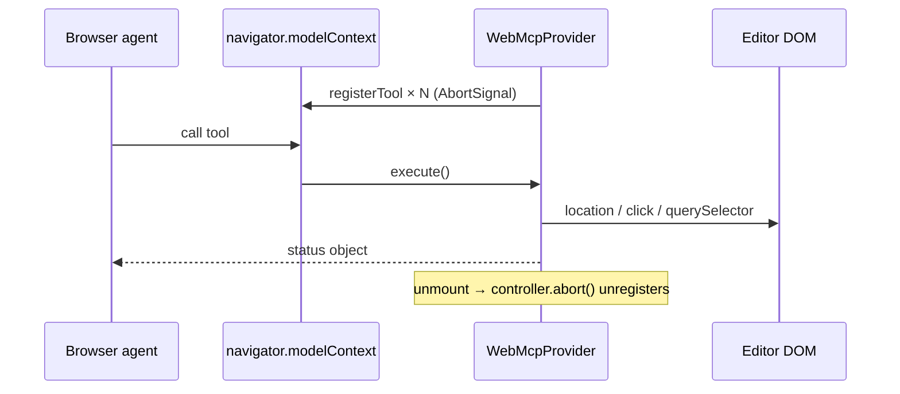

# Web MCP (browser agent tools)

Tokokino registers a small set of **client-side tools** for browsers / agents that expose a `modelContext` API (Web MCP / “model context” on `navigator` or `document`). This is **not** a server MCP server and not Cloudflare Agents — pure in-page registration.

**Module:** `components/web-mcp-provider.tsx`  
**Mount:** root `app/layout.tsx` (`<WebMcpProvider />`).

---

## How it works



| Detail | Behavior |
|---|---|
| Discovery | `navigator.modelContext` or `document.modelContext` |
| No context | Provider no-ops (returns `null` UI) |
| Cleanup | `AbortController` on unmount aborts all registrations |
| Side effects | Navigation, synthetic clicks — **not** read-only store access |

Tools that need the editor assume `/app` is open and top-bar buttons expose `data-action` hooks.

---

## Registered tools

| Name | Title | Side effects | Behavior |
|---|---|---|---|
| `navigate-to-editor` | Open Editor | Navigate | `window.location.href = "/app"` |
| `get-site-info` | Site Info | None (readOnlyHint) | Static product JSON (name, features, editor URL) |
| `upload-screenshot` | Upload Screenshot | Click / navigate | Clicks first `input[type=file]` or redirects to `/app` |
| `export-image` | Export Image | Click | Clicks `[data-action='export']` (optional format in schema — UI opens dialog) |
| `create-share-link` | Share Canvas | Click | Clicks `[data-action='share']` |

### `get-site-info` payload (shape)

```ts
{
  name, url, description, features: string[], editorUrl
}
```

Feature bullets are marketing copy for agents — keep roughly aligned with real capabilities when product changes.

### DOM contracts (export / share)

Top bar controls must keep:

- `data-action="export"`
- `data-action="share"`

If missing, tools return `{ status: "… button not found — open the editor first" }`.

---

## Related agent surfaces

| Surface | Role |
|---|---|
| `/llms.txt` | Static markdown product summary for crawlers |
| `worker.ts` Accept: markdown | Markdown for `/` and `/share/{id}` |
| `/auth.md` | Auth discovery notes for agents |
| Server MCP | **None** in this repo for Tokokino product tools |

Auth for APIs remains session cookies — see [auth-account.md](./auth-account.md) and `app/auth.md/route.ts`.

---

## Constraints

1. **Client-only** — no privileged server actions.  
2. **Best-effort UI automation** — depends on current DOM selectors.  
3. **No canvas state API** — agents cannot set tilt/shadow via MCP today.  
4. **Format arg on export-image** is declared in schema but execute currently only opens the export control (dialog owns format).

---

## Key files

| Path | Role |
|---|---|
| `components/web-mcp-provider.tsx` | Tool registration |
| `app/layout.tsx` | Global mount |
| `components/editor/top-bar/*` | `data-action` targets |
| [marketing-site.md](./marketing-site.md) | Public pages agents may cite |
| [auth-account.md](./auth-account.md) | Session APIs |
